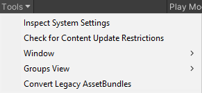
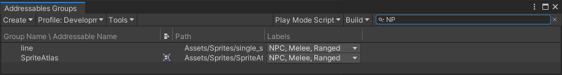

유니티 Addressables 문서 번역 2장 에디터에서 어드레서블 관리

유니티/Addressables/유니티 문서/번역/

- [에디터에서 어드레서블 관리](#에디터에서-어드레서블-관리)
  - [어드레서블 에셋 정리](#어드레서블-에셋-정리)
  - [일반적인 전략](#일반적인-전략)
    - [로드된 에셋 안전하게 편집하기](#로드된-에셋-안전하게-편집하기)
- [어드레서블 시스템 세팅](#어드레서블-시스템-세팅)
  - [프로필 (Profile)](#프로필-profile)
  - [진단 (Diagnostics)](#진단-diagnostics)
    - [모든 로깅 활성화](#모든-로깅-활성화)
  - [카탈로그 (Catalog)](#카탈로그-catalog)
  - [이전 빌드 업데이트 (Update a Previous Build)](#이전-빌드-업데이트-update-a-previous-build)
  - [다운로드 (Downloads)](#다운로드-downloads)
  - [빌드 (Build)](#빌드-build)
  - [모드 스크립트 빌드 및 재생 (Build and Play Mode Scripts)](#모드-스크립트-빌드-및-재생-build-and-play-mode-scripts)
  - [에셋 그룹 템플릿 (Asset Group Templates)](#에셋-그룹-템플릿-asset-group-templates)
  - [초기화 개체 목록 (Initialization object list)](#초기화-개체-목록-initialization-object-list)
  - [클라우드 콘텐츠 전송 (Cloud Content Delivery)](#클라우드-콘텐츠-전송-cloud-content-delivery)
- [에셋번들에 그룹을 패킹하기](#에셋번들에-그룹을-패킹하기)
  - [프로젝트가 커짐에 따라 확장에 미치는 영향](#프로젝트가-커짐에-따라-확장에-미치는-영향)
- [그룹 (Groups)](#그룹-groups)
  - [그룹 관리](#그룹-관리)
    - [그룹 생성](#그룹-생성)
  - [그룹에서 에셋 관리](#그룹에서-에셋-관리)
    - [그룹에 에셋 추가하기](#그룹에-에셋-추가하기)
    - [그룹에서 에셋 제거하기](#그룹에서-에셋-제거하기)
    - [라벨 추가 또는 제거](#라벨-추가-또는-제거)
    - [그룹 컨텍스트 메뉴 (Group context menu)](#그룹-컨텍스트-메뉴-group-context-menu)
    - [에셋 컨텍스트 메뉴 (Asset context menu)](#에셋-컨텍스트-메뉴-asset-context-menu)
- [그룹 창](#그룹-창)
  - [그룹 리스트 (Group List)](#그룹-리스트-group-list)
  - [그룹 윈도우 툴바 (Groups window toolbar)](#그룹-윈도우-툴바-groups-window-toolbar)
    - [Create](#create)
    - [Profile](#profile)
    - [Tools](#tools)
    - [플레이 모드 스크립트 (Play Mode Script)](#플레이-모드-스크립트-play-mode-script)
    - [빌드 스크립트 (Build Script)](#빌드-스크립트-build-script)
    - [필터 목록 (Filter list)](#필터-목록-filter-list)
  - [플레이 모드 스크립트 (Play Mode Scripts)](#플레이-모드-스크립트-play-mode-scripts)
    - [에셋을 찾으려면](#에셋을-찾으려면)
- [그룹 템플릿 (Group templates)](#그룹-템플릿-group-templates)
- [그룹 세팅 (Group Settings)](#그룹-세팅-group-settings)
- [스키마 (Schemas)](#스키마-schemas)
  - [사용자 지정 스키마 정의 (Defining custom schemas)](#사용자-지정-스키마-정의-defining-custom-schemas)
- [컨텐츠 패킹 및 스키마 로드](#컨텐츠-패킹-및-스키마-로드)
  - [경로 빌드 및 로드 (Build and Load Paths)](#경로-빌드-및-로드-build-and-load-paths)
  - [추가 옵션 (Advanced Options)](#추가-옵션-advanced-options)
  - [에셋 번들 압축 (AssetBundle Compression)](#에셋-번들-압축-assetbundle-compression)
  - [에셋 번들 CRC](#에셋-번들-crc)
  - [에셋 로드 모드 (Asset Load Mode)](#에셋-로드-모드-asset-load-mode)
- [업데이트 방지 스키마 (Prevent Updates Schema)](#업데이트-방지-스키마-prevent-updates-schema)
- [라벨 (Labels)](#라벨-labels)
  - [라벨 관리](#라벨-관리)
- [프로필 (Profiles)](#프로필-profiles)
  - [활성 프로필 설정](#활성-프로필-설정)
  - [새 프로필 추가](#새-프로필-추가)
  - [패킹 및 로딩 경로 지정하기](#패킹-및-로딩-경로-지정하기)
  - [프로필 예시](#프로필-예시)
- [프로필 변수들 (Profile Variables)](#프로필-변수들-profile-variables)
  - [새로운 표준 변수 추가](#새로운-표준-변수-추가)
    - [경로 쌍(Path Pairs)](#경로-쌍path-pairs)
    - [기본 경로 값](#기본-경로-값)
  - [프로필 변수 구문](#프로필-변수-구문)
- [에셋 레퍼런스 (Asset References)](#에셋-레퍼런스-asset-references)
  - [에셋 레퍼런스 유형](#에셋-레퍼런스-유형)
  - [클래스에 AssetReference 필드 추가하기](#클래스에-assetreference-필드-추가하기)
  - [AssetReference 로드 및 해제](#assetreference-로드-및-해제)
  - [특정 레이블이 있는 에셋으로 에셋 참조 할당 제한하기](#특정-레이블이-있는-에셋으로-에셋-참조-할당-제한하기)
  - [구체적인 서브클래스 생성](#구체적인-서브클래스-생성)

Addressables 1.21.12 기준 작성

---


# 에디터에서 어드레서블 관리

프로젝트에서 에셋을 구성할 수 있는 다양한 방법을 모두 포괄적으로 분류하는 것은 불가능하지만, 어드레서블 에셋 구성하기에서는 조직 전략을 계획할 때 고려해야 할 몇 가지 사항을 간략하게 설명합니다.

또한 에셋 관리 방법을 고려할 때 어드레서블이 프로젝트 에셋과 상호 작용하는 방식도 이해해야 합니다.

어드레서블 그룹은 어드레서블 에셋을 관리하는 기본 조직 단위입니다. 어드레서블을 사용할 때 중요한 고려 사항은 그룹을 에셋 번들에 패킹하는 옵션입니다.

그룹 설정 외에도 다음을 사용하여 프로젝트에서 어드레서블이 작동하는 방식을 제어할 수 있습니다:

- 어드레서블 에셋 설정: 프로젝트 레벨 설정
- 프로필: 빌드 목적에 따라 전환할 수 있는 빌드 경로 설정 모음을 정의합니다. (주로 콘텐츠를 원격으로 배포하려는 경우에 유용합니다.)
- 레이블: 프로젝트에 사용되는 어드레서블 에셋 레이블을 편집합니다.
- 플레이 모드 스크립트: 에디터에서 플레이 모드로 전환할 때 어드레서블 시스템이 에셋을 로드하는 방법을 선택합니다.

에셋 레퍼런스는 어드레서블 에셋을 UI 친화적으로 사용할 수 있는 방법을 제공합니다. MonoBehaviour 및 ScriptableObject 클래스에 AssetReference 필드를 포함시킨 다음 에디터에서 드래그 앤 드롭 또는 오브젝트 선택 대화 상자를 사용하여 에셋을 할당할 수 있습니다.

어드레서블 시스템은 개발을 돕기 위해 다음과 같은 추가 도구를 제공합니다:

- 분석 도구: 어드레서블이 에셋을 번들로 패키징하는 방법에 대한 보고서를 포함하여 에셋을 원하는 방식으로 구성했는지 확인하기 위해 실행할 수 있는 다양한 분석 규칙을 제공합니다.
- 이벤트 뷰어: 에셋이 로드되고 해제되는 시점을 보여주는 프로필 뷰를 제공합니다. 이벤트 뷰어를 사용하여 에셋을 릴리스하고 있는지 확인하고 최대 메모리 사용량을 모니터링할 수 있습니다.
- 호스팅 서비스: 로컬 개발을 위해 원격 에셋을 호스팅하는 데 사용할 수 있는 간단한 에셋 서버를 제공합니다.
- 빌드 레이아웃 보고서: 빌드에서 생성된 에셋 번들에 대한 설명을 제공합니다.
빌드 프로필 로그: 빌드 프로세스 자체에 대한 프로필링 로그를 제공하여 어느 부분이 가장 오래 걸리는지 확인할 수 있습니다.

## 어드레서블 에셋 정리

에셋을 정리하는 가장 최선의 유일한 솔루션은 없으며, 각 프로젝트의 특정 요구 사항에 따라 달라집니다. 프로젝트에서 에셋을 관리하는 방법을 계획할 때 고려해야 할 사항은 다음과 같습니다:

- 논리적 구성: 에셋을 논리적인 카테고리로 정리하면 조직을 더 쉽게 이해하고 제자리를 벗어난 항목을 발견할 수 있습니다.
- 런타임 성능: 번들이 매우 커지거나 번들 수가 매우 많을 경우 성능 병목 현상이 발생할 수 있습니다.
- 런타임 메모리 관리: 함께 사용하는 에셋을 함께 보관하면 최대 메모리 요구량을 낮추는 데 도움이 될 수 있습니다.
- 규모: 에셋을 구성하는 일부 방법은 작은 게임에서는 잘 작동하지만 큰 게임에서는 작동하지 않을 수 있으며, 그 반대의 경우도 마찬가지입니다.
- 플랫폼 특성: 플랫폼의 특성과 요구 사항은 에셋을 구성하는 방법에서 큰 고려 사항이 될 수 있습니다. 몇 가지 예를 들어보겠습니다:
   - 풍부한 가상 메모리를 제공하는 플랫폼은 가상 메모리가 제한된 플랫폼보다 큰 번들 크기를 더 잘 처리할 수 있습니다.
   - 일부 플랫폼은 콘텐츠 다운로드를 지원하지 않아 에셋의 원격 배포를 완전히 배제합니다.
   - 일부 플랫폼은 에셋 번들 캐싱을 지원하지 않으므로 가능하면 에셋을 로컬 번들에 넣는 것이 더 효율적입니다.
- 배포: 콘텐츠를 원격으로 배포할지 여부는 최소한 원격 콘텐츠와 로컬 콘텐츠를 분리해야 한다는 것을 의미합니다.
- 에셋 업데이트 빈도: 자주 업데이트할 것으로 예상되는 에셋과 거의 업데이트하지 않을 것으로 예상되는 에셋을 분리하여 보관하세요.
- 버전 관리: 동일한 에셋 및 에셋 그룹에서 작업하는 사람이 많을수록 프로젝트에서 버전 관리 충돌이 발생할 가능성이 커집니다.

## 일반적인 전략

일반적인 전략은 다음과 같습니다:

- 동시 사용: 특정 레벨의 모든 에셋과 같이 동시에 로드하는 에셋을 그룹화합니다. 이 전략은 장기적으로 가장 효과적이며 프로젝트의 최대 메모리 사용량을 줄이는 데 도움이 될 수 있습니다.
- 논리적 엔티티: 동일한 논리적 엔티티에 속하는 에셋을 함께 그룹화합니다. 예를 들어 UI 레이아웃 에셋, 텍스처, 음향 효과 등이 이에 해당합니다. 또는 캐릭터 모델과 애니메이션도 마찬가지입니다.
- 유형: 같은 유형의 에셋을 함께 그룹화합니다. 예: 음악 파일, 텍스처.

프로젝트의 필요에 따라 이러한 전략 중 하나가 다른 전략보다 더 적합할 수 있습니다. 예를 들어 레벨이 많은 게임에서는 동시 사용량에 따라 구성하는 것이 프로젝트 관리와 런타임 메모리 성능 측면에서 모두 가장 효율적일 수 있습니다. 동시에 에셋 유형에 따라 다른 전략을 사용할 수도 있습니다. 예를 들어, 레벨 기반 게임에서는 메뉴 화면의 UI 에셋을 모두 함께 그룹화할 수 있지만, 그렇지 않은 경우 레벨 데이터를 개별적으로 그룹화할 수 있습니다. 레벨의 에셋이 포함된 그룹을 특정 유형의 에셋이 포함된 번들로 패킹할 수도 있습니다.

자세한 내용은 에셋 번들용 에셋 준비 문서를 참고하세요.

### 로드된 에셋 안전하게 편집하기

다음 상황에서는 로드된 에셋을 안전하게 편집할 수 있습니다:

- 에셋 번들에서 에셋을 로드한 경우.
- 애플리케이션이 에디터가 아닌 플레이어에서 실행 중인 경우.
- 플레이 모드 스크립트에서 **Use Existing Build (requires built groups)** 옵션을 활성화한 경우.

이 경우 에셋은 활성 메모리에 사본으로 존재합니다. 이렇게 복사된 에셋에 대한 변경 사항은 디스크에 저장된 에셋 번들에 영향을 미치지 않으며, 세션 간에 변경 사항이 지속되지 않습니다.

플레이 모드 설정에서 **Use Asset Database (fastest)** 또는 **Simulate Groups (advanced)** 프로퍼티를 활성화한 경우와 같은 다른 상황에서는 Unity가 프로젝트 파일에서 에셋을 직접 로드합니다. 즉, Unity는 런타임 중에 에셋에 대한 모든 수정 사항을 프로젝트 에셋 파일에 저장하며, 이러한 변경 사항은 여러 세션 간에 유지됩니다.

에셋을 런타임에 변경하려면 수정하려는 게임 오브젝트의 새 인스턴스를 생성하고 그 사본을 런타임 변경에 사용하는 것이 좋습니다. 이렇게 하면 원본 에셋 파일을 실수로 수정할 위험을 방지할 수 있습니다. 다음 코드 예제는 로드된 에셋의 새 사본을 생성하는 방법을 보여줍니다:

```
var op = Addressables.LoadAssetAsync<GameObject>("myKey");
yield return op;
if (op.Result != null)
{
    GameObject inst = UnityEngine.Object.Instantiate(op.Result);
    // can now use and safely make edits to inst, without the source Project Asset being changed.
}
```

위의 방법을 사용하여 에셋의 사본을 사용하는 경우 다음 사항에 유의하세요:

- 에셋을 릴리스할 때는 에셋의 현재 인스턴스가 아닌 원본 에셋 또는 AsyncOperationHandle을 사용해야 합니다.
- 이러한 방식으로 다른 에셋에 대한 참조가 있는 에셋을 인스턴스화할 때 Unity는 참조된 에셋의 새 인스턴스를 생성하지 않습니다. 새로 인스턴스화된 사본에 대한 레퍼런스는 원본 프로젝트 에셋을 대상으로 합니다.
- Unity는 새 인스턴스에서 Start(), OnEnable(), OnDisable()과 같은 MonoBehaviour 메서드를 호출합니다.


# 어드레서블 시스템 세팅

**Addressable Asset Settings** 인스펙터(메뉴: **Window > Asset Management > Addressables > Settings**)에서 메인 어드레서블 시스템 옵션에 액세스할 수 있습니다.

어드레서블 시스템은 프로젝트 에셋 폴더 아래에 있는 어드레서블셋팅데이터 폴더에 설정 에셋을 저장합니다. 이 폴더가 아직 없는 경우, Groups 창(메뉴: **Window > Asset Management > Addressables > Groups**)에서 어드레서블 시스템을 초기화해야 합니다.


인스펙터에는 다음 섹션이 포함되어 있습니다:

- 프로필
- 진단
- 카탈로그
- 이전 빌드 업데이트
- 다운로드
- 빌드
- 빌드 및 플레이 모드 스크립트
- 에셋 그룹 템플릿
- 초기화 오브젝트 목록

**Manage Groups** 버튼을 클릭하여 그룹 창을 열 수 있습니다.


## 프로필 (Profile)


**Profile in Use** 목록을 사용하여 활성 프로필을 선택합니다. 활성 프로필에 따라 어드레서블 빌드 스크립트에서 사용하는 변수 값이 결정됩니다.

**Manage Profiles** 버튼을 클릭하면 새 프로필을 생성하고 프로필 변수를 변경할 수 있는 Profiles 창이 열립니다.

## 진단 (Diagnostics)


|Property|Function|
|---|---|
|**Send Profiler Events**|프로필러 이벤트를 활성화합니다. Addressables Event Viewer 창을 사용하려면 이 설정을 활성화해야 합니다.|
|**Log Runtime Exceptions**|에셋 로딩 작업에 대한 런타임 예외를 기록합니다(오류를 AsyncOperationHandle.OperationException 프로퍼티에 기록하는 것 외에도).|

### 모든 로깅 활성화
기본적으로 어드레서블 에셋은 경고와 오류만 로깅합니다. Player 설정 창(Edit > Project Settings... > Player)을 열고 Other Settings > Configuration 섹션으로 이동한 다음 스크립팅 정의 기호 (Scripting Define Symbols) 필드에 ```ADDRESSABLES_LOG_ALL```을 추가하여 세부 로깅을 활성화할 수 있습니다.

## 카탈로그 (Catalog)


에셋의 주소를 실제 위치에 매핑하는 주소 지정 가능 카탈로그와 관련된 설정입니다.

|Property|Function|
|---|---|
|**Player Version Override**|원격 카탈로그 이름을 공식화하는 데 사용되는 타임스탬프를 재정의합니다. 이 옵션을 설정하면 원격 카탈로그의 이름은 ```Catalog_<Player Version Override>.json```이 됩니다. 비워두면 타임스탬프가 사용됩니다. 모든 새 빌드에 고유한 원격 카탈로그 이름을 사용하면 동일한 기본 URL에서 여러 버전의 콘텐츠를 호스팅할 수 있습니다. 모든 빌드에 동일한 오버라이드 문자열을 사용하면 모든 플레이어가 새 카탈로그를 로드합니다. 또한 플레이어 업데이트 빌드는 항상 업데이트하는 빌드와 동일한 원격 카탈로그 이름을 사용합니다(콘텐츠 업데이트 빌드 참조).|
|**Compress Local Catalog**|카탈로그를 압축된 에셋 번들 파일로 빌드합니다. 카탈로그의 스토리지 크기는 줄어들지만 카탈로그 빌드 및 로드 시간이 늘어납니다.|
|**Build Remote Catalog**|원격 카탈로그를 구축할 수 있도록 설정합니다.|
|**Build & Load Paths**|원격 카탈로그를 빌드하고 로드할 위치입니다. 목록에서 프로필 경로 쌍을 선택하거나 빌드 경로와 로드 경로를 개별적으로 설정하려면 ```<custom>```을 선택합니다.Build Remote Catalog를 활성화한 경우에만 표시됩니다.|
|**Build Path**|원격 카탈로그를 빌드할 위치. 일반적으로 RemoteBuildPath 프로필 변수를 사용해야 합니다. Build & Load Paths를 ```<custom>```으로 설정한 경우에만 표시됩니다.|
|**Load Path**|원격 카탈로그에 액세스할 URL입니다. 일반적으로 RemoteLoadPath 프로필 변수를 사용해야 합니다. Build & Load Paths를 ```<custom>```으로 설정한 경우에만 표시됩니다.|
|**Only update catalogs manually**|런타임에 주소 지정 시스템이 초기화될 때 업데이트된 원격 카탈로그에 대한 자동 확인을 비활성화합니다. 업데이트된 카탈로그를 수동으로 확인할 수 있습니다.|

## 이전 빌드 업데이트 (Update a Previous Build)


원격 콘텐츠 빌드 및 업데이트를 제어하는 설정입니다.

|Property|Function|
|---|---|
|**Content State Build Path**|기본 빌드 스크립트에 의해 생성된 콘텐츠 상태 파일을 빌드할 위치입니다.|


## 다운로드 (Downloads)


카탈로그 및 에셋 번들 다운로드 처리에 영향을 주는 설정입니다.
|Property|Function|
|---|---|
|**Custom certificate handler**|커스텀 인증서 처리에 사용할 클래스입니다. 이 목록에는 프로젝트에서 UnityEngine.Networking.CertificateHandler를 확장하는 모든 클래스가 포함됩니다.|
|**Max Concurrent Web Requests**|이 제한을 초과하는 요청은 시스템에서 대기열에 추가합니다. 최적의 다운로드 속도에 도달하려면 2~4개의 동시 다운로드를 권장합니다.|
|**Catalog Download Timeout**|카탈로그 파일이 다운로드될 때까지 기다릴 시간(초)입니다.|


## 빌드 (Build)


|Property|Function|
|---|---|
|**Build Addressables on Player Build**|유니티가 플레이어 빌드의 일부로 어드레서블 콘텐츠를 빌드할지 여부입니다.<br>&bull; Build Addressables content on Player Build: 플레이어를 빌드할 때 항상 어드레서블 콘텐츠를 빌드합니다.<br>&bull; Do not Build Addressables content on Player Build: 플레이어를 빌드할 때 어드레서블 콘텐츠를 빌드하지 않습니다. (어드레서블 콘텐츠를 수정하는 경우 플레이어를 빌드하기 전에 수동으로 다시 빌드해야 합니다.)<br>&bull; Use global Settings (stored in preferences): Unity 에디터 환경설정(어드레서블 아래)에 지정된 값을 사용합니다.<br><br>처음 두 옵션은 현재 프로젝트의 글로벌 환경설정을 재정의하며 프로젝트를 빌드하는 모든 기여자에게 영향을 줍니다. 그렇지 않으면 글로벌 환경설정 값이 모든 Unity 프로젝트에 적용됩니다. 자세한 내용은 콘텐츠 빌드하기를 참조하세요.|
|**Ignore Invalid/Unsupported Files in Build**|활성화하면 어드레서블 빌드 스크립트가 빌드를 중단하는 대신 유효하지 않거나 지원되지 않는 파일을 제외합니다.|
|**Unique Bundle IDs**|모든 빌드에서 번들의 고유 이름을 생성할지 여부입니다.|
|**Contiguous Bundles**|보다 효율적인 번들 레이아웃을 생성합니다. Addressables 1.12.1 이전 버전에서 생성한 번들을 사용하는 경우 이 옵션을 비활성화하여 번들 변경을 최소화하세요.|
|**Non-Recursive Dependency Calculation**|이 옵션을 활성화하면 에셋에 순환 종속성이 있는 경우 빌드 시간을 개선하고 런타임 메모리 오버헤드를 줄일 수 있습니다. 예시:<br>&bull; 번들 A에 할당된 프리팹이 번들 B에 할당된 머티리얼을 참조하는 경우 이 옵션을 비활성화하면 Unity는 머티리얼의 종속성을 각 번들마다 한 번씩 두 번 계산해야 합니다. 이 옵션이 활성화된 경우 Unity는 번들 B에 대해 머티리얼의 종속성을 한 번만 계산하면 됩니다.<br>&bull; 많은 씬이 동일한 머티리얼을 참조합니다. 이 옵션을 비활성화하면 Unity가 각 씬을 열어 셰이더 사용량을 계산하므로 비용이 많이 듭니다. 이 옵션을 활성화하면 Unity는 머티리얼만 로드하고 종속성 계산을 위해 씬을 열 필요가 없습니다.<br><br>이 옵션은 Unity 버전 2021.2 이상 사용 시 기본적으로 활성화됩니다. 이 옵션을 비활성화하면 재빌드된 번들의 빌드 레이아웃이 달라지므로 이전에 빌드된 번들은 무효화됩니다. 따라서 빌드를 출시하지 않는 한 이 옵션은 활성화된 상태로 유지해야 합니다.<br><br>이 옵션을 활성화하면 빌드에 콘텐츠가 더 추가되더라도 참조된 에셋이 항상 동일한 번들 위치에 할당되므로 일부 순환 종속성이 로드되지 않을 수 있습니다. 이 문제는 모노스크립트에서 자주 발생합니다. 모노스크립트 번들을 빌드하면 이러한 로드 실패를 해결하는 데 도움이 될 수 있습니다.|
|**Shader Bundle Naming Prefix**|Unity 셰이더용으로 생성된 번들의 이름을 지정하는 방법.|
|**MonoScript Bundle Naming Prefix**|모든 모노스크립트가 포함된 번들의 이름을 지정하는 방법. 번들을 사용하면 Unity가 모든 모노스크립트를 로드한 후 모노비헤이비어가 참조하기 전에 모든 모노스크립트를 로드할 수 있습니다. 또한 중복되거나 복잡한 모노스크립트 종속성의 수를 줄여 런타임 메모리 오버헤드를 줄일 수 있습니다.|
|**Strip Unity Version From AssetBundles**|번들 헤더에서 Unity 버전을 제거할지 여부입니다.|
|**Disable Visible Sub Asset Representation**|서브오브젝트(스프라이트, 서브메시 등)를 직접 사용하지 않는 경우 빌드 시간을 개선하려면 이 옵션을 활성화합니다.|

## 모드 스크립트 빌드 및 재생 (Build and Play Mode Scripts)


프로젝트에서 사용할 수 있는 IDataBuilder 스크립트를 구성합니다. 사용자 지정 빌드 또는 재생 모드 스크립트를 만든 경우 이 목록에 추가해야 사용할 수 있습니다.

어드레서블 패키지에는 기본 빌드 프로세스를 처리하고 플레이 모드에서 데이터에 액세스할 수 있는 다양한 방법을 제공하는 몇 가지 빌드 스크립트가 포함되어 있습니다. 이러한 스크립트는 어드레서블 에셋 데이터/데이터 빌더 폴더에서 찾을 수 있습니다.

>**_NOTE :_** 빌드 및 재생 모드 스크립트는 스크립터블 오브젝트 에셋입니다. 스크립터블 오브젝트 매뉴얼 페이지의 지침에 따라 빌드 또는 재생 모드 스크립트를 위한 스크립터블 오브젝트 에셋을 생성합니다.

사용자 지정 스크립트를 추가하려면 + 버튼을 클릭하고 파일 패널에서 원하는 스크립트를 나타내는 스크립터블오브젝트 에셋을 선택합니다.

## 에셋 그룹 템플릿 (Asset Group Templates)


새 그룹을 만드는 데 사용할 수 있는 템플릿 목록을 정의합니다. 새 템플릿을 만들 때 이 목록에 템플릿을 추가해야 사용할 수 있습니다.

어드레서블 패키지에는 기본 빌드 스크립트에서 사용하는 스키마가 포함된 템플릿이 하나 포함되어 있습니다. 템플릿은 어드레서블 에셋 데이터/에셋 그룹 템플릿 폴더에서 찾을 수 있습니다.

>**_NOTE :_** 그룹 템플릿은 스크립터블 오브젝트 에셋입니다. 스크립터블 객체 매뉴얼 페이지의 지침에 따라 그룹 템플릿용 스크립터블 객체 에셋을 만드세요.

사용자 지정 템플릿을 추가하려면 + 버튼을 클릭하고 파일 패널에서 원하는 템플릿을 나타내는 스크립터블오브젝트 에셋을 선택합니다.


## 초기화 개체 목록 (Initialization object list)


프로젝트의 초기화 객체를 구성합니다. 초기화 객체는 IObjectInitializationDataProvider 인터페이스를 구현하는 ScriptableObject 클래스입니다. 이러한 객체를 생성하여 런타임에 Addressables 초기화 프로세스에 데이터를 전달할 수 있습니다.

>**_NOTE :_** 초기화 객체는 스크립터블 오브젝트 에셋입니다. 초기화 객체에 대한 스크립터블 객체 에셋을 생성하려면 스크립터블 객체 설명서 페이지의 지침을 따르세요.

초기화 오브젝트를 추가하려면 + 버튼을 클릭하고 파일 패널에서 원하는 오브젝트를 나타내는 스크립터블 오브젝트 에셋을 선택합니다.

## 클라우드 콘텐츠 전송 (Cloud Content Delivery)


|Property|Function|
|---|---|
|**Enable CCD Features**|클라우드 콘텐츠 전송 패키지의 기능을 사용하여 어드레서블 콘텐츠를 빌드하고 클라우드에 업로드할 수 있습니다.|

이 프로퍼티를 활성화하면 어드레서블과 함께 클라우드 콘텐츠 전송 기능을 사용할 수 있습니다. 이 기능을 사용하면 Unity 에디터의 에셋 파이프라인을 클라우드 콘텐츠 전송 공간에 통합할 수 있습니다. 이를 위해서는 CCD 관리 패키지가 설치되어 있어야 합니다.


---

# 에셋번들에 그룹을 패킹하기


그룹의 에셋을 에셋 번들에 패킹하는 방법을 선택할 때 몇 가지 옵션이 있습니다:

- 그룹에 할당된 모든 어드레서블을 하나의 번들에 함께 패킹할 수 있습니다. 이는 "함께 팩" 번들 모드에 해당합니다. 자세한 내용은 고급 그룹 설정을 참조하세요.
- 그룹에 할당된 각 어드레서블을 개별 번들에 개별적으로 패킹할 수 있습니다. 이는 "별도로 포장" 번들 모드에 해당합니다. 자세한 내용은 고급 그룹 설정을 참조하세요.
- 동일한 레이블 세트를 공유하는 모든 어드레서블을 자체 번들로 묶을 수 있습니다. 이는 '레이블별로 묶기' 번들 모드에 해당합니다. 자세한 내용은 고급 그룹 설정을 참조하십시오.
씬 에셋은 항상 그룹 내 다른 어드레서블 에셋과 별도로 패키징됩니다. 따라서 씬과 씬이 아닌 에셋이 혼합된 그룹은 빌드 시 항상 씬용과 기타 모든 에셋용 번들 두 개 이상을 생성합니다.

어드레서블로 표시된 폴더의 에셋과 스프라이트 시트와 같은 복합 에셋은 각 어드레서블을 개별적으로 패킹하도록 선택할 때 특별하게 처리됩니다:

- 어드레서블로 표시된 폴더의 모든 에셋은 동일한 폴더에 함께 패킹됩니다(폴더에 개별적으로 어드레서블로 표시된 에셋은 제외).
- 어드레서블 스프라이트 아틀라스의 스프라이트는 동일한 번들에 포함됩니다.

>**_NOTE :_** 많은 에셋을 같은 그룹에 보관하면 많은 사람이 같은 프로젝트에서 작업할 때 버전 관리 충돌이 발생할 가능성이 높아질 수 있습니다.

콘텐츠를 몇 개의 큰 번들로 묶을지, 아니면 여러 개의 작은 번들로 묶을지 선택하면 양쪽 모두에 영향을 미칠 수 있습니다:

번들이 너무 많을 경우의 위험:

- 각 번들에는 메모리 오버헤드가 있습니다. 이는 해당 페이지에 설명된 여러 가지 요인과 관련이 있지만 간단히 요약하면 이 오버헤드가 상당할 수 있다는 것입니다. 한 번에 100개 또는 1000개의 번들을 메모리에 로드할 것으로 예상되는 경우 메모리가 눈에 띄게 많이 소모될 수 있습니다.
- 번들 다운로드에는 동시성 제한이 있습니다. 한 번에 필요한 번들이 1000개 이상일 경우 모든 번들을 동시에 다운로드할 수 없습니다. 일부 수가 다운로드되고 다운로드가 완료되면 더 많은 수가 트리거됩니다. 실제로 이 문제는 매우 사소한 문제이며, 번들 수보다는 다운로드의 총 크기로 제한하는 경우가 많습니다.
- 번들 정보로 인해 카탈로그가 부풀어 오를 수 있습니다. 카탈로그를 다운로드하거나 로드할 수 있도록 번들에 대한 문자열 기반 정보를 저장합니다. 1000개 이상의 번들 데이터는 카탈로그의 크기를 크게 증가시킬 수 있습니다.
- 에셋이 중복될 가능성이 높아집니다. 두 개의 머티리얼이 어드레서블로 표시되어 있고 각각 동일한 텍스처에 종속되어 있다고 가정해 보겠습니다. 두 머티리얼이 같은 번들에 있으면 텍스처를 한 번 가져와서 둘 다 참조합니다. 별도의 번들에 있고 텍스처 자체가 어드레서블이 아닌 경우 중복됩니다. 그런 다음 텍스처를 어드레서블로 표시하거나, 복제를 허용하거나, 머티리얼을 같은 번들에 넣어야 합니다. 자세한 내용은 에셋 및 에셋 번들 종속성을 참조하십시오.

번들이 너무 적을 경우의 위험:

- 다운로드에 사용하는 UnityWebRequest는 실패한 다운로드를 다시 시작하지 않습니다. 따라서 대규모 번들을 다운로드하는 도중 사용자가 연결이 끊어지면 다시 연결되면 다운로드가 다시 시작됩니다.
- 번들에서 개별적으로 항목을 로드할 수는 있지만 개별적으로 언로드할 수는 없습니다. 예를 들어 번들에 10개의 머티리얼이 있는 경우 10개를 모두 로드한 다음 어드레서블에 9개를 해제하라고 지시하면 10개를 모두 메모리에 로드할 수 있습니다. 자세한 내용은 메모리 관리를 참조하세요.

## 프로젝트가 커짐에 따라 확장에 미치는 영향

프로젝트 규모가 커짐에 따라 에셋과 번들의 다음 측면을 주의 깊게 살펴보세요:

- 총 번들 크기: 지금까지 Unity는 4GB보다 큰 파일을 지원하지 않았습니다. 이 문제는 일부 최신 에디터 버전에서 수정되었지만 여전히 문제가 있을 수 있습니다. 모든 플랫폼에서 최상의 호환성을 유지하려면 특정 번들의 콘텐츠를 이 제한 이하로 유지하는 것이 좋습니다.
규모에 따른 번들 레이아웃: 콘텐츠 빌드에서 생성되는 에셋 번들의 수와 해당 번들의 크기 간의 메모리 및 성능 절충은 프로젝트가 커짐에 따라 달라질 수 있습니다.
- 번들 종속성: 어드레서블 에셋이 로드되면 해당 에셋의 모든 번들 종속성도 로드됩니다. 어드레서블 그룹을 생성할 때 에셋 간의 참조에 유의하세요. 자세한 내용은 에셋 및 에셋 번들 종속성을 참조하세요.
- UI 퍼포먼스에 영향을 미치는 서브 에셋: 여기에는 엄격한 제한이 없지만 에셋이 많고 그 에셋에 하위 에셋이 많은 경우 하위 에셋 표시를 끄는 것이 가장 좋습니다. 이 옵션은 그룹 창에 데이터가 표시되는 방식에만 영향을 미치며 런타임에 로드할 수 있는 항목과 로드할 수 없는 항목에는 영향을 미치지 않습니다. 이 옵션은 그룹 창의 Tools > Group View > Show Sprite and Subobject Addresses에서 사용할 수 있습니다. 이 옵션을 비활성화하면 UI 반응성이 향상됩니다.
- 그룹 계층 구조 표시: 스케일링에 도움이 되는 또 다른 UI 전용 옵션은 Group Hierarchy with Dashes입니다. 이 옵션은 최상위 레벨 설정의 인스펙터에서 사용할 수 있습니다. 이 옵션을 활성화하면 이름에 대시 '-'가 포함된 그룹은 대시가 폴더 계층 구조를 나타내는 것처럼 표시됩니다. 이는 실제 그룹 이름이나 구성 방식에는 영향을 미치지 않습니다. 예를 들어, 'x-y-z'와 'x-y-w'라는 두 그룹은 마치 'x'라는 폴더 안에 'y'라는 폴더가 있는 것처럼 표시됩니다. 이 폴더 안에는 "x-y-z"와 "x-y-w"라는 두 개의 그룹이 있습니다. 이렇게 하면 UI 반응 속도에는 영향을 미치지 않지만 많은 그룹 모음을 더 쉽게 찾아볼 수 있습니다.

---

# 그룹 (Groups)

그룹은 어드레서블 시스템의 기본 구성 단위입니다. 어드레서블 그룹 창에서 그룹과 그룹에 포함된 에셋을 생성하고 관리할 수 있습니다.

어드레서블 에셋을 그룹으로 구성하고 필요에 따라 각 그룹에 서로 다른 설정을 할당하여 콘텐츠 빌드 중에 Unity가 에셋을 처리하는 방식을 제어할 수 있습니다. 에셋을 구성하는 방법에 대한 자세한 내용은 어드레서블 에셋 구성을 참조하십시오.

콘텐츠 빌드를 시작하면 빌드 스크립트가 그룹에 에셋을 포함하는 에셋 번들을 생성합니다. 빌드는 그룹 설정과 전체 어드레서블 시스템 설정에서 생성할 번들의 수와 생성 위치를 결정합니다. 자세한 내용은 빌드를 참조하세요.

>**_NOTE :_** 어드레서블 그룹은 Unity 에디터에만 존재합니다. 어드레서블 런타임 코드는 그룹 개념을 사용하지 않습니다. 그러나 해당 그룹에 속한 모든 에셋을 찾아 로드하려는 경우 그룹의 에셋에 레이블을 할당할 수 있습니다. 

## 그룹 관리

그룹 및 어드레서블 에셋을 관리하려면 Window > Asset Management > **Addressables** > Groups으로 이동하여 어드레서블 그룹 창을 엽니다. 이 창의 기능에 대한 자세한 내용은 어드레서블 그룹 창을 참조하세요.

### 그룹 생성

그룹을 만들려면 다음과 같이 하세요:

1. 어드레서블 그룹 창을 열고 Window > Asset Management > Addressables로 이동하여 Groups을 선택합니다.
2. 도구 모음에서 Create를 선택하여 만들기 메뉴를 엽니다.
3. Group > Packed Asset을 선택하여 새 그룹을 생성합니다. (그룹 템플릿을 직접 생성한 경우 해당 템플릿도 메뉴에 표시됩니다.)
4. 새 그룹을 선택하고 마우스 오른쪽 버튼으로 클릭(Mac: cmd + 클릭)하여 컨텍스트 메뉴를 엽니다.
5. Rename를 선택하고 원하는 이름을 지정합니다.
6. 컨텍스트 메뉴를 다시 열고 Inspect Group Settings를 선택합니다.
7. 원하는 대로 그룹 설정을 조정합니다.

기본 애플리케이션과 함께 배포하려는 에셋이 포함된 그룹의 경우 기본 설정이 적절한 시작점입니다. 원격으로 배포하려는 에셋이 포함된 그룹의 경우 프로필 경로 변수의 원격 버전을 사용하도록 빌드 및 로드 경로를 변경해야 합니다. (원격 배포용 에셋 번들을 빌드하려면 주소 지정 가능 시스템 설정에서 Build Remote Catalog 옵션도 활성화해야 합니다.)

## 그룹에서 에셋 관리

### 그룹에 에셋 추가하기

다음 방법 중 하나를 사용하여 그룹에 에셋을 추가합니다:

- 프로젝트 창에서 그룹 창으로 에셋을 드래그하여 원하는 그룹에 놓습니다.
- 한 그룹에서 다른 그룹으로 에셋을 드래그합니다.
- 에셋을 선택하여 인스펙터 창에서 열고 Addressables 옵션을 활성화합니다. 그러면 에셋이 기본 그룹에 추가됩니다. 그룹 컨텍스트 메뉴를 사용하여 기본 그룹을 변경할 수 있습니다.
- 에셋이 포함된 폴더를 그룹에 추가하면 폴더에 추가된 모든 에셋이 그룹에 포함됩니다.

>**_NOTE :_** 리소스 폴더에 있는 에셋을 그룹에 추가하면 어드레서블 시스템은 먼저 에셋을 리소스가 아닌 위치로 이동합니다. 에셋을 다른 곳으로 이동할 수는 있지만 어드레서블 에셋은 프로젝트의 리소스 폴더에 저장할 수 없습니다.

### 그룹에서 에셋 제거하기
그룹 창에서 하나 이상의 에셋을 선택하고 마우스 오른쪽 버튼(macOS: cmd + 클릭)을 클릭하여 컨텍스트 메뉴를 연 다음 Remove Addressables를 선택합니다. 에셋을 선택하고 Delete 키를 눌러 그룹에서 에셋을 제거할 수도 있습니다.

### 라벨 추가 또는 제거
그룹 창에서 하나 이상의 에셋을 선택한 다음 선택한 에셋 중 하나에 대한 레이블 필드를 선택합니다.


라벨을 할당하려면 원하는 라벨의 확인란을 활성화 또는 비활성화합니다.

레이블을 추가, 제거 또는 이름을 변경하려면 Plus 버튼을 선택한 다음 Manage Labels를 선택합니다. 새 레이블만 추가하려면 Plus 버튼을 선택한 다음 New Label을 선택합니다.


### 그룹 컨텍스트 메뉴 (Group context menu)

그룹 컨텍스트 메뉴를 열고 그룹 관련 명령에 액세스하려면 그룹 이름을 마우스 오른쪽 버튼으로 클릭(macOS: cmd + 클릭)합니다.


|Command|Action|
|---|---|
|**Remove Group(s)**|그룹을 제거하고 연결된 스크립터블 오브젝트 에셋을 삭제합니다. Unity는 그룹의 모든 에셋을 어드레서블 에셋이 아닌 에셋으로 되돌립니다.|
|**Simplify Addressable Names**|경로와 유사한 구성 요소와 확장자를 제거하여 그룹 내 에셋 이름을 줄입니다.|
|**Set as Default**|그룹을 기본 그룹으로 설정합니다. 그룹을 명시적으로 할당하지 않고 에셋을 어드레서블로 표시하면 Unity는 해당 에셋을 기본 그룹에 추가합니다.|
|**Inspect Group Settings**|Unity 프로젝트 창과 인스펙터 창에서 그룹 에셋을 선택하면 설정을 볼 수 있습니다.|
|**Rename**|그룹 이름을 수정할 수 있습니다.|
|**Create New Group**|그룹 템플릿을 기반으로 새 그룹을 만듭니다.|

### 에셋 컨텍스트 메뉴 (Asset context menu)

어드레서블 에셋 컨텍스트 메뉴를 열고 에셋 관련 명령에 액세스하려면 에셋을 마우스 오른쪽 버튼으로 클릭(macOS: cmd + 클릭)합니다.


|Command|Action|
|---|---|
|**Move Addressables to Group**|선택한 에셋을 다른 기존 그룹으로 이동합니다.|
|**Move Addressables to New Group**|현재 그룹과 동일한 설정으로 새 그룹을 만들고 선택한 에셋을 해당 그룹으로 이동합니다.|
|**Remove Addressables**|선택한 에셋을 그룹에서 제거하고 해당 에셋을 주소 지정 불가로 설정합니다.|
|**Simplify Addressable Names**|경로와 유사한 컴포넌트 및 확장자를 제거하여 선택한 에셋의 이름을 줄입니다.|
|**Copy Address to CLipboard**|에셋에 할당된 주소 문자열을 시스템 클립보드에 복사합니다.|
|**Change Address**|에셋의 이름을 편집할 수 있습니다.|
|**Create New Group**|그룹 템플릿을 기반으로 새 그룹을 만듭니다. 이렇게 해도 선택한 에셋은 이동하지 않습니다.|

---

# 그룹 창

그룹 창을 사용하여 그룹과 어드레서블 에셋을 관리할 수 있습니다.

그룹 창은 콘텐츠 빌드를 시작하고 어드레서블 시스템의 도구 및 설정에 액세스할 수 있는 중앙 위치의 역할을 하기도 합니다.

그룹은 어드레서블 시스템의 기본 조직 단위입니다. 이 창을 사용하여 그룹과 그룹에 포함된 에셋을 만들고 관리할 수 있습니다.


## 그룹 리스트 (Group List)

그룹 목록에는 프로젝트의 주소 지정 가능 그룹이 표시됩니다. 목록에서 그룹을 확장하면 해당 그룹에 포함된 에셋이 표시됩니다. 스프라이트 시트와 같은 복합 에셋을 확장하여 해당 에셋에 포함된 하위 오브젝트를 표시할 수도 있습니다.

어드레서블 패키지를 처음 설치하면 그룹 창에 두 개의 에셋 그룹이 표시됩니다:

- Built In Data: 프로젝트 리소스 폴더에 있는 에셋과 빌드 설정 목록에 포함된 씬이 포함됩니다. (리소스 또는 씬 목록에서 제거하지 않는 한 이러한 에셋은 어드레서블이 될 수 없습니다.)

- Default Local Group (Default): 처음에는 비어 있으며, 어드레서블로 설정한 모든 에셋이 이 그룹에 추가됩니다. 이 그룹은 해당 에셋이 로컬 빌드 경로에 빌드되고 프로젝트 빌드에 포함되도록 설정됩니다. 원하는 경우 이름과 설정을 변경하고 다른 그룹을 기본 그룹으로 설정할 수 있습니다. 기본 그룹의 설정은 공유 에셋 번들을 생성하는 데도 사용됩니다.

목록 열에는 다음 정보가 포함됩니다:

|Column|Purpose|
|---|---|
|**Notifications**|빌드 중에 플래그가 지정된 그룹 또는 에셋과 관련된 모든 알림입니다.|
|**Group Name \ Addressable Name**|항목의 이름입니다. 그룹의 경우 할당할 수 있는 임의의 이름입니다. 에셋의 경우 주소 지정이 가능한 주소입니다. 컨텍스트 메뉴를 사용하여 이름이나 주소를 편집할 수 있습니다.|
|**Icon**|에셋 유형에 따른 Unity 에셋 아이콘입니다.|
|**Path**|프로젝트의 소스 에셋 경로입니다.|
|**Labels**|에셋에 할당된 모든 레이블을 표시합니다. 레이블 항목을 클릭하면 할당된 레이블을 변경하거나 레이블 정의를 관리할 수 있습니다.|

열 헤더 중 하나를 클릭하여 그룹 목록에 표시된 에셋을 정렬할 수 있습니다. 이렇게 하면 각 그룹 내의 에셋이 정렬되지만 그룹 자체의 순서는 변경되지 않습니다. 그룹을 원하는 위치로 드래그하여 그룹이 표시되는 순서를 변경할 수 있습니다.

## 그룹 윈도우 툴바 (Groups window toolbar)

주소 지정 가능 그룹 창 상단의 도구 모음에서 다음 명령과 도구에 액세스할 수 있습니다:

### Create

그룹을 만듭니다.


그룹에 대한 템플릿을 선택하거나 스키마가 없는 경우 공백을 선택합니다.

### Profile

활성 프로필을 설정하여 어드레서블을 빌드하고 로드하는 데 사용되는 경로를 결정합니다.


기존 프로필을 선택하거나 프로필 관리를 선택하여 프로필 창을 엽니다.

### Tools

설정 창 및 도구 메뉴에서 선택합니다.



- Inspect System Settings: Addressables Settings 인스펙터를 엽니다.
- Check for Content Update Restrictions: 업데이트 전 콘텐츠 확인을 실행합니다.
- Window: 다른 어드레서블 시스템 창을 엽니다:
   - Profiles: 프로필 창을 엽니다.
   - Labels: 레이블 창을 엽니다.
   - Analyze: 분석 도구를 엽니다.
   - Hosting Services: 호스팅 창을 엽니다.
   - Event Viewer: 이벤트 뷰어 창을 엽니다.
- Groups View: 그룹 창 표시 옵션을 설정합니다:
   - Show Sprite and Subobject Addresses: 그룹 목록에 스프라이트 및 하위 객체를 표시할지, 아니면 상위 객체만 표시할지 설정합니다.
   - Group Hierarchy with Dashes: 활성화하면 그룹 창에 이름에 대시 '-'가 포함된 그룹이 마치 대시가 그룹 계층 구조를 나타내는 것처럼 표시됩니다. 예를 들어 두 그룹의 이름을 'x-y-z'와 'x-y-w'로 지정하면 창에 'x'라는 항목과 'y'라는 하위 항목이 표시되며, 이 하위 항목에는 'x-y-z'와 'x-y-w'라는 두 개의 그룹이 포함되어 있습니다. 이 옵션을 활성화하면 그룹 표시에만 영향을 줍니다.
- Convert Legacy AssetBundles: 현재 에셋번들 설정에 따라 어드레서블이 아닌 에셋을 어드레서블 그룹에 할당합니다.

### 플레이 모드 스크립트 (Play Mode Script)

활성 재생 모드 스크립트를 설정합니다.


활성화된 플레이 모드 스크립트에 따라 에디터 플레이 모드에서 어드레서블이 로드되는 방식이 결정됩니다.


### 빌드 스크립트 (Build Script)

콘텐츠 빌드 명령을 선택합니다.


- New Build: 전체 콘텐츠 빌드를 실행할 빌드 스크립트를 선택합니다.
- Update a Previous Build: 이전 빌드를 기반으로 차등 업데이트를 실행합니다.
- Clean Build: 기존 빌드 아티팩트를 정리할 명령을 선택합니다.

### 필터 목록 (Filter list)

그룹 목록에서 지정된 문자열과 일치하는 항목을 찾습니다.


지정된 문자열이 목록의 열에 있는 텍스트의 일부와 일치하는 경우 항목이 표시됩니다.

>**_TIP :_** 돋보기 아이콘을 클릭하면 평면 목록이 아닌 할당된 그룹 내에서 결과를 표시하는 계층적 검색을 사용하거나 사용하지 않도록 설정할 수 있습니다.

## 플레이 모드 스크립트 (Play Mode Scripts)

활성 플레이 모드 스크립트는 에디터 플레이 모드에서 게임을 실행할 때 어드레서블 시스템이 어드레서블 에셋에 액세스하는 방식을 결정합니다. 플레이 모드 스크립트를 선택하면 다른 스크립트를 선택할 때까지 활성 스크립트로 유지됩니다. 플레이 모드 스크립트는 에디터 외부에서 애플리케이션을 빌드하고 실행할 때 에셋 로딩에 영향을 미치지 않습니다.

플레이 모드 스크립트에는 다음이 포함됩니다:

- Use Asset Database: 에디터 에셋 데이터베이스에서 직접 에셋을 로드합니다(주소 지정이 불가능한 모든 에셋에도 사용됨). 이 옵션을 사용할 때는 어드레서블 콘텐츠를 빌드할 필요가 없습니다.
- Simulate Groups: 에셋 번들을 생성하지 않고 레이아웃 및 종속성에 대한 콘텐츠를 분석합니다. 번들을 통해 로드하는 것처럼 리소스 관리자를 통해 에셋 데이터베이스에서 에셋을 로드합니다. 시간 지연을 도입하여 원격 에셋 번들의 다운로드 속도와 로컬 번들의 파일 로딩 속도를 시뮬레이션합니다. 이 플레이 모드 스크립트와 함께 이벤트 뷰어를 사용할 수 있습니다. 구성 옵션은 ProjectConfigData를 참조하세요.
- Use Existing Build: 이전 콘텐츠 빌드에서 생성한 번들에서 에셋을 로드합니다. 이 옵션을 사용하기 전에 기본 빌드 스크립트와 같은 빌드 스크립트를 사용하여 전체 빌드를 실행해야 합니다. 원격 콘텐츠는 콘텐츠 빌드에 사용된 프로필의 RemoteLoadPath에서 호스팅되어야 합니다.

### 에셋을 찾으려면
그룹 창에서 주소 지정이 가능한 에셋을 찾으려면 그룹 창 툴바의 필터 컨트롤에 주소, 경로 또는 레이블의 전부 또는 일부를 입력합니다.



*그룹 목록을 "NP" 문자열로 필터링하여 NPC라는 레이블이 붙은 모든 에셋을 찾습니다.*

프로젝트에서 에셋을 찾으려면 그룹 창에서 에셋을 선택합니다. 그러면 Unity가 프로젝트 창에서 에셋을 선택하고 인스펙터 창에 에셋의 세부 정보를 표시합니다.

>**_TIP_** <br>&bull; 검색된 에셋의 그룹을 보려면 계층적 검색을 활성화하고, 검색 문자열과 일치하는 그룹만 표시하려면 이 옵션을 비활성화합니다. 검색 상자에서 돋보기 아이콘을 클릭하여 계층적 검색을 활성화 또는 비활성화합니다.<br>&bull; 스프라이트 아틀라스의 스프라이트와 같은 하위 오브젝트 주소를 보려면 그룹 창 툴바의 도구 메뉴를 사용하여 스프라이트 및 하위 오브젝트 주소 표시 옵션을 활성화합니다.


# 그룹 템플릿 (Group templates)

그룹 템플릿은 Unity가 새 그룹에 대해 생성하는 스키마 오브젝트 유형을 정의합니다. 어드레서블 시스템에는 기본 빌드 스크립트를 사용하여 어드레서블을 빌드하고 로드하는 데 필요한 모든 설정이 포함된 Packed Assets이 포함되어 있습니다.

추가 설정이 필요한 자체 빌드 스크립트나 유틸리티를 생성하려면 자체 스키마 오브젝트에서 이러한 설정을 정의하고 자체 그룹 템플릿을 생성할 수 있습니다. 다음 지침은 이 작업을 수행하는 방법을 설명합니다:

1. 프로젝트 패널을 사용하여 에셋 폴더에서 원하는 위치로 이동합니다.
2. 빈 그룹 템플릿을 만듭니다(메뉴: Assets > Addressables > Group Templates > Blank Group Templates).
3. 템플릿에 적절한 이름을 지정합니다.
4. 인스펙터 창에서 원하는 경우 설명을 추가합니다.
5. Add Schema 버튼을 클릭하고 스키마 목록에서 선택합니다.

위 단계를 반복하여 필요한 만큼 새 스키마를 추가합니다.

>**_NOTE :_** 기본 빌드 스크립트를 사용하는 경우 그룹은 Content Packing & Loading 스키마를 사용해야 합니다. 콘텐츠 업데이트 빌드를 사용하는 경우 그룹에 Content Update Restrictions 스키마가 포함되어 있어야 합니다. 자세한 내용은 빌드를 참조하세요.


# 그룹 세팅 (Group Settings)

그룹 설정은 Unity가 콘텐츠 빌드에서 그룹 내 에셋을 처리하는 방식을 결정합니다. 그룹 설정은 에셋 번들이 빌드되는 위치 또는 번들 압축 설정과 같은 프로퍼티를 제어합니다.

그룹의 설정은 그룹에 첨부된 스키마 오브젝트에서 선언됩니다. Packed Assets 템플릿으로 그룹을 생성하면 Content Packing & Loading 및 Content Update Restriction 스키마가 그룹에 대한 설정을 정의합니다. 기본 빌드 스크립트에서는 이러한 설정을 예상합니다.


>**_NOTE :_** Blank 템플릿으로 그룹을 생성하면 그룹에 스키마가 첨부되지 않습니다. 이러한 그룹의 에셋은 기본 빌드 스크립트로 처리할 수 없습니다.

# 스키마 (Schemas)

그룹 스키마는 주소 지정 가능 그룹에 대한 설정 모음을 정의하는 스크립터블 오브젝트입니다. 그룹에 스키마를 얼마든지 할당할 수 있습니다. 어드레서블 시스템은 자체 목적을 위해 여러 스키마를 정의합니다. 사용자 지정 스키마를 생성하여 자체 빌드 스크립트 및 유틸리티를 지원할 수도 있습니다.

기본 제공 스키마에는 다음이 포함됩니다:

- Content Packing & Loading: 기본 빌드 스크립트에서 사용하는 기본 어드레서블 스키마로, 어드레서블 에셋을 빌드하고 로드하기 위한 설정을 정의합니다.
- Content Update Restrictions: 이전 빌드의 차등 업데이트에 대한 설정을 정의합니다. 업데이트 빌드에 대한 자세한 내용은 빌드를 참조하세요.
- Resources and Built In Scenes: Built In Data 그룹에 표시할 기본 제공 에셋 유형에 대한 설정을 정의하는 특수 목적 스키마입니다.

## 사용자 지정 스키마 정의 (Defining custom schemas)

자신만의 스키마를 만들려면 AddressableAssetGroupSchema 클래스(스크립터블 오브젝트의 일종)를 확장하세요.

```
using UnityEditor.AddressableAssets.Settings;

public class __CustomSchema __: AddressableAssetGroupSchema
{
   public string CustomDescription;
}
```

사용자 지정 스키마 개체를 정의한 후에는 해당 엔티티의 인스펙터 창에 있는 스키마 추가 버튼을 사용하여 기존 그룹 및 그룹 템플릿에 추가할 수 있습니다.

사용자가 사용자 지정 설정과 상호 작용할 수 있도록 사용자 지정 편집기 스크립트를 만들 수도 있습니다. 

빌드 스크립트에서 주소 지정 가능 에셋 그룹 객체를 사용하여 그룹의 스키마 설정에 액세스할 수 있습니다.


# 컨텐츠 패킹 및 스키마 로드 

## 경로 빌드 및 로드 (Build and Load Paths)

콘텐츠 패킹 및 로드 스키마의 빌드 및 로드 경로 설정은 콘텐츠 빌드의 아티팩트가 생성되는 위치와 런타임에 어드레서블 시스템이 해당 아티팩트를 찾을 위치를 결정합니다.


|Setting|Purpose|
|---|---|
|**Build & Load Paths**|주소 지정 빌드 시스템이 이 그룹에 대한 아티팩트를 생성하는 위치와 주소 지정 시스템이 런타임에 해당 아티팩트를 로드하는 위치를 정의하는 프로필 경로 쌍입니다. 빌드 경로와 로드 경로를 별도로 설정하려면 목록에서 경로 쌍을 선택하거나 ```<custom>```을 선택합니다.|
|**Build Path**|어드레서블 빌드 시스템에서 이 그룹에 대한 아티팩트를 생성하는 위치를 정의하는 프로필 변수입니다. 사용자 지정 문자열을 설정할 수도 있습니다. 빌드 경로에 다음 중 하나를 사용합니다:<br>&bull; LocalBuildPath: 애플리케이션 설치의 일부로 배포하려는 에셋에 사용합니다.<br>&bull; RemoteBuildPath: Unity 클라우드 콘텐츠 전송 또는 기타 콘텐츠 전송 네트워크와 같은 원격 호스팅 서비스를 사용하여 배포하려는 에셋에 사용합니다.<br>&bull; ```<custom>```: 이 그룹의 빌드 경로로 문자열을 지정합니다. Build & Load Paths를 ```<custom>```으로 설정한 경우에만 표시됩니다.|
|**Load Path**|런타임에 어드레서블 시스템이 이 그룹에 대한 빌드 아티팩트를 로드하는 위치를 정의하는 Profile 변수입니다. 커스텀 문자열을 설정할 수도 있습니다. 로드 경로는 다음 중 하나를 사용합니다:<br>&bull; LocalLoadPath: 애플리케이션 설치의 일부로 배포하려는 에셋에 사용합니다.<br>&bull; RemoteLoadPath: Unity 클라우드 콘텐츠 전송 또는 기타 콘텐츠 전송 네트워크와 같은 원격 호스팅 서비스를 사용하여 배포하려는 에셋에 사용합니다.<br>&bull; ```<custom>```: 이 그룹의 로드 경로로 문자열을 지정합니다. Build & Load Paths를 ```<custom>```으로 설정한 경우에만 표시됩니다.|

빌드 및 로드 경로 옵션은 프로필의 변수로 정의됩니다. 특정 목적에 맞는 변수만 설정에 사용해야 한다는 점에 유의하세요. 예를 들어 빌드 경로 설정에 로드 경로 변수를 선택하면 유용한 결과를 얻을 수 없습니다.

프로필 변수를 선택하면 경로의 현재 평가가 Path Preview에 표시됩니다. 중괄호로 묶인 경로의 구성 요소(예: ```{UnityEngine.AddressableAssets.Addressable.RuntimePath}```)는 런타임에 최종 경로를 구성하는 데 정적 변수가 사용됨을 나타냅니다. 경로의 해당 부분은 런타임에 어드레서블 시스템이 초기화될 때 정적 변수의 현재 값으로 대체됩니다.

>**_WARNING :_** 대부분의 경우 로컬 빌드 또는 로드 경로를 기본값에서 변경해서는 안 됩니다. 변경하는 경우 플레이어 빌드를 만들기 전에 로컬 빌드 아티팩트를 커스텀 빌드 위치에서 프로젝트의 ```[StreamingAssets]``` 폴더로 복사해야 합니다. 이러한 경로를 변경하면 플레이어 빌드의 일부로 어드레서블을 빌드할 수 없습니다.


## 추가 옵션 (Advanced Options)


|Setting|Purpose|
|---|---|
|**Asset Bundle Compression**|그룹에서 생성된 모든 번들에 대한 압축 유형입니다. 일반적으로 LZ4가 가장 효율적인 옵션이지만 특정 상황에서는 다른 옵션이 더 좋을 수 있습니다. 자세한 내용은 에셋 번들 압축 매뉴얼 페이지를 참조하세요.|
|**Include In Build**|콘텐츠 빌드에 이 그룹의 에셋을 포함할지 여부입니다.|
|**Force Unique Provider**|어드레서블이 이 그룹에 대해 리소스 프로바이더 클래스의 고유 인스턴스를 사용할지 여부입니다. 이 그룹의 에셋 유형에 대한 커스텀 프로바이더 구현이 있고 해당 프로바이더의 인스턴스를 그룹 간에 공유해서는 안 되는 경우 이 옵션을 활성화합니다.|
|**Use Asset Bundle Cache**|원격으로 배포된 번들을 캐시할지 여부입니다.|
|**Asset Bundle CRC**|번들을 로드하기 전에 번들의 무결성을 확인할지 여부입니다.<br>&bull; Disabled: 번들 무결성을 확인하지 않습니다.<br>&bull; Enabled, Including Cached: 항상 번들 무결성을 확인합니다.<br>&bull; Enabled, Excluding Cached: 다운로드할 때만 번들의 무결성을 확인합니다.|
|**Use UnityWebRequest for Local Asset Bundles**|이 그룹에서 AssetBundle.LoadFromFileAsync 대신 UnityWebRequestAssetBundle.GetAssetBundle을 사용하여 로컬 에셋 번들 아카이브를 로드합니다.|
|**Request Timeout**|원격 번들을 다운로드하기 위한 시간 초과 간격입니다.|
|**Use Http Chunked Transfer**|번들을 다운로드할 때 HTTP/1.1 청크 전송 인코딩 방법을 사용할지 여부입니다. Unity 2019.3 이상에서는 더 이상 사용되지 않으며 무시됩니다.|
|**Http Redirect Limit**|번들을 다운로드할 때 허용되는 리디렉션 횟수입니다. 제한을 두지 않으려면 -1로 설정합니다.|
|**Retry Count**|실패한 다운로드를 다시 시도할 횟수입니다.|
|**Include Addresses in Catalog**|카탈로그에 주소 문자열을 포함할지 여부입니다. 주소 문자열을 사용하여 그룹에 있는 에셋을 로드하지 않는 경우 해당 에셋을 포함하지 않음으로써 카탈로그의 크기를 줄일 수 있습니다.|
|**Include GUIDs in Catalog**|카탈로그에 GUID 문자열을 포함할지 여부입니다. 에셋 참조로 에셋에 액세스하려면 GUID 문자열을 포함해야 합니다. 에셋 참조 또는 GUID 문자열을 사용하여 그룹에서 에셋을 로드하지 않는 경우 해당 에셋을 포함하지 않음으로써 카탈로그의 크기를 줄일 수 있습니다.|
|**Include Labels in Catalog**|카탈로그에 레이블 문자열을 포함할지 여부입니다. 레이블을 사용하여 그룹에 에셋을 로드하지 않는 경우 레이블을 포함하지 않음으로써 카탈로그의 크기를 줄일 수 있습니다.|
|**Internal Asset Naming Mode**|에셋 번들에서 에셋의 식별을 결정하고 번들에서 에셋을 로드하는 데 사용됩니다. 이 값은 에셋 위치의 내부 ID로 사용됩니다. 이 설정을 변경하면 번들 CRC 및 해시 값에 영향을 줍니다.<br><br>**경고**: 콘텐츠 업데이트 빌드에 대해서는 이 설정을 수정하지 마세요. 콘텐츠 상태 파일에 저장된 데이터가 유효하지 않게 됩니다.<br><br>다른 모드는 다음과 같습니다:<br>&bull; Full Path: 프로젝트에 있는 에셋의 경로입니다. 이 모드는 필요한 경우 로드 중인 에셋을 ID로 식별할 수 있으므로 개발 중에 사용하는 것이 좋습니다.<br>&bull; Filename: 에셋의 파일 이름입니다. 에셋을 식별하는 데에도 사용할 수 있습니다. 참고: 동일한 이름을 가진 에셋을 여러 개 가질 수 없습니다.<br>&bull; GUID: 에셋의 결정론적 값입니다.<br>&bull; Dynamic: 그룹에 있는 에셋을 기반으로 구성할 수 있는 가장 짧은 ID입니다. 이 모드는 에셋 번들 및 카탈로그의 데이터 양을 줄이고 런타임 메모리 오버헤드를 낮출 수 있으므로 릴리스에 사용하는 것이 좋습니다.|
|**Internal Bundle Id Mode**|에셋 번들을 내부적으로 식별하는 방법을 결정합니다. 이는 에셋 번들이 다른 번들에 포함된 종속성을 찾는 방식에 영향을 줍니다. 이 값을 변경하면 이 번들 및 이 번들을 참조하는 다른 모든 번들의 CRC와 해시에 영향을 줍니다.<br><br>**경고**: 콘텐츠 업데이트 빌드에 대해서는 이 설정을 수정하지 마세요. 콘텐츠 상태 파일에 저장된 데이터가 유효하지 않게 됩니다.<br><br>다른 모드는 다음과 같습니다:<br>&bull; Group Guid: 그룹의 고유 식별자입니다. 이 모드는 변경되지 않으므로 사용하는 것이 좋습니다.<br>&bull; Group Guid Project Id Hash: 그룹 GUID와 클라우드 프로젝트 ID의 조합을 사용합니다(클라우드 서비스가 활성화된 경우). 프로젝트가 다른 클라우드 프로젝트 ID에 바인딩된 경우 변경됩니다. 이 모드는 생성된 ID가 프로젝트 간에 결정적이고 고유하므로 여러 프로젝트 간에 에셋을 공유할 때 권장됩니다.<br>&bull; Group Guid Project Id Entries Hash: 그룹 GUID, 클라우드 프로젝트 ID(클라우드 서비스가 활성화된 경우), 그룹의 에셋 항목의 조합을 사용합니다. 이 모드를 사용하면 번들 캐시 버전 문제가 쉽게 발생할 수 있습니다. 항목을 추가하거나 제거하면 해시가 달라집니다.|
|**Cache Clear Behavior**|설치된 애플리케이션이 캐시에서 에셋 번들을 지우는 시기를 결정합니다.|
|**Bundle Mode**|이 그룹의 에셋을 번들로 패킹하는 방법:<br>&bull; Pack Together: 모든 에셋을 포함하는 단일 번들을 만듭니다.<br>&bull; Pack Separately: 그룹의 각 기본 에셋에 대한 번들을 만듭니다. 스프라이트 시트의 스프라이트와 같은 하위 에셋은 함께 팩으로 묶입니다. 그룹에 추가된 폴더 내의 에셋도 함께 묶습니다.<br>&bull; Pack Together by Label: 동일한 레이블 조합을 공유하는 에셋에 대한 번들을 만듭니다.|
|**Bundle Naming Mode**|에셋 번들의 파일 이름을 구성하는 방법입니다:<br>&bull; Filename: 파일 이름은 그룹 이름에서 파생된 문자열입니다. 해시는 추가되지 않습니다.<br>&bull; Append Hash to Filename: 파일 이름은 그룹 이름에서 파생된 문자열에 번들 해시가 추가됩니다. 번들 해시는 번들의 콘텐츠를 사용하여 계산됩니다.<br>&bull; Use Hash of AssetBundle: 파일 이름이 번들 해시입니다.<br>&bull; Use Hash of Filename: 파일 이름은 그룹 이름에서 파생된 문자열에서 계산된 해시입니다.|
|**Asset Load Mode**|에셋을 요청할 때 개별적으로 로드할지(기본값), 아니면 항상 그룹의 모든 에셋을 함께 로드할지 여부입니다. 대부분의 경우 Requested Asset and Dependencies을 사용하는 것이 좋습니다. 자세한 내용은 에셋 로드 모드를 참조하세요.|
|**Asset Provider**|이 그룹에서 생성된 에셋 번들에서 에셋을 로드할 때 어드레서블이 사용하는 프로바이더 클래스를 정의합니다. 에셋 번들에서 에셋을 제공하는 커스텀 프로바이더 구현이 없는 경우 이 옵션을 Assets from Bundles Provider으로 설정합니다.|
|**Asset Bundle Provider**|이 그룹에서 생성된 에셋 번들을 로드할 때 Addressables 클래스가 사용할 프로바이더를 정의합니다. 에셋 번들을 제공하는 커스텀 프로바이더 구현이 없는 경우 이 옵션을 AssetBundle Provider로 설정합니다.|

## 에셋 번들 압축 (AssetBundle Compression)

어드레서블은 번들 압축을 위한 세 가지 옵션을 제공합니다: 비압축, LZ4, LZMA입니다. 일반적으로 로컬 콘텐츠에는 LZ4를, 원격 콘텐츠에는 LZMA를 사용해야 하지만 예외가 있을 수 있으므로 자세한 내용은 아래에 설명되어 있습니다.

압축 옵션은 각 그룹의 고급 설정을 사용하여 설정할 수 있습니다. 압축은 로드된 콘텐츠의 메모리 내 크기에 영향을 주지 않습니다.

- 비압축 - 이 옵션은 디스크 용량이 가장 크며 일반적으로 로드 속도가 가장 빠릅니다. 게임에 여유 공간이 있는 경우 로컬 콘텐츠의 경우 이 옵션을 고려해야 합니다. 비압축 번들의 주요 장점은 패치 적용을 처리하는 방식입니다. 플랫폼 자체에서 패치를 제공하는 플랫폼(예: Steam 또는 Switch)을 위해 개발하는 경우 비압축 번들이 가장 정확한(가장 작은) 패치 적용을 제공합니다. 다른 압축 옵션 중 하나를 사용하면 패치가 어느 정도 부풀어 오를 수 있습니다.
- LZ4 - 비압축이 실행 가능한 옵션이 아닌 경우 다른 모든 로컬 콘텐츠에 LZ4를 사용해야 합니다. 이 압축은 청크 기반 압축으로 파일 전체를 로드할 필요 없이 파일의 일부를 로드할 수 있는 기능을 제공합니다.
- LZMA - 모든 원격 콘텐츠에는 LZMA를 사용해야 하지만 로컬 콘텐츠에는 사용하지 않아야 합니다. 가장 작은 번들 크기를 제공하지만 로드 속도가 느립니다. 로컬 번들을 LZMA로 저장하면 더 작은 플레이어를 만들 수 있지만 로드 시간이 비압축 또는 LZ4보다 훨씬 더 느려집니다. 다운로드한 번들의 경우, 다운로드한 번들을 에셋 번들 캐시에 저장할 때 재압축하여 로드 시간이 느려지는 것을 방지합니다. 기본적으로 번들은 LZ4 압축으로 캐시에 저장됩니다.

>**_NOTE :_** WebGL의 에셋 번들에는 LZMA 에셋 번들 압축을 사용할 수 없습니다. 대신 LZ4 압축을 사용할 수 있습니다. WebGL 에셋 번들에 대한 자세한 내용은 WebGL 프로젝트 빌드 및 실행을 참조하십시오.

플랫폼의 하드웨어 특성으로 인해 비압축 번들이 항상 가장 빠르게 로드되는 것은 아니라는 점에 유의하세요. 비압축 번들 로딩의 최대 속도는 IO 속도에 의해 제한되는 반면, LZ4 압축 번들 로딩의 속도는 하드웨어에 따라 IO 속도 또는 CPU에 의해 제한될 수 있습니다. 대부분의 플랫폼에서 LZ4 압축 번들 로딩은 CPU에 의해 제한되며, 압축되지 않은 번들 로딩이 더 빠릅니다. IO 속도가 낮고 CPU 속도가 높은 플랫폼에서는 LZ4 로딩이 더 빠를 수 있습니다. 항상 성능 분석을 실행하여 게임이 일반적인 패턴에 맞는지 또는 고유한 조정이 필요한지 검증하는 것이 좋습니다.

유니티의 압축 선택에 대한 자세한 내용은 에셋 번들 압축 매뉴얼 페이지에서 확인할 수 있습니다.


## 에셋 번들 CRC

상황에 따라 다른 CRC 설정을 사용하는 것이 가장 좋습니다. 파일의 변경 사항을 확인하려면 전체 에셋 번들의 압축을 풀고 압축되지 않은 바이트에서 검사를 처리해야 합니다. 이는 성능에 부정적인 영향을 미칠 수 있으며 그만한 가치가 없을 수도 있습니다. 손상 가능성은 다운로드 중에만 발생하며, 디스크 스토리지는 일반적으로 안정적이며 디스크에 저장한 후에는 파일이 손상될 가능성이 낮습니다. 에셋 번들에 설정 값과 같이 변조될 수 있는 데이터가 포함되어 있다면 저장된 에셋 번들에 대해 CRC 검사를 활성화하는 것을 고려할 수 있습니다.

로컬 에셋 번들의 경우 애플리케이션 다운로드가 디스크에 저장하기 전에 다운로드에 대한 검사를 수행합니다. 그런 다음 다운로드가 이미 확인되었으므로 이를 Disabled 로 설정하는 것이 좋습니다.

원격 에셋 번들의 경우 Enabled, Excluding cache를 기본값으로 설정하는 것이 좋습니다. 에셋 번들을 디스크에 다운로드하고 캐싱할 때 바이트가 압축 해제되고 파일 저장 중에 CRC 계산이 수행됩니다. 이는 성능에 영향을 미치지 않으며 다운로드 후 이 단계에서 손상이 발생할 가능성이 가장 높습니다. 설정 값과 같이 데이터를 매번 확인해야 하는 경우 including cache이 좋습니다.

## 에셋 로드 모드 (Asset Load Mode)

대부분의 플랫폼과 콘텐츠 컬렉션의 경우 Requested Asset and Dependencies을 사용하는 것이 좋습니다. 이 모드는 LoadAssetAsync 또는 LoadAssetsAsync로 요청된 에셋에 필요한 것만 로드합니다. 오브젝트는 번들 파일에 나타나는 순서에 따라 로드되므로 동일한 파일을 여러 번 읽을 수 있습니다. 어드레서블 빌드 설정에서 Contiguous Bundles 옵션을 활성화하면 추가 파일 읽기 횟수를 줄일 수 있습니다.

이렇게 하면 사용하지 않는 에셋이 메모리에 로드되는 상황을 방지할 수 있습니다.

로딩 화면과 같이 모든 에셋을 한데 묶어 로드하는 상황에서의 퍼포먼스. 대부분의 콘텐츠 유형은 Requested Asset and Dependencies 모드를 사용하여 각각 개별적으로 로드할 때 성능이 비슷하거나 향상됩니다. 이 모드는 전체 번들 파일을 순차적으로 읽어오므로 Switch와 같은 일부 플랫폼에서는 이 모드가 더 적합할 수 있습니다.

>**_NOTE :_** 아래 예는 데스크톱 및 모바일 플랫폼에 적용됩니다. 퍼포먼스는 플랫폼마다 다를 수 있습니다. 일반적으로 All Packed Assets and Dependencies 모드는 하드웨어 및 메모리 읽기 제한으로 인해 Nintendo Switch에서 에셋을 개별적으로 로드하는 것보다 성능이 더 좋습니다. 특정 콘텐츠와 플랫폼에 대한 로딩 성능을 프로필링하여 애플리케이션에 적합한 것이 무엇인지 확인하는 것이 좋습니다.

로딩 성능은 콘텐츠 유형에 따라 다를 수 있습니다. 예를 들어 다른 직렬화된 데이터를 직접 참조하는 프리팹 또는 스크립터블 오브젝트와 같이 직렬화된 데이터의 수가 많은 경우 All Packed Assets and Dependencies을 사용하면 더 빠르게 로드됩니다. 텍스처와 같은 다른 애셋의 경우 각 애셋을 개별적으로 로드하면 더 나은 퍼포먼스를 얻을 수 있는 경우가 많습니다.

동기식 어드레서블을 사용하는 경우, 애셋 로드 모드 간 퍼포먼스 차이가 거의 없습니다. 유연성을 높이려면 콘텐츠가 동기식으로 로드될 것을 알고 있는 경우 Requested Asset and Dependencies을 사용하는 것이 좋습니다.

All Packed Assets and Dependencies으로 첫 번째 에셋을 로드할 때 모든 에셋이 메모리에 로드됩니다. 나중에 해당 팩의 에셋에 대해 LoadAssetAsync를 호출하면 로드할 필요 없이 미리 로드된 에셋을 반환합니다.

모든 패킹된 에셋 및 종속성 옵션을 사용하면 그룹의 모든 에셋과 모든 종속성이 메모리에 로드되지만, 명시적으로 로드하지 않는 한(또는 명시적으로 로드하는 에셋의 종속성인 경우) 개별 에셋의 레퍼런스 카운트는 증가하지 않습니다. 나중에 Resources.UnloadUnusedAssets를 호출하거나 LoadSceneMode.Single을 사용하여 새 씬을 로드하면 사용하지 않은 에셋(레퍼런스 카운트가 0인 에셋)은 모두 언로드됩니다.


# 업데이트 방지 스키마 (Prevent Updates Schema)

업데이트 방지(Prevent Updates) 옵션은 콘텐츠 업데이트 제한 사항 확인 도구가 그룹의 에셋을 처리하는 방법을 결정합니다. 전체 콘텐츠 빌드가 아닌 차등 콘텐츠 업데이트 빌드를 위해 그룹을 준비하려면 ```[Group Window]```에서 Tools 로 이동하여 Check for Content Update Restrictions 명령을 실행합니다. 이 도구는 Prevent Updates 기능이 켜져 있는 모든 그룹의 수정된 에셋을 새 그룹으로 이동합니다.

Prevent Updates 옵션에는 다음이 포함됩니다:

- On: 툴이 에셋을 이동하지 않습니다. 업데이트 빌드 시 번들에 있는 에셋이 변경된 경우 전체 번들을 다시 빌드합니다.
- Off: 번들에 있는 에셋이 변경된 경우 콘텐츠 업데이트 제한 사항 확인 도구가 업데이트를 위해 생성된 새 그룹으로 에셋을 이동합니다. 업데이트를 빌드할 때 이 새 그룹에서 생성된 에셋 번들의 에셋이 기존 번들의 버전을 재정의합니다.

---

# 라벨 (Labels)

그룹 창에서 하나 이상의 레이블로 어드레서블 에셋에 태그를 지정할 수 있습니다. 레이블은 어드레서블 시스템에서 다음과 같은 몇 가지 용도로 사용됩니다:

- 하나 이상의 레이블을 키로 사용하여 런타임에 로드할 에셋을 식별할 수 있습니다.
- 할당된 레이블에 따라 그룹의 에셋을 에셋 번들에 패킹할 수 있습니다.
- 그룹 창의 필터 상자에서 레이블을 사용하여 레이블이 지정된 에셋을 찾을 수 있습니다.

레이블 목록을 사용하여 에셋을 로드할 때 목록에 있는 모든 레이블이 있는 에셋을 로드할지, 목록에 있는 모든 레이블이 있는 에셋만 로드할지 지정할 수 있습니다. 예를 들어 '캐릭터' 및 '동물' 레이블을 사용하여 에셋을 로드하는 경우 모든 캐릭터와 모든 동물을 포함하는 두 에셋 세트의 합집합을 로드하거나 동물인 캐릭터만 포함하는 두 세트의 교집합을 로드하도록 선택할 수 있습니다. 자세한 내용은 여러 에셋 로드를 참조하십시오.

그룹 번들 모드 설정을 사용하여 할당된 레이블을 기준으로 그룹에 에셋을 패킹하도록 선택하면 어드레서블 빌드 스크립트는 그룹에 있는 각 고유한 레이블 조합에 대해 번들을 생성합니다. 예를 들어 그룹에 "고양이" 또는 "개", "소형" 또는 "대형"으로 레이블을 지정한 에셋이 있는 경우 빌드는 작은 고양이용, 작은 개용, 큰 고양이용, 큰 개용 등 4개의 번들을 생성합니다.

## 라벨 관리

Labels 창에서 라벨을 만들고 삭제합니다. Groups 창 툴바의 Tools 메뉴에서 레이블 창을 엽니다.


새 레이블을 만들려면 목록 하단의 + 버튼을 클릭합니다. 새 이름을 입력하고 Save을 클릭합니다.

레이블을 삭제하려면 목록에서 레이블을 선택한 다음 - 버튼을 클릭합니다. 레이블을 삭제하면 모든 에셋에서 해당 레이블도 제거됩니다.

>**_TIP :_** 어드레서블 빌드를 실행하기 전까지는 레이블 대화 상자에 레이블을 다시 추가하여(동일한 문자열을 사용하여) 레이블 삭제를 실행 취소할 수 있습니다. 이렇게 하면 레이블이 원래 에셋에 다시 추가됩니다. 그러나 어드레서블 빌드를 실행한 후에는 삭제된 레이블을 다시 추가해도 더 이상 에셋에 다시 적용되지 않습니다.

---

# 프로필 (Profiles)

프로필에는 어드레서블 빌드 스크립트에서 사용하는 변수 집합이 포함되어 있습니다. 이러한 변수는 빌드 아티팩트를 저장할 위치, 런타임에 데이터를 로드할 위치 등의 정보를 정의합니다. 사용자 지정 프로필 변수를 추가하여 자체 빌드 스크립트에서 사용할 수 있습니다.

프로필 창(메뉴: Window > Asset Management > Addressables > Profiles)을 열어 프로필 값을 편집하고 새 프로필을 생성합니다.


기본 프로필이 표시된 어드레서블 프로필 창입니다.

개발 프로세스의 여러 단계 또는 작업에 대해 서로 다른 프로필을 설정할 수 있습니다. 예를 들어 프로젝트를 개발하는 동안 사용할 프로필, 테스트에 사용할 프로필, 최종 게시 또는 릴리스에 사용할 프로필을 각각 하나씩 만들 수 있습니다. 프로필을 미리 설정하고 프로필 간에 교체하면 다른 단계로 이동하거나 다른 작업을 수행할 때 개별적으로 값을 편집하는 것보다 오류가 훨씬 적습니다.

프로필 이름을 마우스 오른쪽 버튼으로 클릭하여 활성 프로필로 설정하거나 프로필 이름을 바꾸거나 삭제할 수 있습니다.

어드레서블은 기본적으로 5개의 프로필 변수를 정의합니다:

- Local : 로컬 콘텐츠에 대한 두 개의 경로 변수를 정의합니다:
   - Local.BuildPath: 애플리케이션과 함께 로컬로 설치하려는 에셋이 포함된 파일을 빌드할 위치입니다. 기본적으로 이 경로는 프로젝트 라이브러리 폴더 안에 있습니다.
   - Local.LoadPath: 애플리케이션과 함께 로컬로 설치된 에셋을 로드할 위치입니다. 기본적으로 이 경로는 스트리밍 에셋 폴더에 있습니다. 어드레서블은 플레이어를 빌드할 때 스트리밍 에셋의 기본 위치에 빌드된 로컬 콘텐츠를 자동으로 포함합니다(다른 위치는 아님).
- Remote: 원격 콘텐츠에 대한 두 개의 경로 변수를 정의합니다:
   - Remote.BuildPath: 원격으로 배포하려는 에셋이 포함된 파일을 빌드할 위치.
   - Remote.LoadPath: 원격 콘텐츠 및 카탈로그를 다운로드할 URL입니다.
- BuildTarget: 빌드 대상의 이름(예: Android 또는 StandaloneWindows64)

로컬 및 원격 경로 변수에 대해 다음과 같이 사전 정의된 Bundle Locations를 선택할 수 있습니다:

- Built-In: 로컬 콘텐츠에 대한 경로 정의입니다. 빌드 시스템은 이 설정으로 빌드된 콘텐츠를 플레이어 빌드에 자동으로 포함합니다. 이 경로 값을 변경하면 안 됩니다.
- Editor Hosted: 에디터 ```[호스팅 서비스]```에 사용할 경로 정의입니다. 호스팅 서비스를 설정하는 방법에 따라 서비스 URL과 일치하도록 로드 경로를 편집해야 할 수 있습니다.
- Cloud Content Delivery: Unity Cloud Content Delivery(CCD) 서비스에 대한 경로 정의입니다. 프로젝트 설정의 서비스 섹션에서 Unity 프로젝트 ID를 생성(또는 기존 ID에 연결)해야 합니다. 또한 CCD 관리 SDK 패키지도 설치해야 합니다. Cloud Content Delivey Bundle Location 옵션 설정 및 사용에 대한 자세한 내용은 클라우드 콘텐츠 전달이 포함된 어드레서블 에셋 시스템을 참조하십시오.
- Custom: 빌드 및 로드 경로에 사용되는 값을 편집할 수 있습니다. 빌드 시와 런타임에 어드레서블이 평가하는 플레이스홀더를 사용하여 변수 값을 설정하는 방법에 대한 자세한 내용은 프로필 변수 구문을 참조하세요.

>**_WARNING :_** 대부분의 경우 로컬 빌드 또는 로드 경로를 기본값에서 변경해서는 안 됩니다. 변경하는 경우 플레이어 빌드를 만들기 전에 로컬 빌드 아티팩트를 커스텀 빌드 위치에서 프로젝트의 StreamingAssets 폴더로 수동으로 복사해야 합니다. 이러한 경로를 변경하면 플레이어 빌드의 일부로 어드레서블을 빌드할 수 없습니다.

>**_TIP :_** 여러 프로필을 사용하는 것은 애플리케이션의 콘텐츠를 원격으로 배포할 때 가장 유용합니다. 애플리케이션 설치의 일부로 모든 콘텐츠를 배포하는 경우 단일 기본 프로필이 필요한 유일한 프로필일 수 있습니다.

## 활성 프로필 설정

활성 프로필은 빌드 스크립트를 실행할 때 사용되는 변수 집합을 결정합니다.

활성 프로필을 설정하려면 다음과 같이 하세요:

1. 그룹 창을 엽니다(메뉴: Window > Asset Management > Addressables > Groups).
2. 툴바에서 Profile 메뉴를 클릭합니다.
3. 활성화할 프로필을 선택합니다.

또는:

1. 프로필 창을 엽니다(메뉴: Window > Asset Management > Addressables > Profiles).
2. 프로필을 마우스 오른쪽 버튼으로 클릭하거나 cmd-클릭하여 컨텍스트 메뉴를 엽니다.
3. Set Active을 선택합니다.

>**_NOTE :_** 빌드 스크립트에는 에디터에서 플레이 모드로 진입할 때 어드레서블이 호출하는 플레이 모드 스크립트가 포함됩니다. 일부 플레이 모드 스크립트는 활성 프로필의 변수를 사용하여 콘텐츠를 찾습니다. 자세한 내용은 플레이 모드 스크립트를 참조하세요.

## 새 프로필 추가

새 프로필을 만들려면 Create > Profile을 선택합니다. 새 프로필 행이 표에 나타납니다.

모든 프로필은 모든 변수에 대한 값을 정의해야 합니다. 새 프로필을 만들면 어드레서블은 현재 선택된 프로필의 모든 값을 복사합니다.


## 패킹 및 로딩 경로 지정하기

프로필에서 필요한 변수를 설정한 후에는 지정된 변수를 기반으로 에셋 그룹의 빌드 및 로드 경로를 선택할 수 있습니다.

빌드 및 로드 경로를 설정하려면 다음과 같이 하세요:

1. Project 창에서 어드레서블 에셋 그룹을 선택합니다.
2. 그룹의 인스펙터에서 Content Packing & Loading > Build and Load Paths에서 원하는 경로 쌍을 선택합니다. ```<custom>``` 옵션을 선택하면 빌드 경로와 로드 경로를 개별적으로 지정할 수 있습니다.

경로를 직접 입력하는 것이 아니라 앞서 Profiles 창에서 정의한 경로를 나타내는 변수를 선택해야 합니다. Path Preview에는 활성 프로필을 기준으로 현재 경로가 표시됩니다. 그룹 설정 인스펙터에서 직접 경로를 편집하려면 Build & Load Paths를 ```<custom>```으로 설정하고 개별 Build 또는 Load Path도 ```<custom>```으로 설정합니다. 편집된 경로는 해당 그룹에만 적용됩니다.

## 프로필 예시

콘텐츠의 로컬 개발 단계를 보여주는 다음 예시를 살펴보겠습니다.


*개발을 위해 로컬 및 원격 번들을 로컬에 저장한 콘텐츠.*

개발 중에는 아래와 같이 로컬 경로를 사용하는 로컬 번들과 원격 번들을 모두 보유하게 됩니다.


*로컬 개발용으로 설정된 경로.*

이 경우 로컬 경로와 원격 경로가 실제로 로컬이므로 로컬 개발을 위해 원격 서버를 설정할 필요가 없음을 알 수 있습니다.

콘텐츠가 프로덕션 준비가 완료되면 아래 다이어그램과 같이 원격 번들을 서버로 이동합니다.


*원격 번들이 포함된 콘텐츠가 프로덕션을 위해 서버로 이동되었습니다.*

이 경우 프로필을 사용하여 '프로덕션'에 대한 원격 로드 경로를 해당 서버로 변경할 수 있습니다. 에셋 그룹을 변경하지 않고도 모든 원격 번들을 실제로 원격으로 변경할 수 있습니다.


*원격 콘텐츠 호스팅을 위한 경로 설정*

>**_IMPORTANT_**<br>&bull; 어드레서블 시스템은 플레이어 빌드 도중 Addressables.BuildPath의 데이터를 스트리밍 에셋 폴더로만 복사하며, LocalBuildPath 또는 LocalLoadPath 변수를 통해 지정된 임의의 경로는 처리하지 않습니다. 다른 위치에 데이터를 빌드하거나 기본값과 다른 위치에서 데이터를 로드하는 경우 데이터를 수동으로 복사해야 합니다.
<br>&bull; 마찬가지로 원격 에셋 번들 및 관련 카탈로그와 해시 파일을 서버에 수동으로 업로드해야 RemoteLoadPath에 정의된 URL에서 액세스할 수 있습니다.

---

# 프로필 변수들 (Profile Variables)

프로필 변수는 다양한 개발 상황에 맞게 어드레서블 구성을 빠르게 변경하는 데 사용할 수 있는 일반적인 키/값 조합입니다.

프로필 변수에는 표준 변수와 경로 쌍의 두 가지 유형이 있습니다. 표준 변수는 독립형 키/값 쌍입니다. 경로 쌍은 특수한 명명 규칙을 사용하여 변수 집합을 서로 연결합니다.

경로 쌍은 일반적으로 개발 상황에 따라 서로 다른 빌드 및 로드 경로 간에 전환하는 데 사용됩니다. 예를 들어, 경로 쌍을 사용하여 다양한 플랫폼에 대한 어드레서블 콘텐츠의 빌드 및 로드 경로를 수정할 수 있습니다.

## 새로운 표준 변수 추가
프로필에 두 가지 종류의 변수를 추가할 수 있습니다:

- 단일 값을 정의하는 기본 변수
- 두 개의 경로 값 집합을 정의하는 경로 쌍. 한 값은 빌드 경로에, 다른 한 값은 로드 경로에 사용됩니다.

기본 변수를 경로 값의 구성 요소로 사용할 수 있으며(예: BuildTarget), 자체 빌드 스크립트에서 사용할 수 있습니다. 경로 쌍 변수를 사용하여 어드레서블 ```[Groups]``` 및 ```[remote catalog]```의 Build & Local Paths 설정을 설정할 수 있습니다.

새 프로필 변수를 추가하려면 Create 메뉴에서 Variable 또는 Build Load Path Variable 중 하나를 선택합니다. 새 변수에 이름과 값을 지정한 다음 Save을 선택합니다. 그러면 어드레서블이 모든 프로필에 새 변수를 추가합니다.

변수 이름을 마우스 오른쪽 버튼으로 클릭(macOS: cmd + 클릭)하여 변수 이름을 바꾸거나 삭제합니다.

### 경로 쌍(Path Pairs)
경로 쌍은 일치하는 BuildPath 및 LoadPath 변수 집합을 정의합니다. 경로 쌍을 만들 때 쌍 이름을 사용하여 주소 지정 가능 ```[그룹]``` 또는 원격 카탈로그의 ```[경로 설정]```을 하나의 단위로 지정할 수 있습니다.

경로 쌍을 만들려면 Create 로 이동하여 Build Load Path Variables를 선택합니다. 경로 쌍에 접두사 이름을 지정하고 개별 필드에 경로 문자열을 할당합니다.


*새 경로 쌍*

새 경로 쌍은 초기 값과 함께 Bundle Location 속성에 대한 Custom 설정을 사용합니다. 필요한 경우 다른 Bundle Location로 변경할 수 있습니다.

>**_TIP_**<br>빌드 경로와 로드 경로에 대한 두 개의 일반 변수를 프로필 창에서 이름을 변경하여 경로 쌍으로 변환할 수 있습니다. 하나는 VariableName.BuildPath로 설정하고 다른 하나는 VariableName.LoadPath로 설정합니다.


*두 개의 경로 쌍이 있는 두 개의 프로필을 표시하는 Addressables Profiles 창입니다.*

### 기본 경로 값
빌드 및 로드 경로의 기본값은 다음과 같습니다:

- 로컬 빌드 경로: ```[UnityEditor.EditorUserBuildSettings.activeBuildTarget]```
- 로컬 로드 경로: ```[UnityEngine.AddressableAssets.Addressables.BuildPath]/[BuildTarget]```
- 원격 빌드 경로: ```서버데이터/[빌드타겟]```
- 원격 로드 경로: ```http://localhost/[BuildTarget]```


대부분의 경우 로컬 경로 값을 변경해서는 안 됩니다. Unity 빌드 시스템은 에셋 번들 및 기타 파일이 기본 위치에 존재할 것으로 예상합니다. 로컬 경로를 변경하는 경우 플레이어를 빌드하기 전에 빌드 경로에서 로드 경로로 파일을 복사해야 합니다. 로드 경로는 항상 Unity StreamingAssets 폴더 내에 있어야 합니다.

콘텐츠를 원격으로 배포하는 경우 원격 콘텐츠를 호스팅하는 URL을 반영하도록 원격 로드 경로를 수정해야 합니다. 원격 빌드 경로는 편리한 위치로 설정할 수 있으며, 빌드 시스템은 기본값을 사용하지 않습니다.

## 프로필 변수 구문

모든 프로필 변수는 "문자열" 유형입니다. 고정된 경로 또는 값을 할당할 수 있습니다. 또한 두 가지 구문 지정을 사용하여 변수 값의 전부 또는 일부를 정적 속성이나 다른 변수에서 파생할 수 있습니다:

- 대괄호 [ ]: 어드레서블은 빌드 시 대괄호로 둘러싸인 항목을 평가합니다. 항목은 다른 프로필 변수(예: ```[BuildTarget]```) 또는 코드 변수(예: ```[UnityEditor.EditorUserBuildSettings.activeBuildTarget]```)일 수 있습니다. 빌드 중에 그룹을 처리할 때 어드레서블은 괄호 안의 문자열을 평가하고 그 결과를 카탈로그에 기록합니다.
- 중괄호 { }: 어드레서블은 런타임에 중괄호로 둘러싸인 항목을 평가합니다. 런타임 클래스의 코드 변수를 사용할 수 있습니다(예: {UnityEngine.AddressableAssets.Addressables.RuntimePath}).

괄호 또는 중괄호 안에 정적 필드와 프로퍼티를 사용할 수 있습니다. 이름은 정규화된 이름이어야 하며 유형은 컨텍스트에서 유효해야 합니다. 예를 들어 UnityEditor 네임스페이스의 클래스는 런타임에 사용할 수 없습니다. 네임스페이스에 대한 자세한 내용은 Microsoft의 네임스페이스 설명서를 참조하세요.

기본 프로필 변수 설정에 사용되는 코드 변수는 다음과 같습니다:

- ```[UnityEditor.EditorUserBuildSettings.activeBuildTarget]```
- ```[UnityEngine.AddressableAssets.Addressables.BuildPath]```
- ```[UnityEngine.AddressableAssets.Addressables.RuntimePath]```

예를 들어 "trees.bundle"이라는 에셋 번들을 생성하는 그룹에 ```{MyNamespace.MyClass.MyURL}/content/[BuildTarget]```의 로드 경로가 설정되어 있습니다. 빌드하는 동안 카탈로그는 해당 번들의 로드 경로를 ```{MyNamespace.MyClass.MyURL}/content/Android/trees.bundle```로 등록하고 ```[BuildTarget]```을 "Android"로 평가한 다음 경로에 에셋 번들 이름을 추가합니다. 런타임에 어드레서블 시스템이 카탈로그를 처리할 때 {MyNamespace.MyClass.MyURL}을 평가하여 최종 로드 경로(http://example.com/content/Android/trees.bundle)를 생성합니다.

>**_NOTE_**<br>프로필 문자열에서 런타임 변수를 참조해도 빌드 최적화 단계에서 Unity가 애플리케이션의 런타임 라이브러리에서 해당 변수를 제거하는 것을 막지는 못합니다(코드에서 동일한 변수를 참조하는 다른 변수가 없는 경우). 클래스 또는 멤버가 제거되는 것을 방지하는 방법에 대한 자세한 내용은 ```[관리 코드 제거]```를 참조하십시오.

# 에셋 레퍼런스 (Asset References)

AssetReference는 어드레서블 에셋을 참조할 수 있는 유형입니다.

MonoBehaviour 또는 ScriptableObject에서 AssetReference 클래스를 사용합니다. 이러한 클래스 중 하나에 직렬화 가능한 AssetReference 필드를 추가하면 인스펙터 창에서 필드에 값을 할당할 수 있습니다. 필드에 할당할 수 있는 에셋을 유형 및 레이블별로 제한할 수 있습니다.


*여러 AssetReference 필드가 표시된 인스펙터 창*

값을 할당하려면 에셋을 필드로 드래그하거나 오브젝트 선택기 아이콘을 클릭하여 주소 지정 가능 에셋을 선택할 수 있는 대화 상자를 엽니다.

어드레서블 에셋이 아닌 에셋을 AssetReference 필드에 드래그하면 시스템이 자동으로 해당 에셋을 어드레서블로 설정하고 기본 어드레서블 그룹에 추가합니다. 스프라이트 및 스프라이트아틀라스 에셋은 서브오브젝트를 가질 수 있습니다. 이러한 유형의 에셋에 할당된 에셋 레퍼런스에는 참조할 서브오브젝트를 지정할 수 있는 추가 오브젝트 선택기가 표시됩니다.

프로젝트에서 AssetReference를 사용하는 예제는 어드레서블-샘플 저장소의 기본 AssetReference, 컴포넌트 레퍼런스 및 스프라이트 랜드 프로젝트를 참조하세요.

>**_IMPORTANT_**<br>그룹에서 AssetReference 필드에 에셋을 할당할 수 있으려면 그룹의 고급 설정에서 카탈로그에 GUID 포함 옵션을 활성화해야 합니다. 카탈로그에 GUID 포함 옵션은 기본적으로 활성화되어 있습니다.

## 에셋 레퍼런스 유형

어드레서블 API는 일반적인 에셋 유형에 대한 AssetReference 서브클래스를 제공합니다. 일반 서브클래스인 ```AssetReferenceT<TObject>```를 사용하여 AssetReference 필드를 다른 에셋 유형으로 제한할 수 있습니다.

AssetReference의 유형은 다음과 같습니다:

- ```AssetReference```: 모든 에셋 유형을 참조할 수 있습니다.
- ```AssetReferenceT<TObject>```: TObject와 동일한 유형의 에셋을 참조할 수 있습니다.
- ```AssetReferenceTexture```: 텍스처 에셋을 참조할 수 있습니다.
- ```AssetReferenceTexture2D```: Texture2D 에셋을 참조할 수 있습니다.
- ```AssetReferenceTexture3D```: Texture3D 에셋을 참조할 수 있습니다.
- ```AssetReferenceGameObject```: 프리팹 에셋을 참조할 수 있습니다.
- ```AssetReferenceAtlasedSprite```: 스프라이트 아틀라스 에셋을 참조할 수 있습니다.
- ```AssetReferenceSprite```: 단일 스프라이트 에셋을 참조할 수 있습니다.

>**_NOTE_**<br>커스텀 프로퍼티 드로어를 일반 AssetReferenceT와 함께 사용하려는 경우(또는 2020.1 이전 버전의 Unity를 사용 중인 경우) 커스텀 에셋 참조 유형을 지원하는 구체적인 서브클래스를 만들어야 합니다.

## 클래스에 AssetReference 필드 추가하기
클래스에 직렬화 가능한 필드로 선언하여 AssetReference 또는 그 하위 클래스 중 하나를 MonoBehaviour 또는 ScriptableObject에 추가합니다:

```
using System;
using UnityEngine;
using UnityEngine.AddressableAssets;

internal class DeclaringReferences : MonoBehaviour
{
    // Any asset type
    public AssetReference reference;

    // Prefab assets
    public AssetReferenceGameObject gameObjectReference;

    // Sprite asset types
    public AssetReferenceSprite spriteReference;
    public AssetReferenceAtlasedSprite atlasSpriteReference;

    // Texture asset types
    public AssetReferenceTexture textureReference;
    public AssetReferenceTexture2D texture2DReference;
    public AssetReferenceTexture3D texture3DReference;

    // Any asset type with the specified labels
    [AssetReferenceUILabelRestriction("animals", "characters")]
    public AssetReference labelRestrictedReference;

    // Generic asset type (Unity 2020.3+)
    public AssetReferenceT<AudioClip> typedReference;

    // Custom asset reference class
    public AssetReferenceMaterial materialReference;

    [Serializable]
    public class AssetReferenceMaterial : AssetReferenceT<Material>
    {
        public AssetReferenceMaterial(string guid) : base(guid)
        {
        }
    }

    private void Start()
    {
        // Load assets...
    }

    private void OnDestroy()
    {
        // Release assets...
    }
}
```

>**_NOTE_**<br>Unity 2020.1 이전 버전에서는 인스펙터 창에 기본적으로 일반 필드를 표시할 수 없었습니다. 이전 버전의 Unity에서는 대신 AssetReferenceT의 비일반 서브클래스를 직접 만들어야 합니다. 구체적인 서브클래스 생성을 참조하십시오.

## AssetReference 로드 및 해제
AssetReference 클래스는 참조된 에셋을 로드, 인스턴스화 및 해제하는 자체 메서드를 제공합니다. AssetReference 인스턴스를 에셋을 로드하는 모든 Addressables 클래스 메서드의 키로 사용할 수도 있습니다.

다음 예제는 현재 게임 오브젝트의 자식으로 AssetReference를 인스턴스화하고 부모가 소멸되면 이를 해제합니다:

```
using UnityEngine;
using UnityEngine.AddressableAssets;

internal class InstantiateReference : MonoBehaviour
{
    [SerializeField]
    private AssetReferenceGameObject reference;

    void Start()
    {
        if (reference != null)
            reference.InstantiateAsync(this.transform);
    }

    private void OnDestroy()
    {
        if (reference != null && reference.IsValid())
            reference.ReleaseAsset();
    }
}
```


## 특정 레이블이 있는 에셋으로 에셋 참조 할당 제한하기

AssetReferenceUILabelRestriction 속성을 사용하여 AssetReference 필드에 할당할 수 있는 에셋을 특정 레이블이 있는 에셋으로 제한할 수 있습니다. 이 어트리뷰트 참조를 AssetReference 서브클래스와 함께 사용하여 유형과 레이블별로 할당을 제한할 수 있습니다.

다음 예제에서는 '동물' 레이블이나 '문자' 레이블이 없는 참조에 어드레서블 에셋을 할당할 수 없도록 합니다:

```
[AssetReferenceUILabelRestriction("animals", "characters")]
public AssetReference labelRestrictedReference;
```

>**_NOTE_**<br>
&bull; 이 속성은 Unity 에디터의 인스펙터를 사용하여 지정된 레이블 없이 에셋을 할당하는 것을 방지할 뿐입니다. 스크립트를 사용하여 레이블이 없는 에셋을 필드에 할당할 수는 있습니다.<br>
&bull; 
주소 지정이 불가능한 에셋은 AssetReferenceUILabelRestriction 속성이 있는 필드에 드래그할 수 없습니다.


## 구체적인 서브클래스 생성
일반적인 형태의 AssetReference 클래스를 직접 사용할 수 없는 경우(Unity 202.1 이전 버전 또는 CustomPropertyDrawer 속성을 사용하는 경우) 구체적인 서브클래스를 생성할 수 있습니다.

구체적인 서브클래스를 생성하려면 AssetReferenceT 클래스에서 상속하고 에셋 유형을 지정합니다. 또한 기본 클래스 생성자에 GUID 문자열을 전달해야 합니다:

```
[Serializable]
internal class AssetReferenceMaterial : AssetReferenceT<Material>
{
    public AssetReferenceMaterial(string guid) : base(guid)
    {
    }
}
```

다른 스크립트에서 커스텀 AssetReference 서브클래스를 다른 AssetReference 유형과 동일한 방식으로 사용할 수 있습니다:

```
// Custom asset reference class
public AssetReferenceMaterial materialReference;
```