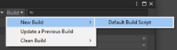
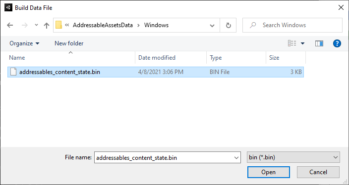
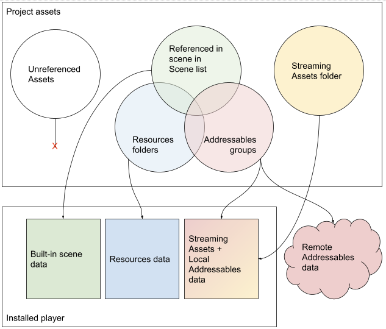
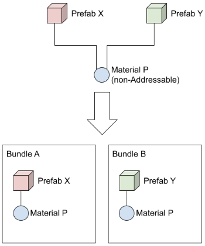
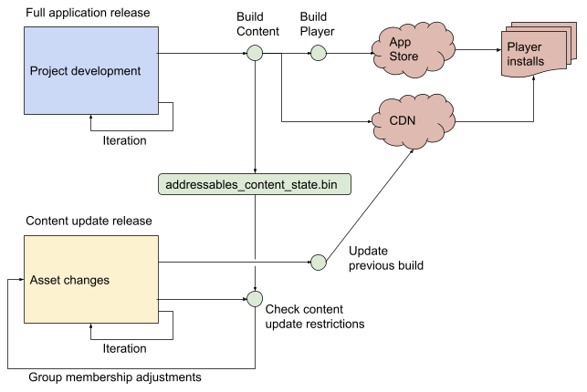
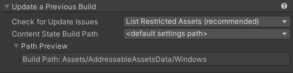
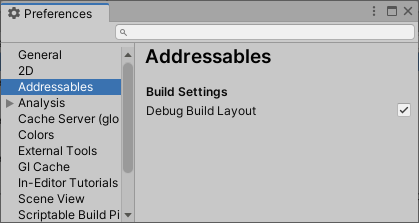
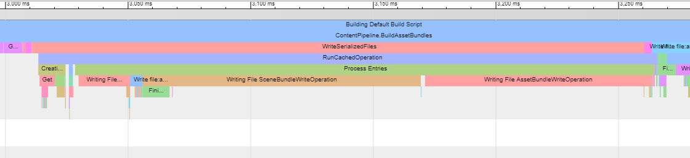

유니티 Addressables 문서 번역 3장 어드레서블 빌드

유니티/Addressables/유니티 문서/번역/

- [컨텐츠 빌드](#컨텐츠-빌드)
  - [플레이어 빌드로 어드레서블 콘텐츠 빌드하기](#플레이어-빌드로-어드레서블-콘텐츠-빌드하기)
  - [빌드 명령](#빌드-명령)
- [빌드 만들기](#빌드-만들기)
  - [전체 빌드 만들기](#전체-빌드-만들기)
    - [빌드 및 로드 경로 설정](#빌드-및-로드-경로-설정)
      - [기본 로컬 경로](#기본-로컬-경로)
      - [기본 원격 경로](#기본-원격-경로)
    - [원격 콘텐츠 빌드 설정](#원격-콘텐츠-빌드-설정)
    - [빌드 수행하기](#빌드-수행하기)
  - [업데이트 빌드 만들기](#업데이트-빌드-만들기)
    - [번들 변경 사항을 최소화하는 방법](#번들-변경-사항을-최소화하는-방법)
  - [어드레서블을 리빌드해야 하는 스크립트 변경 사항](#어드레서블을-리빌드해야-하는-스크립트-변경-사항)
- [어드레서블이 다른 프로젝트 에셋과 상호작용하는 방식](#어드레서블이-다른-프로젝트-에셋과-상호작용하는-방식)
  - [서브오브젝트 레퍼런스](#서브오브젝트-레퍼런스)
  - [에셋 및 에셋 번들 종속성](#에셋-및-에셋-번들-종속성)
- [빌드 스크립팅](#빌드-스크립팅)
  - [스크립트에서 어드레서블 빌드 시작](#스크립트에서-어드레서블-빌드-시작)
    - [어드레서블 에셋 설정 설정하기](#어드레서블-에셋-설정-설정하기)
    - [활성 프로필 설정](#활성-프로필-설정)
    - [활성 빌드 스크립트 설정](#활성-빌드-스크립트-설정)
    - [빌드 시작](#빌드-시작)
    - [빌드를 시작하는 스크립트 예시](#빌드를-시작하는-스크립트-예시)
    - [도메인 리로드 및 어드레서블 빌드](#도메인-리로드-및-어드레서블-빌드)
  - [커스텀 빌드 스크립팅](#커스텀-빌드-스크립팅)
    - [기본 빌드 스크립트 확장](#기본-빌드-스크립트-확장)
    - [콘텐츠 상태 저장](#콘텐츠-상태-저장)
  - [스크립트를 다시 컴파일할 때 어드레서블을 빌드할 수 있나요?](#스크립트를-다시-컴파일할-때-어드레서블을-빌드할-수-있나요)
    - [빌드하기 전에 스크립트를 안전하게 변경할 수 있는 방법이 있나요?](#빌드하기-전에-스크립트를-안전하게-변경할-수-있는-방법이-있나요)
- [어드레서블 및 스프라이트 아틀라스](#어드레서블-및-스프라이트-아틀라스)
  - [어드레서블 스프라이트](#어드레서블-스프라이트)
  - [스프라이트 종속성이 있는 주소 지정 가능 프리팹](#스프라이트-종속성이-있는-주소-지정-가능-프리팹)
- [셰이더](#셰이더)
- [빌드 아티팩트](#빌드-아티팩트)
  - [플레이어에 포함된 아티팩트](#플레이어에-포함된-아티팩트)
  - [플레이어에 포함되지 않은 아티팩트](#플레이어에-포함되지-않은-아티팩트)
    - [원격 콘텐츠](#원격-콘텐츠)
    - [콘텐츠 상태 파일](#콘텐츠-상태-파일)
    - [진단 데이터](#진단-데이터)
  - [콘텐츠 카탈로그](#콘텐츠-카탈로그)
    - [카탈로그 설정](#카탈로그-설정)
  - [공유 에셋 번들](#공유-에셋-번들)
- [콘텐츠 업데이트 빌드](#콘텐츠-업데이트-빌드)
  - [개요](#개요)
    - [전체 재빌드가 필요한 경우](#전체-재빌드가-필요한-경우)
  - [설정](#설정)
    - [그룹 업데이트 제한 설정](#그룹-업데이트-제한-설정)
      - [업데이트 방지 활성화(정적 콘텐츠)](#업데이트-방지-활성화정적-콘텐츠)
      - [업데이트 방지 비활성화(동적 콘텐츠)](#업데이트-방지-비활성화동적-콘텐츠)
    - [고유 번들 ID 설정](#고유-번들-id-설정)
  - [콘텐츠 업데이트 빌드 실행](#콘텐츠-업데이트-빌드-실행)
    - [콘텐츠 업데이트 제한 사항 확인 툴](#콘텐츠-업데이트-제한-사항-확인-툴)
  - [런타임에 콘텐츠 업데이트 확인](#런타임에-콘텐츠-업데이트-확인)
  - [콘텐츠 업데이트 예시](#콘텐츠-업데이트-예시)
  - [콘텐츠 업데이트가 종속성을 처리하는 방법](#콘텐츠-업데이트가-종속성을-처리하는-방법)
- [빌드 레이아웃 보고서](#빌드-레이아웃-보고서)
  - [빌드 보고서 생성](#빌드-보고서-생성)
  - [리포트 데이터](#리포트-데이터)
    - [요약 섹션](#요약-섹션)
    - [그룹 섹션](#그룹-섹션)
    - [에셋 번들 정보](#에셋-번들-정보)
    - [에셋 정보](#에셋-정보)
    - [파일 정보](#파일-정보)
    - [빌트인 번들](#빌트인-번들)
- [빌드 프로파일링](#빌드-프로파일링)

Addressables 1.21.12 기준 작성

---

# 컨텐츠 빌드

콘텐츠 빌드는 어드레서블 그룹을 처리하여 콘텐츠 카탈로그, ```[런타임 설정]```, 에셋이 포함된 에셋 번들을 생성합니다. 어드레서블은 이러한 파일을 사용하여 런타임에 콘텐츠를 로드합니다.

모든 플레이어 빌드의 일부로 어드레서블 콘텐츠를 빌드하도록 어드레서블 시스템을 구성하거나 플레이어 빌드를 만들기 전에 콘텐츠를 별도로 빌드할 수 있습니다. 이러한 옵션 구성에 대한 자세한 내용은 플레이어 빌드로 어드레서블 콘텐츠 빌드를 참조하십시오.

콘텐츠를 플레이어 빌드의 일부로 빌드하도록 Unity를 구성한 경우 에디터 빌드 설정 창에서 일반 Build 또는 Build and Run 버튼을 사용하여 빌드를 시작합니다. 명령줄에서 에디터를 호출하여 -buildPlatformPlayer 옵션 중 하나를 전달하거나 BuildPipeline.BuildPlayer와 같은 API를 사용하여 빌드를 시작할 수도 있습니다. 모든 경우에 Unity는 플레이어를 빌드하기 전에 사전 빌드 단계로 어드레서블 콘텐츠를 빌드합니다.

콘텐츠를 별도로 빌드하도록 Unity를 구성한 경우 빌드 제작에 설명된 대로 Addressables Groups 창의 Build 메뉴를 사용하여 어드레서블 빌드를 시작해야 합니다. 다음에 프로젝트의 플레이어를 빌드할 때 현재 플랫폼에 대해 마지막으로 실행한 어드레서블 콘텐츠 빌드에서 생성된 아티팩트를 사용합니다. 어드레서블 빌드 프로세스 자동화에 대한 자세한 내용은 빌드 스크립팅을 참조하십시오.

콘텐츠 빌드에서는 일반적으로 두 가지 범주의 콘텐츠를 생성할 수 있습니다:

- 로컬 콘텐츠(Local content): 플레이어 빌드에 직접 포함된 콘텐츠입니다. 로컬 콘텐츠에 기본 빌드 경로를 사용하는 한 어드레서블 시스템은 로컬 콘텐츠를 자동으로 관리합니다. 로컬 빌드 경로를 변경하는 경우 플레이어 빌드를 만들기 전에 로컬 빌드 경로의 아티팩트를 프로젝트의 Assets/StreamingAssets 폴더에 복사해야 합니다.
- 원격 콘텐츠(Remote content): 애플리케이션이 설치된 후 URL에서 다운로드되는 콘텐츠입니다. 애플리케이션이 지정된 URL(리모트 로드 경로에 지정됨)로 액세스할 수 있도록 원격 콘텐츠를 호스팅 서버에 업로드하는 것은 사용자의 책임입니다.
콘텐츠 빌드에서 생성된 파일에 대한 자세한 내용은 빌드 아티팩트를 참조하십시오.

그룹 설정은 그룹이 속한 카테고리를 결정하고, 활성 프로필은 어드레서블 시스템이 콘텐츠를 빌드하고 로드하는 데 사용하는 특정 경로와 URL을 결정합니다. (어드레서블 에셋 설정에는 원격 콘텐츠 빌드 여부와 같이 콘텐츠 빌드에 영향을 주는 옵션도 포함되어 있습니다.)

스크립트뿐만 아니라 Groups 창에서도 빌드를 시작할 수 있습니다. 어드레서블 콘텐츠 빌드를 확장하는 방법에 대한 자세한 내용은 빌드 스크립팅을 참조하세요.

어드레서블 시스템에는 다음과 같은 빌드 스크립트가 포함되어 있습니다:

- Default Build Script: 그룹, 프로필 및 어드레서블 시스템 설정을 기반으로 전체 콘텐츠 빌드를 수행합니다.
- Update a Previous Build: 이전에 생성된 빌드를 업데이트하기 위해 차등 콘텐츠 빌드를 수행합니다.
- Play Mode scripts: 플레이 모드 스크립트는 엄밀히 말해 빌드 스크립트이며, 에디터가 플레이 모드에서 콘텐츠에 액세스하는 방법을 제어합니다. 

자세한 내용은 플레이 모드 스크립트를 참조하세요.
빌드 스크립트는 생성한 캐시 파일을 지우는 기능도 제공합니다. 이 기능은 그룹 창의 Build > Clean Build 메뉴에서 실행할 수 있습니다.

## 플레이어 빌드로 어드레서블 콘텐츠 빌드하기

개발 중에 어드레서블 에셋을 수정하는 경우 플레이어를 빌드하기 전에 어드레서블 콘텐츠를 다시 빌드해야 합니다. 플레이어를 빌드하기 전에 별도의 단계로 어드레서블 콘텐츠 빌드를 실행하거나 어드레서블 콘텐츠 빌드와 플레이어 빌드를 함께 실행할 수 있습니다.

플레이어와 함께 어드레서블 콘텐츠를 빌드하면 편리할 수 있지만, 에셋을 수정하지 않은 경우에도 어드레서블 콘텐츠가 다시 빌드되므로 특히 대규모 프로젝트의 경우 빌드 시간이 늘어날 수 있습니다. 대부분의 빌드 사이에 어드레서블 콘텐츠를 변경하지 않는다면 이 옵션을 비활성화하는 것이 좋습니다.

프로젝트 어드레서블 에셋 설정의 Build Addressables on Player Build 설정은 어드레서블 콘텐츠 빌드에 사용할 옵션을 지정합니다. 각 프로젝트에 적합한 옵션을 선택하거나 글로벌 환경설정(Unity 에디터 환경설정의 Addressables 섹션에서 찾을 수 있음)으로 설정할 수 있습니다. 프로젝트 수준 설정을 설정하면 해당 프로젝트를 빌드하는 모든 기여자에게 적용됩니다. Preferences 설정은 특정 값을 설정하지 않은 모든 Unity 프로젝트에 적용됩니다.

>**_NOTE_**<BR>플레이어 빌드에서 어드레서블을 빌드하려면 Unity 2021.2 이상이 필요합니다. 이전 버전의 Unity에서는 별도의 단계로 어드레서블 콘텐츠를 빌드해야 합니다.

## 빌드 명령
그룹 창 상단의 도구 모음에 있는 Build 메뉴에서 빌드 명령에 액세스합니다.



메뉴에는 다음 항목이 제공됩니다:

- New Build: 전체 콘텐츠 빌드를 실행할 빌드 스크립트를 선택합니다. 어드레서블 패키지에는 Default Build Script인 하나의 빌드 스크립트가 포함되어 있습니다. 사용자 지정 빌드 스크립트를 생성한 경우 여기에서 액세스할 수 있습니다(빌드 스크립팅 참조).
- Update a Previous Build: 이전 빌드를 기반으로 차등 업데이트를 실행합니다. 원격 콘텐츠 배포를 지원하고 업데이트된 콘텐츠를 게시할 때 업데이트 빌드를 사용하면 다운로드 횟수를 줄일 수 있습니다. 콘텐츠 업데이트 빌드를 참조하세요.
- Clean Build: 기존 빌드 캐시 파일을 정리할 명령을 선택합니다. 각 빌드 스크립트는 이 메뉴에서 호출할 수 있는 정리 기능을 제공할 수 있습니다. (빌드 스크립팅 참조).

---

# 빌드 만들기

어드레서블 패키지를 사용하면 애플리케이션 플레이어와 별도의 단계로 콘텐츠(에셋 번들)를 빌드할 수 있습니다. 어드레서블 패키지는 이를 위한 자체 빌드 스크립트를 제공하며, 그룹 창의 툴바에서 액세스할 수 있습니다.

프로젝트를 빌드할 때 두 가지 옵션이 있습니다. 플레이어 빌드의 일부로 어드레서블 콘텐츠를 빌드하거나 별도의 단계로 빌드할 수 있습니다.

## 전체 빌드 만들기

콘텐츠 아티팩트를 빌드합니다:

1. 그룹 설정을 구성합니다.
2. 콘텐츠를 원격으로 배포하는 경우 프로필 및 어드레서블 시스템 설정을 구성하여 원격 콘텐츠 배포를 사용하도록 설정합니다.
3. 올바른 프로필을 선택합니다.
4. 그룹 창에서 빌드를 시작합니다.

>**_TIP_**<BR>개발 중에 빌드 또는 런타임 로딩 문제가 발생하는 경우 콘텐츠를 다시 빌드하기 전에 Build 메뉴에서 Clean > All 명령을 실행하는 것이 좋습니다.


### 빌드 및 로드 경로 설정

프로필은 로컬 콘텐츠와 원격 콘텐츠의 빌드 및 로드 경로에 대해 별도의 변수를 정의합니다. 여러 프로필을 생성하여 여러 종류의 빌드에 서로 다른 경로를 사용할 수 있습니다. 예를 들어 에디터에서 프로젝트를 개발하는 동안 사용할 프로필과 최종 콘텐츠 빌드를 퍼블리시할 때 사용할 프로필을 만들 수 있습니다.

대부분의 프로젝트에서 원격 콘텐츠 배포를 지원하는 경우에만 여러 프로필이 필요합니다. 일반적으로 개발 프로세스의 여러 단계에서 로컬 경로를 변경할 필요는 없습니다. 대부분의 프로젝트는 로컬 콘텐츠를 기본 로컬 빌드 경로로 빌드하고 기본 로컬 로드 경로(스트리밍 에셋 폴더로 확인됨)에서 로드해야 합니다.

>**_WARNING_**<BR>Windows의 파일 경로 제한은 260자입니다. 콘텐츠의 빌드 경로가 Windows에서 이 제한을 충족하거나 초과하는 경로를 만들면 빌드가 실패합니다. 프로젝트가 글자 수 제한에 가까운 디렉터리에 있는 경우에도 이 문제가 발생할 수 있습니다. 스크립터블 빌드 파이프라인은 빌드 도중 임시 디렉터리에 에셋 번들을 생성합니다. 이 임시 경로는 프로젝트의 하위 디렉터리로, 결국 Windows 제한을 초과하는 문자열을 생성할 수 있습니다. 어드레서블 콘텐츠 빌드가 경로의 일부를 찾을 수 없음 오류와 함께 실패하고 Windows를 사용 중이라면 이 문제가 원인일 가능성이 높습니다.

#### 기본 로컬 경로
로컬 빌드 경로는 기본적으로 Unity 프로젝트의 라이브러리 폴더 내에 있는 Addressables.BuildPath에서 제공하는 경로를 사용합니다. 어드레서블은 현재 플랫폼 빌드 타겟 설정에 따라 로컬 빌드 경로에 폴더를 추가합니다. 여러 플랫폼에 대해 빌드하는 경우 빌드는 각 플랫폼의 아티팩트를 다른 하위 폴더에 배치합니다.

마찬가지로 로컬 로드 경로는 기본적으로 StreamingAssets 폴더로 확인되는 Addressables.RuntimePath에서 제공하는 경로를 사용합니다. 다시 어드레서블은 플랫폼 빌드 타깃을 경로에 추가합니다.

로컬 번들을 기본 빌드 경로로 빌드하면 플레이어를 빌드할 때 빌드 코드가 빌드 경로의 아티팩트를 StreamingAssets 폴더에 임시로 복사합니다(빌드 후에는 제거).

>**_WARNING_**<BR>커스텀 로컬 경로로 빌드하거나 커스텀 로컬 경로에서 로드하는 경우, 플레이어를 빌드하기 전에 빌드 아티팩트를 프로젝트의 올바른 위치에 복사하고 애플리케이션이 런타임에 해당 아티팩트에 액세스할 수 있는지 확인하는 것은 사용자의 책임입니다.

#### 기본 원격 경로
어드레서블은 기본 원격 빌드 경로를 프로젝트 폴더 아래에 생성되는 임의로 선택한 폴더 이름인 "서버데이터"로 설정합니다. 빌드는 현재 플랫폼 타겟을 경로에 하위 폴더로 추가하여 다른 플랫폼에 대한 고유한 아티팩트를 분리합니다.

기본 원격 로드 경로는 ```"http://localhost/"```에 현재 프로파일 BuildTarget 변수가 추가된 경로입니다. 이 경로는 어드레서블 에셋을 로드할 기본 URL로 변경해야 합니다.

다른 프로필을 사용하여 수행 중인 개발, 테스트 또는 퍼블리싱 유형에 따라 원격 로드 경로를 적절하게 설정하세요. 예를 들어 일반 개발 빌드에는 로컬 호스트 서버에서 에셋을 로드하는 프로필을, QA 빌드에는 스테이징 환경에서 에셋을 로드하는 프로필을, 릴리스 빌드에는 콘텐츠 전송 네트워크(CDN)에서 에셋을 로드하는 프로필을 사용할 수 있습니다. 호스팅 구성에 대한 자세한 내용은 호스팅을 참조하세요.

>**_NOTE_**<BR>에디터에서 게임을 실행할 때 Use Asset Database 플레이 모드 스크립트를 사용하면 원격 또는 로컬 로드 경로를 통한 에셋 로드를 우회할 수 있습니다. 특히 로컬 호스트 서버가 설정되어 있지 않은 경우 편리할 수 있습니다. 하지만 그룹 구성 및 에셋 할당 실수가 숨겨질 수 있습니다.


### 원격 콘텐츠 빌드 설정
원격 콘텐츠 빌드를 설정하려면 다음과 같이 하세요:

1. Adressables시스템설정 에셋으로 이동합니다(메뉴: Window > Asset Management > Addressables > Settings).
2. Catalog 아래에서 Build Remote Catalog 옵션을 활성화합니다. 카탈로그의 BuildPath 및 LoadPath 설정은 원격 그룹에 사용하는 설정과 동일해야 합니다. 대부분의 경우 RemoteBuildPath 및 RemoteLoadPath 프로필 변수를 사용합니다.
3. 원격 콘텐츠로 빌드하려는 각 그룹에 대해 BuildPath 및 LoadPath 를 RemoteBuildPath 및 RemoteLoadPath 프로필 변수(또는 원하는 경우 사용자 지정 값)로 설정합니다.
4. 프로파일 창을 엽니다(메뉴: Window > Asset Management > Addressables > Profiles).
5. RemoteLoadPath 변수를 원격 콘텐츠를 호스팅할 URL로 설정합니다. 빌드 유형마다 다른 URL이 필요한 경우 각 빌드 유형에 대해 새 프로필을 생성합니다. 자세한 내용은 프로필 및 호스팅을 참조하세요.

자세한 내용은 원격 콘텐츠 배포를 참조하세요.


### 빌드 수행하기

그룹 및 어드레서블 시스템 설정을 구성한 후에는 콘텐츠 빌드를 실행할 수 있습니다:

1. 그룹 창을 엽니다(메뉴: Windows > Asset Management > Addressables > Groups).
툴바의 프로필 메뉴에서 원하는 Profile을 선택합니다.
2. Build > New Build 메뉴에서 Default Build Script를 선택합니다. (자체 빌드 스크립트를 생성한 경우 이 메뉴에서도 사용할 수 있습니다.)
3. 기본 빌드 스크립트는 각 그룹에 대해 하나 이상의 에셋 번들을 생성하고 로컬 또는 원격 빌드 경로에 저장합니다.


## 업데이트 빌드 만들기

콘텐츠를 원격으로 배포할 때 이전에 게시한 빌드의 차등 업데이트를 수행하여 사용자가 다운로드해야 하는 데이터의 양을 최소화할 수 있습니다(전체 빌드에 비해).

원격 그룹을 올바르게 구성하고 원격 콘텐츠가 포함된 이전 빌드가 있으면 다음과 같이 콘텐츠 업데이트 빌드를 수행할 수 있습니다:

1. 그룹 창을 엽니다(메뉴: Windows > Asset Management > Addressables > Groups).
2. 툴바의 Profile 메뉴에서 원하는 프로필을 선택합니다.
3. Build 메뉴에서 Update a Previous Build를 선택합니다.



*파일 선택 대화 상자가 열립니다.*

4. 업데이트하려는 빌드에서 생성한 addressables_content_state.bin 파일을 찾습니다. (기본 위치는 Assets/AddressableAssetsData/TargetPlatform 폴더에 있습니다.)

5. Open를 클릭하여 업데이트 빌드를 시작합니다.

기존 클라이언트를 업데이트하려면 업데이트된 원격 콘텐츠를 호스팅 서비스에 복사합니다(적절한 테스트 후). (업데이트 빌드에는 로컬 및 원격 콘텐츠가 모두 포함되며, 콘텐츠 업데이트 빌드 후에 생성하는 모든 플레이어 빌드에는 전체 어드레서블 에셋 세트가 포함됩니다).

이전 빌드를 업데이트해도 addressables_content_state.bin 파일은 변경되지 않습니다. 향후 업데이트 빌드에 동일한 버전의 파일을 사용합니다(New Build 메뉴에서 생성한 다른 전체 빌드를 게시할 때까지).

콘텐츠 업데이트 빌드 사용 방법 및 시기에 대한 자세한 내용은 콘텐츠 업데이트 빌드를 참조하세요.


### 번들 변경 사항을 최소화하는 방법

콘텐츠 번들의 용량이 클 수 있으며, 작은 변경 사항에 대해 전체 번들을 업데이트해야 하는 경우 모노스크립트의 작은 변경 사항에 대해 많은 양의 데이터가 업데이트될 수 있습니다. 어드레서블 설정에서 '모노스크립트 번들 명명 접두사' 옵션을 활성화하면 모노스크립트 오브젝트가 포함된 에셋 번들을 직렬화된 데이터와 별도로 빌드할 수 있습니다. 직렬화된 클래스 데이터에 변경 사항이 없는 경우 모노스크립트 번들만 변경되며 다른 번들은 업데이트할 필요가 없습니다.


## 어드레서블을 리빌드해야 하는 스크립트 변경 사항
Unity는 MonoScript 오브젝트를 사용하여 어드레서블 콘텐츠의 클래스를 참조하며, 이 오브젝트는 어셈블리 이름, 네임스페이스, 클래스 이름 또는 참조된 클래스 중 하나를 사용하여 클래스를 정의합니다.

런타임에 콘텐츠를 로드할 때 Unity는 모노스크립트를 사용하여 플레이어 어셈블리에서 런타임 클래스의 인스턴스를 로드하고 생성합니다. 모노스크립트의 변경 사항은 플레이어와 빌드된 어드레서블 콘텐츠 간에 일관성을 유지해야 합니다. 클래스를 올바르게 로드하려면 플레이어 콘텐츠와 어드레서블 콘텐츠를 모두 다시 빌드해야 합니다.

다음 작업을 수행하면 모노스크립트 데이터가 변경될 수 있습니다:

- 스크립트 파일을 다른 어셈블리 정의 파일 아래에 있는 위치로 옮기기
- 클래스가 포함된 어셈블리 정의 파일의 이름 변경
- 클래스 네임스페이스 추가 또는 변경
- 클래스 이름 변경

---

# 어드레서블이 다른 프로젝트 에셋과 상호작용하는 방식

프로젝트 빌드 설정에 씬을 포함하고 플레이어를 빌드하면 Unity는 해당 씬과 씬에 사용된 모든 에셋을 게임 또는 애플리케이션의 빌트인 데이터에 포함합니다. 마찬가지로 Unity는 프로젝트의 리소스 폴더에 있는 모든 에셋을 별도의 빌트인 에셋 컬렉션에 포함합니다. (씬의 에셋은 씬의 일부로만 로드되는 반면, 리소스의 에셋은 독립적으로 로드할 수 있다는 차이점이 있습니다.)

어드레서블 에셋은 게임이나 애플리케이션에 추가 '로컬' 에셋 세트로 빌드하거나 서버에서 호스팅되는 '원격' 에셋으로 게임 빌드 외부에 보관했다가 필요할 때 다운로드할 수 있습니다. 원격 에셋은 애플리케이션 자체와 독립적으로 업데이트할 수 있습니다(단, 원격 에셋에는 코드를 포함할 수 없으므로 에셋과 직렬화된 데이터만 변경할 수 있습니다).



*프로젝트 에셋을 플레이어 빌드로 익스포트하는 방법*

하지만 동일한 에셋을 두 개 이상의 카테고리에 사용하는 경우 Unity는 빌드할 때 단일 인스턴스를 공유하는 대신 에셋의 사본을 만듭니다. 예를 들어, 빌트인 씬에서 머티리얼을 사용하면서 리소스 폴더에 있는 프리팹에도 사용한 경우, 머티리얼 에셋 자체가 리소스에 있지 않더라도 빌드에 해당 머티리얼의 사본이 두 개가 생성됩니다. 그런 다음 동일한 머티리얼을 어드레서블로 표시하면 사본이 세 개가 됩니다. (프로젝트 StreamingAssets 폴더의 파일은 해당 폴더 외부의 에셋에서 참조할 수 없습니다.)

>**_NOTE_**<BR>플레이어를 빌드하기 전에 어드레서블 에셋의 콘텐츠 빌드를 만들어야 합니다. 플레이어 빌드 중에 유니티는 로컬 어드레서블을 스트리밍 에셋 폴더에 복사하여 스트리밍 에셋에 배치한 에셋과 함께 빌드에 포함시킵니다. (이러한 에셋은 빌드 프로세스가 끝나면 제거됩니다.) 콘텐츠 빌드에서 생성된 원격 어드레서블 파일을 호스팅 서비스에 업로드하는 것은 사용자의 책임입니다. 자세한 내용은 빌드를 참조하세요.

프로젝트에서 어드레서블을 사용할 때는 리소스 폴더에 있는 씬과 모든 데이터를 어드레서블 그룹으로 이동하여 어드레서블로 관리하는 것이 좋습니다.

빌드 설정 씬 목록에는 씬이 하나 이상 포함되어야 합니다. 애플리케이션 또는 게임을 초기화하는 최소한의 씬을 생성할 수 있습니다.

리소스 폴더의 데이터 양이 적으면 일반적으로 성능 문제가 발생하지 않습니다. 에셋을 배치하는 타사 패키지를 사용하는 경우 문제를 일으키지 않는 한 에셋을 이동할 필요가 없습니다. (주소 지정이 가능한 에셋은 리소스 폴더에 저장할 수 없습니다.)


## 서브오브젝트 레퍼런스
Unity는 에셋과 스크립트가 서로를 참조하는 방식에 따라 콘텐츠 빌드에 포함할 항목을 부분적으로 결정합니다. 서브오브젝트 레퍼런스는 프로세스를 더 복잡하게 만듭니다.

AssetReference가 주소 지정이 가능한 에셋의 서브오브젝트를 가리키는 경우 Unity는 빌드 시점에 전체 오브젝트를 에셋 번들에 빌드합니다. AssetReference가 서브오브젝트를 직접 참조하는 어드레서블 오브젝트(예: 게임 오브젝트, 스크립터블 오브젝트, 씬)를 가리키는 경우 Unity는 서브오브젝트를 암시적 종속성으로만 에셋 번들에 빌드합니다.


## 에셋 및 에셋 번들 종속성
에셋을 어드레서블 그룹에 추가하면 콘텐츠 빌드 시 해당 에셋이 에셋번들에 패킹됩니다. 이 경우 에셋은 번들에 명시적으로 포함되거나, 다시 말해 명시적 에셋입니다.

에셋이 다른 에셋을 참조하는 경우 참조된 에셋은 원본 에셋의 종속 요소입니다. 이를 에셋 종속성이라고 합니다. 에셋이 에셋번들 A에 패킹되고 참조된 에셋이 에셋번들 B에 패킹된 경우, 번들 B는 번들 A의 종속성이 되며 이를 에셋번들 종속성이라고 합니다. 자세한 내용은 에셋 번들 종속성 매뉴얼 페이지를 참조하십시오.

에셋 종속성은 어드레서블인지 여부에 따라 처리됩니다. 어드레서블인 종속성은 해당 종속성이 속한 그룹의 설정에 따라 에셋 번들에 패킹되며, 참조 에셋과 동일한 번들일 수도 있고 다른 번들일 수도 있습니다. 어드레서블이 아닌 종속성은 참조 에셋의 번들에 포함됩니다. 참조 에셋은 번들에 암시적으로 포함되어 있습니다. 즉, 암시적 에셋입니다.

>**_TIP_**<BR>번들 레이아웃 미리보기 분석 규칙을 사용하여 어드레서블 그룹의 콘텐츠에 따라 에셋 번들에 포함될 명시적 및 암시적 에셋을 확인할 수 있습니다. 이는 콘텐츠 빌드 전에 에셋을 미리 볼 때 유용합니다. 빌드 레이아웃 보고서 툴을 사용하면 콘텐츠 빌드에서 생성된 에셋 번들에 대한 자세한 정보를 표시할 수 있습니다.

두 개 이상의 어드레서블이 동일한 암시적 에셋을 참조하는 경우, 참조하는 어드레서블이 포함된 각 번들에 암시적 에셋의 사본이 포함됩니다.



*어드레서블이 아닌 에셋은 어드레서블을 참조하여 각 번들에 복사됩니다.*

암시적 에셋이 둘 이상의 번들에 포함될 때 발생할 수 있는 미묘한 결과는 런타임에 게임 로직이 예상하는 단일 인스턴스 대신 해당 에셋의 여러 인스턴스가 인스턴스화될 수 있다는 것입니다. 런타임에 인스턴스 상태를 변경하면 다른 모든 에셋이 공통 인스턴스를 공유하는 대신 개별 인스턴스를 갖게 되므로 동일한 번들의 오브젝트만 변경 사항을 볼 수 있습니다.

이러한 중복을 제거하려면 암시적 에셋을 어드레서블 에셋으로 만들어 기존 번들 중 하나에 포함하거나 다른 번들에 추가할 수 있습니다. 에셋이 추가된 번들은 해당 에셋을 참조하는 어드레서블 중 하나를 로드할 때마다 로드됩니다. 어드레서블이 참조된 에셋과 다른 에셋번들에 패킹된 경우, 참조된 에셋이 포함된 번들은 에셋번들 종속성이 됩니다.

종속 번들은 참조가 포함된 에셋뿐만 아니라 현재 번들의 모든 에셋을 로드할 때 로드해야 한다는 점에 유의하세요. 이 다른 에셋 번들의 에셋이 로드되지 않더라도 번들을 로드하는 데는 자체 런타임 비용이 발생합니다. 자세한 내용은 에셋 번들 종속성 로드의 메모리 영향을 참조하십시오.

>**_TIP_**<BR>중복 번들 종속성 확인 분석 규칙을 사용하여 프로젝트 콘텐츠 조직에서 발생하는 원치 않는 에셋 중복을 식별하고 해결하세요.

---

# 빌드 스크립팅

어드레서블 API를 사용하여 프로젝트 빌드를 사용자 지정할 수 있는 몇 가지 방법이 있습니다:

- 스크립트에서 빌드 시작
- 기존 스크립트 재정의
- 빌드 스크립트 베이스 확장 또는 IDataBuilder 구현

다른 에셋 유형을 처리하거나 다른 방식으로 에셋을 처리하도록 빌드 스크립트를 커스터마이징하는 경우, 에디터가 플레이 모드에서 해당 에셋을 동일한 방식으로 처리할 수 있도록 ```[플레이 모드 스크립트]```도 커스터마이징해야 할 수 있습니다.

## 스크립트에서 어드레서블 빌드 시작

다른 스크립트에서 어드레서블 빌드를 시작하려면 AddressableAssetSettings.BuildPlayerContent 메서드를 호출합니다.

빌드를 시작하기 전에 활성 프로필과 활성 빌드 스크립트를 설정해야 합니다. 원하는 경우 기본값과 다른 어드레서블 에셋 세팅 오브젝트를 설정할 수도 있습니다.

빌드를 수행할 때 빌드플레이어콘텐츠가 고려하는 몇 가지 정보가 있습니다: AddressableAssetSettingsDefaultObject, ActivePlayerDataBuilder, addressables_content_state.bin 파일입니다.

### 어드레서블 에셋 설정 설정하기

어드레서블 에셋 설정에 정의된 설정에는 그룹 목록과 사용할 프로필이 포함됩니다.

에디터(메뉴: Window > Asset Management > Addressables > Settings)에 표시되는 설정에 액세스하려면 정적 AddressableAssetSettingsDefaultObject.Settings 프로퍼티를 사용합니다. 그러나 원하는 경우 빌드에 다른 설정 오브젝트를 사용할 수 있습니다.

빌드에서 커스텀 설정 오브젝트를 로드하려면 다음과 같이 하세요:

```
static void getSettingsObject(string settingsAsset)
{
    // This step is optional, you can also use the default settings:
    //settings = AddressableAssetSettingsDefaultObject.Settings;

    settings
        = AssetDatabase.LoadAssetAtPath<ScriptableObject>(settingsAsset)
            as AddressableAssetSettings;

    if (settings == null)
        Debug.LogError($"{settingsAsset} couldn't be found or isn't " +
                       $"a settings object.");
}
```

### 활성 프로필 설정

BuildContent로 시작된 빌드는 활성 프로필의 변수 설정을 사용합니다. 커스터마이즈된 빌드 스크립트의 일부로 활성 프로필을 설정하려면 원하는 프로필의 ID를 AddressableAssetSettingsDefaultObject.Settings 오브젝트의 activeProfileId 필드에 할당합니다.

AddressableAssetSettings 오브젝트에는 프로필 목록이 포함되어 있습니다. 원하는 프로필의 이름을 사용하여 해당 프로필의 ID 값을 조회한 다음 해당 ID를 activeProfileId 변수에 할당합니다:

```
static void setProfile(string profile)
{
    string profileId = settings.profileSettings.GetProfileId(profile);
    if (String.IsNullOrEmpty(profileId))
        Debug.LogWarning($"Couldn't find a profile named, {profile}, " +
                         $"using current profile instead.");
    else
        settings.activeProfileId = profileId;
}
```

### 활성 빌드 스크립트 설정

BuildContent 메서드는 현재 ActivePlayerDataBuilder 세팅에 따라 빌드를 실행합니다. 특정 빌드 스크립트를 사용하려면 AddressableAssetSetting.DataBuilders 목록에 있는 IDataBuilder 오브젝트의 인덱스를 ```[ActivePlayerDataBuilderIndex]``` 프로퍼티에 할당합니다.

빌드 스크립트는 IDataBuilder를 구현하는 스크립터블 오브젝트여야 하며, 어드레서블 에셋 세팅 인스턴스의 데이터 빌더 목록에 추가해야 합니다. 목록에 추가한 후에는 표준 List.IndexOf 메서드를 사용하여 오브젝트의 인덱스를 가져옵니다.

```
static void setBuilder(IDataBuilder builder)
{
    int index = settings.DataBuilders.IndexOf((ScriptableObject)builder);

    if (index > 0)
        settings.ActivePlayerDataBuilderIndex = index;
    else
        Debug.LogWarning($"{builder} must be added to the " +
                         $"DataBuilders list before it can be made " +
                         $"active. Using last run builder instead.");
}
```

### 빌드 시작
사용할 프로필과 빌더를 설정한 후(원하는 경우) 빌드를 시작할 수 있습니다:

```
static bool buildAddressableContent()
{
    AddressableAssetSettings
        .BuildPlayerContent(out AddressablesPlayerBuildResult result);
    bool success = string.IsNullOrEmpty(result.Error);

    if (!success)
    {
        Debug.LogError("Addressables build error encountered: " + result.Error);
    }

    return success;
}
```
빌드 성공 여부를 확인하려면 BuildPlayerContent(out AddressablesPlayerBuildResult 결과)를 사용합니다. result.Error에는 어드레서블 빌드에 실패한 경우 반환되는 오류 메시지가 포함됩니다. string.IsNullOrEmpty(result.Error)가 참이면 빌드에 성공한 것입니다.


### 빌드를 시작하는 스크립트 예시
다음 예제는 에디터의 에셋 관리 > 어드레서블 메뉴에 몇 가지 메뉴 명령을 추가하는 예제입니다. 첫 번째 명령은 사전 설정된 프로필과 빌드 스크립트를 사용하여 어드레서블 콘텐츠를 빌드합니다. 두 번째 명령은 어드레서블 콘텐츠를 빌드하고, 성공하면 플레이어도 빌드합니다.

빌드 스크립트에서 도메인 리로드가 필요한 설정 변경을 수행하는 경우 에디터에서 대화형으로 실행하는 대신 Unity 명령줄 옵션을 사용하여 빌드 스크립트를 실행해야 합니다. 자세한 내용은 도메인 재로드 및 어드레서블 빌드를 참조하십시오.

```
#if UNITY_EDITOR
    using UnityEditor;
    using UnityEditor.AddressableAssets.Build;
    using UnityEditor.AddressableAssets.Settings;
    using System;
    using UnityEngine;

    internal class BuildLauncher
    {
        public static string build_script
            = "Assets/AddressableAssetsData/DataBuilders/BuildScriptPackedMode.asset";

        public static string settings_asset
            = "Assets/AddressableAssetsData/AddressableAssetSettings.asset";

        public static string profile_name = "Default";
        private static AddressableAssetSettings settings;


        static void getSettingsObject(string settingsAsset)
        {
            // This step is optional, you can also use the default settings:
            //settings = AddressableAssetSettingsDefaultObject.Settings;

            settings
                = AssetDatabase.LoadAssetAtPath<ScriptableObject>(settingsAsset)
                    as AddressableAssetSettings;

            if (settings == null)
                Debug.LogError($"{settingsAsset} couldn't be found or isn't " +
                               $"a settings object.");
        }


        static void setProfile(string profile)
        {
            string profileId = settings.profileSettings.GetProfileId(profile);
            if (String.IsNullOrEmpty(profileId))
                Debug.LogWarning($"Couldn't find a profile named, {profile}, " +
                                 $"using current profile instead.");
            else
                settings.activeProfileId = profileId;
        }


        static void setBuilder(IDataBuilder builder)
        {
            int index = settings.DataBuilders.IndexOf((ScriptableObject)builder);

            if (index > 0)
                settings.ActivePlayerDataBuilderIndex = index;
            else
                Debug.LogWarning($"{builder} must be added to the " +
                                 $"DataBuilders list before it can be made " +
                                 $"active. Using last run builder instead.");
        }


        static bool buildAddressableContent()
        {
            AddressableAssetSettings
                .BuildPlayerContent(out AddressablesPlayerBuildResult result);
            bool success = string.IsNullOrEmpty(result.Error);

            if (!success)
            {
                Debug.LogError("Addressables build error encountered: " + result.Error);
            }

            return success;
        }


        [MenuItem("Window/Asset Management/Addressables/Build Addressables only")]
        public static bool BuildAddressables()
        {
            getSettingsObject(settings_asset);
            setProfile(profile_name);
            IDataBuilder builderScript
                = AssetDatabase.LoadAssetAtPath<ScriptableObject>(build_script) as IDataBuilder;

            if (builderScript == null)
            {
                Debug.LogError(build_script + " couldn't be found or isn't a build script.");
                return false;
            }

            setBuilder(builderScript);

            return buildAddressableContent();
        }

        [MenuItem("Window/Asset Management/Addressables/Build Addressables and Player")]
        public static void BuildAddressablesAndPlayer()
        {
            bool contentBuildSucceeded = BuildAddressables();

            if (contentBuildSucceeded)
            {
                var options = new BuildPlayerOptions();
                BuildPlayerOptions playerSettings
                    = BuildPlayerWindow.DefaultBuildMethods.GetBuildPlayerOptions(options);

                BuildPipeline.BuildPlayer(playerSettings);
            }
        }
    }
#endif
```

### 도메인 리로드 및 어드레서블 빌드
스크립팅된 빌드 프로세스에 어드레서블 빌드를 만들기 전에 도메인 리로드를 트리거하는 설정 변경이 포함된 경우 에디터에서 스크립트를 대화형으로 실행하는 대신 Unity의 명령줄 인수를 사용하도록 해당 빌드를 스크립팅해야 합니다. 이러한 유형의 설정에는 다음이 포함됩니다:

- 정의된 컴파일러 심볼 변경
- 플랫폼 타겟 또는 타겟 그룹 변경

에디터에서 메뉴 명령 등을 사용하여 도메인 리로드를 트리거하는 스크립트를 인터랙티브하게 실행하면 도메인 리로드가 발생하기 전에 에디터 스크립트 실행이 완료됩니다. 따라서 어드레서블 빌드를 즉시 시작하면 코드와 임포트한 에셋이 모두 원래 상태로 유지됩니다. 콘텐츠 빌드를 시작하기 전에 도메인 로드가 완료될 때까지 기다려야 합니다.

도메인 로드가 완료될 때까지 기다리는 것은 명령줄에서 빌드를 실행할 때는 비교적 간단하지만 대화형 스크립트에서는 여러 가지 이유로 인해 안정적으로 수행하기 어렵거나 불가능할 수 있습니다.

다음 예제 스크립트에서는 명령줄에서 Unity를 실행할 때 호출할 수 있는 두 가지 함수를 정의합니다. ChangeSettings 예제는 지정된 정의 기호를 설정합니다. BuildContentAndPlayer 함수는 어드레서블 빌드와 플레이어 빌드를 실행합니다.

```
#if UNITY_EDITOR
    using System;
    using UnityEditor;
    using UnityEditor.AddressableAssets;
    using UnityEditor.AddressableAssets.Build;
    using UnityEditor.AddressableAssets.Settings;
    using UnityEditor.Build.Reporting;
    using UnityEngine;

    internal class BatchBuild
    {
        public static string build_script
            = "Assets/AddressableAssetsData/DataBuilders/BuildScriptPackedMode.asset";

        public static string profile_name = "Default";

        public static void ChangeSettings()
        {
            string defines = "";
            string[] args = Environment.GetCommandLineArgs();

            foreach (var arg in args)
                if (arg.StartsWith("-defines=", System.StringComparison.CurrentCulture))
                    defines = arg.Substring(("-defines=".Length));

            var buildSettings = EditorUserBuildSettings.selectedBuildTargetGroup;
            PlayerSettings.SetScriptingDefineSymbolsForGroup(buildSettings, defines);
        }

        public static void BuildContentAndPlayer()
        {
            AddressableAssetSettings settings
                = AddressableAssetSettingsDefaultObject.Settings;

            settings.activeProfileId
                = settings.profileSettings.GetProfileId(profile_name);

            IDataBuilder builder
                = AssetDatabase.LoadAssetAtPath<ScriptableObject>(build_script) as IDataBuilder;

            settings.ActivePlayerDataBuilderIndex
                = settings.DataBuilders.IndexOf((ScriptableObject)builder);

            AddressableAssetSettings.BuildPlayerContent(out AddressablesPlayerBuildResult result);

            if (!string.IsNullOrEmpty(result.Error))
                throw new Exception(result.Error);

            BuildReport buildReport
                = BuildPipeline.BuildPlayer(EditorBuildSettings.scenes,
                    "d:/build/winApp.exe", EditorUserBuildSettings.activeBuildTarget,
                    BuildOptions.None);

            if (buildReport.summary.result != BuildResult.Succeeded)
                throw new Exception(buildReport.summary.ToString());
        }
    }
#endif
```

이러한 함수를 호출하려면 터미널이나 명령 프롬프트 또는 셸 스크립트에서 Unity의 명령줄 인수를 사용합니다:

```
D:\Unity\2020.3.0f1\Editor\Unity.exe -quit -batchMode -projectPath . -executeMethod BatchBuild.ChangeSettings -defines=FOO;BAR -buildTarget Android
D:\Unity\2020.3.0f1\Editor\Unity.exe -quit -batchMode -projectPath . -executeMethod BatchBuild.BuildContentAndPlayer -buildTarget Android
```

>**_NOTE_**<BR>플랫폼 대상을 명령줄 매개변수로 지정하면 동일한 명령에서 어드레서블 빌드를 수행할 수 있습니다. 그러나 스크립트에서 플랫폼을 변경하려면 이 예제의 ChangeSettings 함수와 같은 별도의 명령으로 변경해야 합니다.

## 커스텀 빌드 스크립팅
새 사용자 지정 스크립트를 구성하려면 빌드 및 재생 모드 스크립트 목록에 추가합니다.

커스텀 스크립트는 BuildScriptBase 클래스를 확장하거나 IDataBuilder 인터페이스를 구현합니다. ClearCachedData 및 ```CanBuildData<T>```와 같이 재정의 가능한 메서드가 몇 가지 있습니다. BuildScriptBase 클래스를 확장하는 경우 재정의할 수 있는 가장 주목할 만한 메서드는 ```BuildDataImplementation<TResult>```입니다. 이 메서드는 콘텐츠를 설정하거나 빌드하는 데 사용되는 메서드입니다.

커스텀 스크립트는 빌드 스크립트 또는 플레이 모드 스크립트 중 하나입니다. 이는 ```CanBuildData<T>``` 메서드가 구현되는 방식에 따라 결정됩니다. 빌드 스크립트는 AddressablesPlayerBuildResult 유형의 데이터만 빌드할 수 있으므로 이 메서드는 이러한 방식으로 구현됩니다:

```
public override bool CanBuildData<T>()
{
    return typeof(T).IsAssignableFrom(typeof(AddressablesPlayerBuildResult));
}
```

이렇게 하면 스크립트를 Build/New Build/ 메뉴에 나열할 수 있습니다.

플레이 모드 스크립트는 AddressablesPlayModeBuildResult 유형의 데이터만 빌드할 수 있으므로 메서드는 이러한 방식으로 구현됩니다:

```
public override bool CanBuildData<T>()
{
    return typeof(T).IsAssignableFrom(typeof(AddressablesPlayModeBuildResult));
}
```

이렇게 하면 스크립트가 Play Mode Scripts 메뉴에 나열됩니다.

예제는 사용자 지정 빌드 및 플레이 모드 스크립트 샘플을 참조하세요.

### 기본 빌드 스크립트 확장
기본 빌드 스크립트 BuildScriptPackedMode와 동일한 기본 빌드를 사용하되 특정 그룹이나 에셋 유형을 다르게 처리하려는 경우 기본 빌드 스크립트를 확장하고 그 안에 있는 함수를 재정의할 수 있습니다. 빌드 스크립트가 처리하는 그룹이나 에셋을 다르게 처리하려는 경우 자체 코드를 실행할 수 있으며, 그렇지 않은 경우 함수의 베이스 클래스 버전을 호출하여 기본 알고리즘을 사용할 수 있습니다.

예제는 어드레서블 변형 프로젝트를 참조하세요.

### 콘텐츠 상태 저장
원격 콘텐츠 배포를 지원하고 플레이어 릴리스 간에 콘텐츠를 업데이트하는 경우 빌드 시점에 어드레서블 그룹의 상태를 기록해야 합니다. 상태를 기록하면 이전 빌드 업데이트 스크립트를 사용하여 차등 빌드를 수행할 수 있습니다.

자세한 내용은 BuildScriptPackedMode 및 ContentUpdateScript의 구현을 참조하세요.


## 스크립트를 다시 컴파일할 때 어드레서블을 빌드할 수 있나요?

도메인 다시 로드를 트리거하는 사전 빌드 단계가 있는 경우 도메인 다시 로드가 완료될 때까지 어드레서블 빌드 자체가 시작되지 않도록 특별히 주의해야 합니다.

스크립팅 정의 심볼 설정(PlayerSettings.SetScriptingDefineSymbolsForGroup) 또는 활성 빌드 타겟 전환(EditorUserBuildSettings.SwitchActiveBuildTarget) 등의 메서드를 사용하면 스크립트를 다시 컴파일하고 다시 로드하도록 트리거할 수 있습니다. 에디터 코드 실행은 도메인이 다시 로드되고 실행이 중지될 때까지 현재 로드된 도메인으로 계속됩니다. 플랫폼 종속 컴파일 또는 사용자 정의 정의는 도메인이 다시 로드될 때까지 설정되지 않습니다. 이로 인해 코드가 이러한 정의에 의존하여 올바르게 빌드되는 예기치 않은 문제가 발생할 수 있으며 쉽게 놓칠 수 있습니다.

### 빌드하기 전에 스크립트를 안전하게 변경할 수 있는 방법이 있나요?
플랫폼을 전환하거나 코드에서 에디터 스크립트를 수정한 다음 정의 세트를 계속 사용하려면 도메인 다시 로드를 수행해야 합니다. 이 경우 -quit 인수를 사용해서는 안 되며, 그렇지 않으면 호출된 메서드가 실행된 후 에디터가 즉시 종료됩니다.

도메인이 다시 로드되면 InitializeOnLoad가 호출됩니다. 아래 코드는 스크립팅 정의 심볼을 설정하고 에디터 코드에서 해당 심볼에 반응하여 도메인 재로드가 완료된 후 어드레서블을 빌드하는 방법을 보여줍니다. 플랫폼 전환 및 플랫폼 종속 컴파일에 대해서도 동일한 프로세스를 수행할 수 있습니다.

```
[InitializeOnLoad]
public class BuildWithScriptingDefinesExample
{
    static BuildWithScriptingDefinesExample()
    {
        bool toBuild = SessionState.GetBool("BuildAddressables", false);
        SessionState.EraseBool("BuildAddressables");
        if (toBuild)
        {
            Debug.Log("Domain reload complete, building Addressables as requested");
            BuildAddressablesAndRevertDefines();
        }
    }

    [MenuItem("Build/Addressables with script define")]
    public static void BuildTest()
    {
#if !MYDEFINEHERE
        Debug.Log("Setting up SessionState to inform an Addressables build is requested on next Domain Reload");
        SessionState.SetBool("BuildAddressables", true);
        string originalDefines = PlayerSettings.GetScriptingDefineSymbolsForGroup(EditorUserBuildSettings.selectedBuildTargetGroup);
        string newDefines = string.IsNullOrEmpty(originalDefines) ? "MYDEFINEHERE" : originalDefines + ";MYDEFINEHERE";
        Debug.Log("Setting Scripting Defines, this will then start compiling and begin a domain reload of the Editor Scripts.");
        PlayerSettings.SetScriptingDefineSymbolsForGroup(EditorUserBuildSettings.selectedBuildTargetGroup, newDefines);
#endif
    }

    static void BuildAddressablesAndRevertDefines()
    {
#if MYDEFINEHERE
        Debug.Log("Correct scripting defines set for desired build");
        AddressableAssetSettings.BuildPlayerContent();
        string originalDefines = PlayerSettings.GetScriptingDefineSymbolsForGroup(EditorUserBuildSettings.selectedBuildTargetGroup);
        if (originalDefines.Contains(";MYDEFINEHERE"))
            originalDefines = originalDefines.Replace(";MYDEFINEHERE", "");
        else
            originalDefines = originalDefines.Replace("MYDEFINEHERE", "");
        PlayerSettings.SetScriptingDefineSymbolsForGroup(EditorUserBuildSettings.selectedBuildTargetGroup, originalDefines);
        AssetDatabase.SaveAssets();
#endif
        EditorApplication.Exit(0);
    }
}
```

---

# 어드레서블 및 스프라이트 아틀라스

일부 스프라이트아틀라스 옵션은 Unity가 스프라이트를 로드하는 방식을 변경할 수 있습니다. 에셋 데이터베이스 사용 플레이 모드 스크립트를 사용하려는 경우 고려해야 할 중요한 사항입니다.

다음 예제에서는 어드레서블이 다른 에셋과 스프라이트아틀라스를 다르게 처리하는 방법을 보여줍니다:

## 어드레서블 스프라이트

**예제 1:**

3개의 별도 그룹에 3개의 어드레서블 텍스처가 있으며, 각 텍스처는 약 500KB로 빌드됩니다. 이 텍스처는 별도의 그룹에 존재하므로 Unity는 이를 3개의 개별 에셋 번들로 빌드합니다. 각 에셋 번들은 약 500KB를 사용하며 종속성 없이 스프라이트 텍스처와 관련 메타데이터만 포함합니다.

**예제 2:**

예제 1의 텍스처 세 개를 어드레서블 스프라이트 아틀라스에 넣습니다. 이 경우에도 Unity는 여전히 세 개의 에셋 번들을 생성하지만 크기가 동일하지 않습니다. 에셋 번들 중 하나는 아틀라스 텍스처를 포함하며 약 1500KB를 사용합니다. 다른 두 개의 에셋 번들은 스프라이트 메타데이터만 포함하며 아틀라스 에셋 번들을 종속성으로 나열합니다.

텍스처가 포함된 에셋 번들을 제어할 수는 없지만 프로세스가 결정적이기 때문에 동일한 에셋 번들이 다른 리빌드를 통해 텍스처를 포함하게 됩니다. 이것이 표준 종속성 중복과 가장 큰 차이점입니다. 스프라이트는 로드할 SpriteAtlas 텍스처에 종속되지만 해당 텍스처는 세 개의 에셋 번들 모두에 빌드되지 않고 하나의 에셋 번들에만 빌드됩니다.

**예제 3:**

이번에는 예제 2의 스프라이트아틀라스가 자체 에셋 번들에서 어드레서블로 표시되어 있습니다. 이제 Unity는 4개의 에셋 번들을 생성합니다. Unity 버전 2020.x 이상을 사용하는 경우 예상대로 빌드됩니다. 스프라이트가 포함된 세 개의 에셋 번들은 각각 몇KB에 불과하며, 스프라이트 아틀라스가 포함된 네 번째 에셋 번들에 종속되어 있으며 약 1500KB입니다. 2019.4 이상을 사용하는 경우 텍스처 자체가 다른 곳에 있을 수 있습니다. 세 개의 스프라이트 에셋 번들은 여전히 스프라이트 아틀라스 에셋 번들에 의존합니다. 그러나 SpriteAtlas 에셋 번들에는 메타데이터만 포함될 수 있으며 텍스처는 다른 스프라이트 에셋 번들 중 하나에 있을 수 있습니다.

## 스프라이트 종속성이 있는 주소 지정 가능 프리팹

**예제 1:**

어드레서블 스프라이트 프리팹이 세 개 있는데, 각 프리팹에는 자체 스프라이트에 대한 종속성(약 500KB)이 있습니다. 세 개의 프리팹을 개별적으로 빌드하면 각각 약 500KB의 에셋 번들 세 개가 생성됩니다.

**예제 2:**

이전 예제의 텍스처 세 개가 스프라이트 아틀라스에 추가되었지만 해당 아틀라스는 어드레서블로 표시되지 않았습니다. 이 시나리오에서는 SpriteAtlas 텍스처가 복제됩니다. 세 개의 에셋 번들은 모두 약 1500KB입니다. 이는 종속성 중복에 대한 일반적인 규칙에 따라 예상되지만 "어드레서블 스프라이트 예제 2"에서 볼 수 있는 동작에 위배됩니다.

**예제 3:**

이전 예제의 스프라이트 아틀라스도 이제 어드레서블로 표시됩니다. 명시적 포함 규칙에 따라 SpriteAtlas 텍스처는 SpriteAtlas가 포함된 에셋 번들에만 포함됩니다. 프리팹이 있는 에셋 번들은 이 네 번째 에셋 번들을 종속성으로 참조합니다. 이렇게 하면 약 500KB의 에셋 번들 세 개와 약 1500KB의 에셋 번들 하나가 생성됩니다.

---

# 셰이더

기본적으로 Unity는 씬에서 사용되지 않는 셰이더 배리언트를 제거합니다. 이렇게 하면 에셋 번들에서만 사용되는 배리언트가 제외될 수 있습니다. 특정 배리언트가 제거되지 않도록 하려면 그래픽스 설정의 Shader Stripping 프로퍼티에 해당 배리언트를 포함시킵니다.

예를 들어 혼합 조명과 같은 라이트맵 관련 셰이더를 사용하는 어드레서블 에셋이 있는 경우 Edit > Project Settings > Graphics > Shader Stripping으로 이동하여 Lightmap Mode 프로퍼티를 Custom로 설정합니다.

품질 설정은 에셋 번들에서 사용되는 셰이더 배리언트에도 영향을 줍니다.

---

# 빌드 아티팩트

콘텐츠 빌드는 여러 위치에 파일을 생성하지만 Unity가 빌드된 플레이어에 모든 파일을 포함하지는 않습니다. 일반적으로 Unity는 빌드된 플레이어에 로컬 콘텐츠와 관련된 파일은 포함하지만 원격 콘텐츠와 관련된 파일은 제외합니다.

로컬 콘텐츠와 관련된 대부분의 파일은 라이브러리/com.unity.addressables 폴더에 있습니다. 이 폴더는 Unity에서 어드레서블 파일을 저장하는 데 사용하는 라이브러리 폴더의 특수 하위 폴더입니다. 라이브러리 폴더에 대한 자세한 내용은 에셋 임포트를 참조하십시오.

## 플레이어에 포함된 아티팩트
플레이어 빌드 중에 어드레서블 시스템은 ```Library/com.unity.addressables/aa/<AddressablesPlatform>``` 폴더에서 스트리밍 에셋 폴더로 다음 파일을 복사합니다:

- 로컬 에셋 번들(.bundle): 그룹, 프로필, 플랫폼 설정에 따라 다릅니다. 기본적으로 이러한 파일은 BuildTarget 하위 폴더에 있습니다. 그룹에서 생성한 번들 파일의 빌드 위치를 변경하려면 빌드 및 로드 경로 설정을 수정합니다.
- settings.json: 런타임에 사용되는 어드레서블 구성 데이터를 포함합니다.
- catalog.json: 런타임에 에셋을 찾고 로드하는 데 사용되는 콘텐츠 카탈로그(최신 원격 카탈로그를 사용할 수 없는 경우). 카탈로그에 대한 자세한 내용은 콘텐츠 카탈로그를 참조하세요.
- AddressablesLink/link.xml: Unity 링커가 에셋에 사용되는 유형을 스트리핑하지 못하도록 방지합니다. 코드 스트리핑에 대한 자세한 내용은 관리형 코드 스트리핑을 참조하십시오. Unity 버전 2021.2 이상에서 이 파일은 임시로 AddressableAssetSettings.ConfigFolder를 복사하거나 설정 파일이 없는 경우 Assets/Addressables_Temp 폴더를 복사합니다.

플랫폼 이름 전체 목록은 어드레서블플랫폼을 참조하세요.

## 플레이어에 포함되지 않은 아티팩트
### 원격 콘텐츠
원격 콘텐츠에 사용되는 파일은 호스팅 서버에 업로드해야 합니다. 기본적으로 이러한 파일은 ServerData 폴더에 있습니다.

파일은 다음과 같습니다:

- 원격 에셋 번들(.bundle): 그룹, 프로필, 플랫폼 설정에 따라 다릅니다. 기본적으로 이러한 파일은 BuildTarget 하위 폴더에 있습니다. 그룹에서 생성한 파일의 빌드 위치를 변경하려면 빌드 및 로드 경로 설정을 수정합니다.
- catalog_{timestamp or player version}.json: 다운로드 시 로컬 카탈로그를 재정의하는 원격 카탈로그입니다. 이 파일은 카탈로그 설정에서 Build Remote Catalogs 옵션이 활성화된 경우에만 생성됩니다. 이 파일의 빌드 위치를 변경하려면 카탈로그 설정에서 Build & Load Paths를 수정합니다. 기본적으로 파일 이름에는 빌드 타임스탬프가 포함됩니다. 대신 버전 번호를 사용하려면 카탈로그 설정에서 Player Version Override 값을 지정합니다. 카탈로그에 대한 자세한 내용은 콘텐츠 카탈로그를 참조하세요.
- catalog_{timestamp or player version}.hash: 클라이언트 앱이 마지막으로 다운로드한 이후 원격 카탈로그가 변경되었는지 확인하는 데 사용되는 파일입니다. 원격 카탈로그 파일과 마찬가지로 이 파일은 카탈로그 설정에서 Build Remote Catalogs 옵션이 활성화된 경우에만 생성됩니다. 이 파일의 빌드 위치를 변경하려면 카탈로그 설정에서 Build & Load Paths를 수정합니다. 기본적으로 파일 이름에는 빌드 타임스탬프가 포함됩니다. 대신 버전 번호를 사용하려면 카탈로그 설정에서 Player Version Override 값을 지정합니다. 카탈로그에 대한 자세한 내용은 콘텐츠 카탈로그를 참조하세요.

### 콘텐츠 상태 파일
addressables_content_state.bin 파일은 콘텐츠 업데이트 빌드를 만드는 데 사용됩니다. 동적 콘텐츠 업데이트를 지원하는 경우 전체 콘텐츠 빌드를 릴리스할 때마다 이 파일을 저장해야 합니다. 그렇지 않으면 이 파일을 무시해도 됩니다.

기본적으로 이 파일은 ```Assets/AddressableAssetsData/<AddressablesPlatform>```에 있습니다. 모든 플랫폼 이름은 어드레서블플랫폼을 참조하세요. 파일의 빌드 위치를 변경하려면 이전 빌드 업데이트에서 Content State Build Path의 값을 지정합니다.

>**_NOTE_**<BR>이 파일을 버전 관리에서 확인하고 플레이어 빌드가 릴리스될 때마다 새 브랜치를 생성하는 것이 좋습니다.

### 진단 데이터
콘텐츠 빌드에 대한 데이터를 수집하기 위해 추가 파일을 생성할 수 있습니다.

파일은 다음과 같습니다:

- 라이브러리/com.unity.addressables/AddressablesBuildTEP.json: 빌드 성능 데이터. 빌드 프로파일링을 참조하십시오.
- 라이브러리/com.unity.addressables/buildlayoutreport: 빌드에서 생성된 에셋 번들에 대한 정보. 빌드 레이아웃 보고서를 참조하십시오.


## 콘텐츠 카탈로그

콘텐츠 카탈로그는 어드레서블이 시스템에 제공된 키를 기반으로 에셋의 실제 위치를 조회하는 데 사용하는 데이터 저장소입니다. 어드레서블은 모든 어드레서블 에셋에 대해 단일 카탈로그를 빌드합니다. 카탈로그는 애플리케이션 플레이어를 빌드할 때 스트리밍 에셋 폴더에 배치됩니다. 로컬 카탈로그는 로컬 에셋뿐만 아니라 원격 에셋에도 액세스할 수 있지만, 애플리케이션의 전체 빌드 간에 콘텐츠를 업데이트하려면 원격 카탈로그를 생성해야 합니다.

원격 카탈로그는 원격 콘텐츠와 함께 호스팅하는 카탈로그의 별도 복사본입니다. 궁극적으로 어드레서블은 이러한 카탈로그 중 하나만 사용합니다. 해시 파일에는 카탈로그의 해시(수학적 지문)가 포함되어 있습니다. 원격 카탈로그가 빌드되고 로컬 카탈로그와 다른 해시가 있는 경우 해당 카탈로그가 다운로드되고 캐시되어 내장된 로컬 카탈로그 대신 사용됩니다. 콘텐츠 업데이트 빌드를 생성하면 해시가 업데이트되고 새 원격 카탈로그는 업데이트된 에셋의 변경된 버전을 가리킵니다.

>**_NOTE_**<BR>게시하는 전체 플레이어 빌드에 대해 원격 카탈로그를 활성화해야 합니다. 그렇지 않으면 어드레서블 시스템이 원격 카탈로그를 확인하지 않으므로 콘텐츠 업데이트를 감지할 수 없습니다. 원격 카탈로그 활성화하기를 참조하세요.

어드레서블은 프로젝트당 하나의 콘텐츠 카탈로그를 생성하지만, 다른 Unity 프로젝트에서 생성한 카탈로그를 로드하여 해당 프로젝트에서 생성한 어드레서블 에셋을 로드할 수 있습니다. 이렇게 하면 별도의 프로젝트를 사용하여 일부 에셋을 개발 및 빌드할 수 있으므로 대규모 프로덕션에서 반복 작업과 팀 협업을 더 쉽게 수행할 수 있습니다. 카탈로그 로딩에 대한 자세한 내용은 런타임에 카탈로그 관리하기를 참조하십시오.

### 카탈로그 설정
카탈로그 설정을 사용하여 로컬 및 원격 카탈로그를 구성할 수 있습니다.

카탈로그 크기를 최소화하려면 다음 설정을 사용합니다:

1. 로컬 카탈로그 압축. 빌드에서 카탈로그의 크기가 가장 중요한 경우 카탈로그 설정에 Compress Local Catalog이라는 옵션이 있습니다. 이 옵션은 게임과 함께 제공되는 카탈로그를 에셋 번들로 빌드합니다. 카탈로그를 압축하면 파일 자체의 크기는 작아지지만 카탈로그 로드 시간이 늘어납니다.
2. 빌트인 씬 및 리소스 비활성화. 어드레서블은 리소스 및 빌트인 씬 목록에서 콘텐츠를 로드하는 기능을 제공합니다. 기본적으로 이 기능은 켜져 있으므로 이 기능이 필요하지 않은 경우 카탈로그가 부풀어 오를 수 있습니다. 이 기능을 비활성화하려면 그룹 창(Window > Asset Management > Addressables > Groups)에서 "내장 데이터" 그룹을 선택합니다. 해당 그룹의 설정에서 "리소스 폴더 포함" 및 "빌드 설정 장면 포함"을 선택 해제할 수 있습니다. 이 옵션을 선택 해제하면 어드레서블 카탈로그에서 해당 에셋 유형에 대한 참조만 제거됩니다. 콘텐츠 자체는 여전히 생성한 플레이어에 빌드되며 레거시 API를 통해 계속 로드할 수 있습니다.
3. Internal Asset Naming Mode와 같이 카탈로그 크기를 줄이는 데 도움이 되는 몇 가지 그룹 설정이 있습니다. 자세한 내용은 고급 그룹 설정을 참조하세요.


## 공유 에셋 번들

AddressableAssetGroups 그룹에서 생성된 번들 외에도 빌드에서 "공유 에셋 번들"이라는 특수한 번들을 생성할 수 있습니다. 여기에는 unitybuiltinshaders 에셋 번들과 MonoScript 에셋 번들이 있습니다.

전자는 빌드에 포함된 에셋에서 빌트인 셰이더를 사용하는 경우 생성됩니다. 스탠다드 셰이더와 같이 Unity 에디터에 기본 제공되는 셰이더를 참조하는 모든 어드레서블 에셋은 이 특수 셰이더인 에셋 번들을 참조하여 생성됩니다. 빌트인 셰이더 번들의 명명 방법은 어드레서블 빌드 설정의 Shader Bundle Naming Prefix 옵션을 사용하여 변경할 수 있습니다.

후자는 어드레서블 빌드 설정에서 MonoScript Bundle Naming Prefix 옵션을 변경하여 켜거나 끌 수 있습니다. MonoScript 번들에는 여기에 나열된 명명 옵션이 있으며, 이는 일반적으로 다중 프로젝트 상황에서 사용됩니다. 이는 종속성으로 참조할 수 있는 에셋 번들에 MonoScript 비헤이비어를 빌드하는 데 사용됩니다.

공유 에셋 번들은 기본 AddressableAssetGroup에서 빌드 옵션을 파생합니다. 기본적으로 이 그룹은 Default Local Group (Default)으로 명명되며 로컬 빌드 및 로드 경로를 사용합니다. 이 경우 공유 번들은 콘텐츠 업데이트의 일부로 업데이트할 수 없으며, 새 플레이어 빌드에서만 변경할 수 있습니다. 콘텐츠 업데이트 제한 사항 확인 도구는 콘텐츠 빌드 중에만 생성되므로 번들의 변경 사항을 감지하지 못합니다. 따라서 향후 공유 번들에 콘텐츠를 변경할 계획이라면 기본 그룹을 원격 빌드 및 로드 경로 사용으로 설정하고 업데이트 제한을 Can Change Post Release으로 설정하세요.

---

# 콘텐츠 업데이트 빌드
어드레서블 패키지에는 원격으로 배포하는 콘텐츠의 업데이트 크기를 줄이는 데 사용할 수 있는 도구가 포함되어 있습니다.

콘텐츠 업데이트 도구에는 다음이 포함됩니다:

- 콘텐츠 업데이트 제한 확인 도구: 그룹 설정에 따라 콘텐츠 업데이트 빌드를 위해 그룹 조직을 준비합니다.
- 이전 빌드 스크립트 업데이트: 콘텐츠 업데이트 빌드를 수행하는 빌드 스크립트입니다.

>**_IMPORTANT_**<BR>향후 업데이트하려는 각 빌드에 대해 기본 빌드 스크립트에서 생성한 addressables_content_state.bin 파일을 저장해야 합니다. 이 파일은 빌드 스크립트를 실행할 때마다 업데이트됩니다. 게시하는 콘텐츠 빌드에 대해 생성된 버전을 저장해야 합니다. 이전 콘텐츠 상태 파일의 사용을 처리하는 관련 어드레서블 설정은 설정을 참조하세요.

>**_NOTE_**<BR>자체 패치 시스템을 제공하거나 원격 콘텐츠 배포를 지원하지 않는 플랫폼(예: Switch 또는 Steam)에서는 콘텐츠 업데이트 빌드를 사용하지 마세요. 게임의 모든 빌드는 완전히 새로운 콘텐츠 빌드여야 합니다. (이 경우 플랫폼에 대한 각 빌드 후에 생성되는 addressables_content_state.bin 파일을 삭제하거나 무시할 수 있습니다.)

## 개요

콘텐츠를 원격으로 배포할 때 전체 애플리케이션을 다시 빌드하고 다시 게시할 필요 없이 콘텐츠를 변경할 수 있습니다. 어드레서블 시스템은 런타임에 초기화할 때 업데이트된 콘텐츠 카탈로그를 확인합니다. 카탈로그가 있는 경우 시스템은 새 카탈로그를 다운로드하고 에셋을 로드할 때 모든 에셋 번들의 최신 버전을 다운로드합니다.

그러나 새 콘텐츠 카탈로그로 모든 콘텐츠를 다시 빌드하면 설치된 플레이어는 에셋이 변경되었는지 여부와 관계없이 모든 원격 에셋 번들을 다시 다운로드해야 합니다. 콘텐츠의 양이 많은 경우 모든 콘텐츠를 재다운로드하는 데 상당한 시간이 소요될 수 있으며 플레이어 리텐션이 저하될 수 있습니다. 이 프로세스의 효율성을 높이기 위해 어드레서블 패키지는 변경된 에셋을 식별하고 콘텐츠 업데이트 빌드를 생성하기 위해 실행할 수 있는 툴을 제공합니다.

다음 다이어그램은 어드레서블 툴을 사용하여 플레이어가 새 콘텐츠나 변경된 콘텐츠만 다운로드하면 되는 소규모 콘텐츠 업데이트를 생성하는 방법을 보여줍니다:



*콘텐츠 업데이트 크기를 줄이기 위한 워크플로*

전체 애플리케이션을 릴리스할 때는 먼저 평소와 같이 어드레서블 콘텐츠를 빌드한 다음 플레이어 빌드를 만듭니다. 플레이어 빌드에는 로컬 에셋 번들이 포함되며, 원격 에셋 번들은 CDN(콘텐츠 전송 네트워크) 또는 기타 호스팅 서비스에 업로드합니다.

어드레서블 콘텐츠 빌드를 생성하는 기본 빌드 스크립트는 항상 콘텐츠 전용 업데이트를 효율적으로 게시하는 데 필요한 addressables_content_state.bin 파일을 생성합니다. 게시된 전체 애플리케이션 릴리스마다 이 파일을 저장해야 합니다(모든 플랫폼에서).

사용자가 새 플레이어 빌드를 다운로드하여 설치해야 하는 전체 애플리케이션 릴리스 사이에 프로젝트에서 어드레서블 에셋을 변경할 수 있습니다. (에셋 번들에는 코드가 포함되어 있지 않으므로 에셋 변경을 개발하는 데 사용하는 프로젝트 버전에서 코드를 변경하지 마세요). 로컬 및 원격 에셋을 모두 변경할 수 있습니다.

콘텐츠 업데이트를 게시할 준비가 되면 Check Content Update Restrictions 도구를 수동으로 실행하거나 업데이트 빌드 프로세스의 일부로 확인이 실행되는지 확인하는 것이 좋습니다. 자세한 내용은 설정 섹션을 참조하세요. 이 검사는 주소가능_콘텐츠_상태.bin 파일을 검사하고 변경된 에셋이 속한 그룹의 설정에 따라 새 원격 그룹으로 이동합니다.

업데이트된 에셋 번들을 빌드하려면 Update a Previous Build 스크립트를 실행합니다. 이 툴은 addressables_content_state.bin 파일도 사용합니다. 모든 콘텐츠를 다시 빌드하지만 원래 에셋 번들에서 변경되지 않은 콘텐츠와 새 에셋 번들에서 변경된 콘텐츠에 액세스하는 수정된 카탈로그를 생성합니다.

마지막 단계는 업데이트된 콘텐츠를 CDN에 업로드하는 것입니다. (생성된 모든 새 에셋 번들을 업로드하거나 이름이 변경된 번들만 업로드할 수 있으며, 변경되지 않은 번들은 원본과 동일한 이름을 사용하므로 원본을 덮어쓰게 됩니다).

동일한 프로세스에 따라 콘텐츠를 추가로 업데이트할 수 있습니다. 항상 원래 릴리스의 addressables_content_state.bin 파일을 사용하세요.

단계별 지침은 콘텐츠 업데이트 빌드하기를 참조하세요.


### 전체 재빌드가 필요한 경우

어드레서블은 코드가 아닌 콘텐츠만 배포할 수 있습니다. 따라서 코드를 변경하려면 일반적으로 플레이어 빌드를 새로 빌드해야 하며, 일반적으로 콘텐츠도 새로 빌드해야 합니다. 새 플레이어 빌드에서 CDN의 오래된 기존 콘텐츠를 재사용할 수 있지만 기존 에셋 번들의 유형 트리가 새 코드와 호환되는지 신중하게 분석해야 합니다. 이는 신중하게 살펴봐야 할 고급 영역입니다.

어드레서블 자체는 코드이므로 어드레서블 또는 Unity 버전을 업데이트하려면 새 플레이어 빌드 및 콘텐츠 빌드를 새로 생성해야 할 수 있습니다.

## 설정

콘텐츠 업데이트를 퍼블리시하려면 애플리케이션이 이미 원격 카탈로그를 사용 중이고 액세스 가능한 서버에서 원격 콘텐츠를 호스팅해야 합니다. 콘텐츠 호스팅 및 배포 설정에 대한 자세한 내용은 원격 배포 활성화를 참조하십시오.

원격 콘텐츠 배포를 활성화하는 것 외에도 각 그룹의 Update Restriction 설정을 설정하는 방법도 고려해야 합니다. 이러한 설정에 따라 Check for Content Update Restriction 도구에서 그룹에서 변경된 콘텐츠를 처리하는 방법이 결정됩니다. 콘텐츠 업데이트의 다운로드 크기를 최소화하는 데 도움이 되는 적절한 설정을 선택하세요. 그룹 업데이트 제한 설정을 참조하세요.

어드레서블 에셋 설정에는 이전 빌드를 업데이트하는 섹션도 포함되어 있습니다.



두 가지 설정은 Check For Update Issues으로, Check For Content Update Restrictions을 자동으로 실행할지 여부와 감지된 문제를 처리하는 방법을 시스템에 알려줍니다. 두 번째는 Content State Build Path입니다. 이 위치는 두 가지 용도로 사용됩니다:

1. 새 콘텐츠 빌드가 이전 상태 파일을 저장할 위치를 나타냅니다.
2. 이전 빌드 업데이트가 이전 상태 파일을 자동으로 가져오려고 시도하는 위치입니다.
  
서버에서 이전 상태 파일을 공유하려는 경우 Content State Build Path는 원격 위치가 될 수 있습니다. 시스템에서는 이전 상태 파일의 원격 위치를 약간 다르게 처리합니다.

1. 새 콘텐츠 빌드는 이전 상태 파일을 기본적으로 라이브러리/com.unity.addressables/AddressablesBinFileDownload/인 ContentUpdateScript.PreviousContentStateFileCachePath에 배치합니다.
2. 이전 빌드 업데이트는 원격 이전 상태 파일을 ContentUpdateScript.PreviousContentStateFileCachePath에 다운로드한 다음 평소와 같이 파일을 읽습니다. 파일이 원격 위치에 존재하지 않지만 캐시 경로에 이미 배치된 경우 시스템은 로컬 파일을 로드합니다.

애플리케이션 시작 시점이 아닌 즉시 콘텐츠를 업데이트하려는 경우 고려해야 할 또 다른 설정은 Unique Bundle IDs 설정입니다. 이 옵션을 활성화하면 애플리케이션 세션 중간에 업데이트된 에셋 번들을 더 쉽게 로드할 수 있지만 일반적으로 빌드 속도가 느려지고 업데이트 용량이 커집니다. 고유 번들 ID 설정을 참조하십시오.

### 그룹 업데이트 제한 설정

프로젝트의 각 그룹에 대해 Update Restriction 스키마는 콘텐츠 업데이트에서 그룹 및 해당 에셋이 처리되는 방식을 결정합니다. 설정은 다음과 같습니다:

- 업데이트 방지: 이 설정으로 전환하면 시스템에서 해당 그룹의 에셋을 업데이트할 일이 거의 없는 정적 콘텐츠로 취급합니다. 모든 로컬 콘텐츠는 이 설정을 사용해야 합니다.

그룹의 콘텐츠 유형과 해당 콘텐츠의 업데이트 빈도(애플리케이션의 전체 플레이어 빌드 사이)에 따라 설정을 선택합니다.

어떤 설정을 선택하든 그룹의 콘텐츠를 변경할 수 있습니다. 다만 Check for Content Update Restrictions 및 Update Previous Build 도구가 그룹의 에셋을 처리하는 방식과 설치된 애플리케이션이 업데이트된 콘텐츠에 액세스하는 방식에 차이가 있습니다.

>**_IMPORTANT_**<BR>전체 빌드를 수행하지 않는 한 그룹의 Update Restriction 설정을 변경하지 마세요. 콘텐츠 업데이트 전에 그룹 설정을 변경하면 어드레서블이 업데이트 빌드에 필요한 올바른 변경 사항을 생성할 수 없습니다.

#### 업데이트 방지 활성화(정적 콘텐츠)
Prevent Updates 기능을 활성화하면 Check for Content Update Restrictions 도구가 변경된 에셋을 원격 경로에서 빌드 및 로드하도록 설정된 새 그룹으로 이동합니다. 이는 이전 빌드 업데이트와 자동으로 통합할 수 있는 동일한 검사 기능입니다. 도구를 수동으로 실행하든, Update a Previous Build가 자동으로 검사를 처리하도록 하든 관계없이 후속 콘텐츠 업데이트는 변경된 에셋은 새 번들에서 액세스하지만 변경되지 않은 에셋은 여전히 원래 번들에서 액세스하도록 원격 카탈로그를 설정합니다.

>**_NOTE_**<BR>업데이트 빌드는 변경된 에셋이 없는 원본 번들 버전을 생성하지만, 설치된 애플리케이션은 로컬로 캐시된 버전이 어떤 이유로 삭제되지 않는 한 이러한 번들을 다운로드하지 않습니다.

Prevent Updates 기능이 활성화된 그룹으로 설정된 그룹에서 자주 업데이트하지 않을 것으로 예상되는 콘텐츠를 정리하세요. 사용자는 일반적으로 이러한 번들을 두 번 이상 다운로드할 필요가 없으므로 이러한 그룹을 안전하게 설정하여 더 적은 수의 더 큰 번들을 생성할 수 있습니다.

로컬 로드 경로에서 로드하려는 모든 그룹은 항상 Prevent Updates로 설정해야 합니다. 마찬가지로 대규모 원격 번들을 생성하는 모든 그룹도 Prevent Updates로 설정해야 이러한 그룹에서 에셋을 변경하는 경우 사용자가 변경된 에셋만 다운로드하면 됩니다.

#### 업데이트 방지 비활성화(동적 콘텐츠)
그룹에 Prevent Updates 기능이 없는 경우 그룹 내 에셋이 변경된 경우 콘텐츠 업데이트가 전체 번들을 다시 빌드합니다. Update a Previous Build 스크립트는 설치된 애플리케이션이 새 번들에서 그룹의 모든 에셋을 로드하도록 카탈로그를 설정합니다.

자주 변경할 것으로 예상되는 콘텐츠는 Prevent Updates를 비활성화한 그룹으로 구성합니다. 단일 에셋이 변경되면 이러한 그룹의 모든 에셋이 다시 게시되므로 일반적으로 더 적은 수의 에셋을 포함하는 더 작은 번들을 생성하도록 이러한 그룹을 설정해야 합니다.

### 고유 번들 ID 설정
어드레서블 에셋 설정에는 콘텐츠 업데이트 빌드에 영향을 주는 Unique Bundle IDs 옵션이 포함되어 있습니다. 런타임에 애플리케이션 카탈로그를 업데이트할 때 에셋번들 ID 충돌이 발생하는 경우 이 옵션을 활성화해야 하는지 여부를 평가할 수 있습니다.

Unique Bundle IDs 옵션을 활성화하면 원래 번들이 메모리에 남아 있는 동안 에셋 번들의 변경된 버전을 로드할 수 있습니다. 고유한 내부 ID로 에셋 번들을 빌드하면 에셋 번들 ID 충돌 없이 런타임에 콘텐츠를 쉽게 업데이트할 수 있습니다.

하지만 이 옵션도 단점이 없는 것은 아닙니다. 이 옵션을 활성화하면 변경된 에셋을 참조하는 에셋을 포함하는 모든 에셋 번들도 다시 빌드해야 합니다. 콘텐츠 업데이트를 위해 더 많은 번들을 업데이트해야 하며 모든 빌드가 느려집니다.

일반적으로 어드레서블 시스템이 이미 초기화되고 에셋 로딩을 시작한 후에 콘텐츠 카탈로그를 업데이트할 때만 고유한 번들 ID를 사용하면 됩니다.

다음 방법 중 하나를 사용하여 에셋 번들 로딩 충돌 및 고유 ID 활성화 필요성을 피할 수 있습니다:

- 어드레서블 초기화의 일부로 콘텐츠 카탈로그를 업데이트합니다. 기본적으로 어드레서블은 초기화 시 새 카탈로그를 확인합니다(어드레서블 에셋 설정에서 수동으로 카탈로그만 업데이트 옵션을 활성화하지 않는 한). 이 방법을 선택하면 세션 중간에 애플리케이션 콘텐츠를 업데이트할 수 없습니다.
- 콘텐츠 카탈로그를 업데이트하기 전에 모든 원격 에셋 번들을 언로드합니다. 모든 원격 번들과 에셋을 언로드하면 번들 이름 충돌을 방지할 수 있지만 새 콘텐츠가 로드되기를 기다리는 동안 사용자의 세션이 중단될 수 있습니다.


## 콘텐츠 업데이트 빌드 실행

콘텐츠 업데이트를 빌드하려면 Update a Previous Build 스크립트를 실행합니다:

1. 이전 빌드 업데이트 스크립트가 자동으로 검사를 실행하지 않도록 하려면 콘텐츠 업데이트 제한 사항 확인 툴을 실행하는 것이 좋습니다.
2. Unity 에디터에서 Addressables Groups 창을 엽니다(Window > Asset Management > Addressables > Groups).
3. 툴바의 Build 메뉴에서 Update a Previous Build 스크립트를 실행합니다.

빌드가 콘텐츠 카탈로그, 해시 파일, 에셋 번들을 생성합니다.

생성된 콘텐츠 카탈로그는 원래 애플리케이션 빌드의 카탈로그와 동일한 이름을 가지며 이전 카탈로그 및 해시 파일을 덮어씁니다. 애플리케이션은 런타임에 해시 파일을 로드하여 새 카탈로그를 사용할 수 있는지 확인합니다. 시스템은 애플리케이션과 함께 제공되었거나 애플리케이션이 이미 다운로드한 기존 번들에서 수정되지 않은 에셋을 로드합니다.

시스템은 주소 가능_콘텐츠_상태.bin 파일의 콘텐츠 버전 문자열과 위치 정보를 사용하여 에셋 번들을 생성합니다. 업데이트된 콘텐츠가 포함되지 않은 에셋 번들은 업데이트를 위해 선택한 빌드의 파일명과 동일한 파일명을 사용하여 작성됩니다. 에셋 번들에 업데이트된 콘텐츠가 포함된 경우 콘텐츠 호스팅 서비스에서 원본과 공존할 수 있도록 업데이트된 콘텐츠가 포함된 새 번들이 새 파일 이름으로 생성됩니다. 새 파일 이름을 가진 에셋 번들만 콘텐츠를 호스팅하는 위치에 복사해야 합니다(모두 안전하게 업로드할 수 있음).

시스템에서는 로컬 에셋 번들과 같이 변경할 수 없는 콘텐츠에 대한 에셋 번들도 빌드하지만, 어드레서블 에셋 항목이 이를 참조하지 않으므로 콘텐츠 호스팅 위치에 업로드할 필요는 없습니다.

새 플레이어를 빌드하고 콘텐츠 업데이트(예: 플레이어 코드, 어드레서블)를 하는 사이에 빌드 스크립트를 변경해서는 안 된다는 점에 유의하세요. 이렇게 하면 애플리케이션에서 예기치 않은 동작이 발생할 수 있습니다.

또한 어드레서블 빌드에서 생성한 로컬 콘텐츠 번들을 프로젝트 라이브러리 폴더에서 삭제하면 에디터에서 게임 또는 애플리케이션을 실행하고 기존 빌드 사용(빌드 그룹 필요) 플레이 모드 스크립트를 사용할 때 해당 번들의 에셋을 로드하려는 시도가 실패합니다.

### 콘텐츠 업데이트 제한 사항 확인 툴

Check for Content Update Restrictions 툴은 콘텐츠 업데이트 빌드를 위해 그룹 조직을 준비합니다. 이 도구는 addressables_content_state.bin 파일과 그룹 설정을 검사합니다. 그룹의 Update Restrictions 옵션이 이전 빌드에서 Prevent Updates로 설정된 경우, 이 도구는 변경된 에셋을 새 원격 그룹으로 이동할 수 있는 옵션을 제공합니다. 특별한 이유가 없는 한 제안된 변경 사항을 적용하거나 이러한 에셋에 대한 변경 사항을 되돌릴 것을 권장합니다. 업데이트 빌드를 생성하면 새 카탈로그는 변경된 에셋을 새로운 원격 에셋 번들에 매핑하고 변경되지 않은 에셋은 원래 에셋 번들에 계속 매핑합니다. 콘텐츠 업데이트 제한을 확인하면 업데이트 방지 기능이 비활성화된 그룹은 확인되지 않습니다.

툴을 실행하려면 다음과 같이 하세요:

1. Unity 에디터에서 Addressables Groups 창을 엽니다(Window > Asset Management > Addressables > Groups).
2. 그룹 창의 툴바 Tools 메뉴에서 Check for Content Update Restrictions 툴을 실행합니다.
3. 원하는 경우 툴로 변경한 그룹을 검토합니다. 도구가 생성한 새 원격 그룹의 이름을 변경할 수 있지만 에셋을 다른 그룹으로 이동하면 의도하지 않은 결과가 발생할 수 있습니다.

중요: Check for Content Update Restrictions 도구를 실행하기 전에 버전 관리 시스템으로 브랜치를 만들어야 합니다. 이 도구는 콘텐츠 업데이트에 적합한 방식으로 에셋 그룹을 재정렬합니다. 브랜치를 생성하면 다음에 전체 플레이어 빌드를 출시할 때 원하는 콘텐츠 배열로 돌아갈 수 있습니다.

## 런타임에 콘텐츠 업데이트 확인
사용자 지정 스크립트를 추가하여 새 어드레서블 콘텐츠 업데이트가 있는지 주기적으로 확인할 수 있습니다. 다음 함수 호출을 사용하여 업데이트를 시작하세요:

```
public static AsyncOperationHandle<List<string>> CheckForCatalogUpdates(bool autoReleaseHandle = true)
```

여기서 ```List<string>```은 수정된 로케이터 ID의 목록을 포함합니다. 이 목록을 필터링하여 특정 ID만 업데이트하거나 전체 목록을 UpdateCatalogs API로 전달할 수 있습니다.

새 콘텐츠가 있는 경우 사용자에게 업데이트를 수행할 수 있는 버튼을 표시하거나 자동으로 수행할 수 있습니다. 오래된 에셋을 릴리스하는 것은 개발자의 몫입니다.

카탈로그 목록은 null일 수 있으며, 이 경우 다음 스크립트는 업데이트가 필요한 모든 카탈로그를 업데이트합니다:

```
public static AsyncOperationHandle<List<IResourceLocator>> UpdateCatalogs(IEnumerable<string> catalogs = null, bool autoReleaseHandle = true)
```

반환 값은 업데이트된 로케이터 목록입니다.

카탈로그를 업데이트한 결과 더 이상 참조되지 않는 번들 캐시 항목을 제거할 수도 있습니다. 그렇다면 이 버전의 UpdateCatalogs API를 대신 사용하여 추가 매개변수 autoCleanBundleCache를 활성화하여 불필요한 캐시 데이터를 제거할 수 있습니다:

```
public static AsyncOperationHandle<List<IResourceLocator>> UpdateCatalogs(bool autoCleanBundleCache, IEnumerable<string> catalogs = null, bool autoReleaseHandle = true)
```

번들 캐시에 대한 자세한 내용은 에셋 번들 캐싱을 참조하세요.

런타임에 콘텐츠를 업데이트하는 방법에 대한 자세한 내용은 고유 번들 ID 설정을 참조하세요.

## 콘텐츠 업데이트 예시
다음 설명에서는 콘텐츠 업데이트 중에 어드레서블 콘텐츠가 처리되는 방식을 설명하기 위해 가상의 예제를 살펴봅니다. 이 예제에서는 다음과 같은 어드레서블 그룹으로 빌드된 애플리케이션을 고려합니다:

|Local_Static|Remote_Static|Remote_NonStatic|
|---|---|---|
|AssetA|AssetL|AssetX|
|AssetB|AssetM|AssetY|
|AssetC|AssetN|AssetZ|

Local_Static 및 Remote_Static은 릴리스 후 변경 불가 그룹에 속합니다.

이 버전은 라이브 버전이므로 기존 플레이어는 장치에 Local_Static이 있으며, 원격 번들 중 하나 또는 둘 다 로컬에 캐시되어 있을 수 있습니다.

각 그룹(AssetA, AssetL, AssetX)에서 하나의 에셋을 수정한 다음 Check for Content Update Restrictions을 실행하면 이제 로컬 어드레서블 설정에 결과가 표시됩니다:

|Local_Static|Remote_Static|Remote_NonStatic|content_update_group(non-static)
|---|---|---|---|
|||AssetX|AssetA|
|AssetB|AssetM|AssetY|AssetL|
|AssetC|AssetN|AssetZ||

준비 작업은 실제로 릴리스 후 변경할 수 없음 그룹을 편집하므로 직관적이지 않게 보일 수 있습니다. 그러나 핵심은 시스템이 위의 레이아웃을 빌드하지만 해당 그룹에 대한 빌드 결과는 버린다는 것입니다. 따라서 플레이어의 관점에서 보면 다음과 같은 결과가 나타납니다:

|Local_Static|
|---|
|AssetA|
|AssetB|
|AssetC|

Local_Static 번들은 이미 플레이어 장치에 있으며 변경할 수 없습니다. 이 이전 버전의 AssetA는 더 이상 참조되지 않습니다. 대신 플레이어 디바이스에 데드 데이터로 고정됩니다.

|Remote_Static|
|---|
|AssetL|
|AssetM|
|AssetN|

Remote_Static 번들은 변경되지 않습니다. 플레이어의 디바이스에 아직 캐시되어 있지 않은 경우, 에셋M 또는 에셋N이 요청될 때 다운로드됩니다. AssetA와 마찬가지로 이 이전 버전의 AssetL은 더 이상 참조되지 않습니다.

|Remote_NonStatic(old)|
|---|
|AssetX|
|AssetY|
|AssetZ|

Remote_NonStatic 번들은 이제 오래된 번들입니다. 서버에서 삭제하거나 그대로 둘 수 있으며, 어느 쪽이든 이 시점부터는 다운로드되지 않습니다. 캐싱된 경우 플레이어가 제거하지 않는 한 플레이어 장치에 무기한 남아 있습니다. 자세한 내용은 에셋 번들 캐싱을 참조하세요. AssetA 및 AssetL과 마찬가지로 이 이전 버전의 AssetX는 더 이상 참조되지 않습니다.

|Remote_NonStatic(new)|
|---|
|AssetX|
|AssetY|
|AssetZ|

이전 Remote_NonStatic 번들은 해시 파일로 구분되는 새 버전으로 대체됩니다. 수정된 버전의 AssetX는 이 새 번들로 업데이트됩니다.

|content_update_group|
|---|
|AssetA|
|AssetL|

content_update_group 번들은 앞으로 참조할 수정된 에셋으로 구성됩니다.

위의 예시에는 다음과 같은 의미가 있습니다:

1. 변경된 로컬 에셋은 사용자의 디바이스에서 영원히 사용되지 않습니다.
2. 사용자가 이미 정적이 아닌 번들을 캐시한 경우, 변경되지 않은 에셋(이 예에서는 AssetY 및 AssetZ)을 포함하여 번들을 다시 다운로드해야 합니다. 이상적으로는 사용자가 번들을 캐시하지 않은 경우이며, 이 경우 새 Remote_NonStatic 번들을 다운로드하기만 하면 됩니다.
3. 사용자가 이미 Static_Remote 번들을 캐싱한 경우 업데이트된 에셋만 다운로드하면 됩니다(이 경우 content_update_group을 통해 AssetL). 이 경우 이상적입니다. 사용자가 번들을 캐시하지 않은 경우, content_update_group을 통해 새 에셋을 다운로드하고 변경되지 않은 Remote_Static 번들을 통해 지금은 사라진 에셋을 모두 다운로드해야 합니다. 초기 캐시 상태와 관계없이 어느 시점에서 사용자는 디바이스에서 사라진 에셋엘을 한 번도 액세스하지 않았음에도 불구하고 무기한 캐시된 상태로 보유하게 됩니다.

원격 콘텐츠에 가장 적합한 설정은 특정 사용 사례에 따라 달라집니다.

## 콘텐츠 업데이트가 종속성을 처리하는 방법

에셋을 직접 변경하는 것만이 콘텐츠 업데이트의 일부로 다시 빌드해야 하는 것으로 플래그를 지정하는 유일한 방법은 아닙니다. 에셋의 종속성을 변경하는 것은 업데이트를 빌드할 때 고려되는 덜 분명한 요소입니다.

예를 들어 위 예시의 Local_Static 그룹을 생각해 보겠습니다:

|Local_Static|
|---|
|AssetA|
|AssetB|
|AssetC|

하지만 이제 이 그룹의 에셋에 다음과 같은 종속성 체인이 있다고 가정해 보겠습니다: 에셋A는 종속성1에 종속되고, 종속성1은 종속성2에 종속되고, 종속성2는 종속성3에 종속되며, 세 종속성 모두 주소 지정 가능 및 주소 지정 불가 에셋이 혼합되어 있습니다.

이제 종속성1만 변경하고 콘텐츠 업데이트 제한 확인을 실행하면 결과 프로젝트 구조는 다음과 같습니다:

|Local_Static|content_update_group|
|---|---|
||AssetA|
|AssetB||
|AssetC||

Dependency2만 변경된 경우:

|Local_Static|content_update_group|
|---|---|
||AssetA|
||AssetB|
|AssetC||

마지막으로 Dependency3만 변경된 경우:

|Local_Static|content_update_group|
|---|---|
|AssetA||
|AssetB||
||AssetC|

종속성이 변경되면 전체 종속성 트리를 다시 빌드해야 하기 때문입니다.

다음 종속성 트리를 사용하여 한 가지 예를 더 살펴보겠습니다. AssetA는 의존성2에 종속된 AssetB에 종속되고, AssetB는 의존성2에 종속되며, AssetC는 의존성3에 종속됩니다. 이제 Dependency2가 변경되면 프로젝트 구조는 다음과 같습니다:

|Local_Static|content_update_group|
|---|---|
||AssetA|
||AssetB|
|AssetC||

에셋A는 에셋B에 의존하고 에셋B는 의존성2에 의존하기 때문입니다. 전체 체인을 다시 빌드해야 하므로 에셋A와 에셋B 모두 content_update_group에 넣습니다.

---

# 빌드 레이아웃 보고서

빌드 레이아웃 보고서는 다음을 포함하여 어드레서블 빌드에 대한 자세한 정보와 통계를 제공합니다:

- 에셋 번들에 대한 설명
- 각 에셋 및 에셋 번들의 크기
- 에셋 번들에 종속성으로 암시적으로 포함된 어드레서블 에셋이 아닌 에셋에 대한 설명. 자세한 내용은 에셋 및 에셋 번들 종속성 문서를 참조하세요.
- 에셋 번들 종속성

   이 옵션을 활성화하면 어드레서블 콘텐츠를 빌드할 때마다 어드레서블 빌드 스크립트가 보고서를 생성합니다. 환경설정 창의 어드레서블 섹션에서 보고서를 활성화할 수 있습니다. 보고서는 프로젝트 폴더의 Library/com.unity.addressables/buildlayout에서 찾을 수 있습니다. 보고서를 생성하면 빌드 시간이 늘어납니다.

콘텐츠 빌드에 대한 자세한 내용은 어드레서블 콘텐츠 빌드하기를 참조하세요.

## 빌드 보고서 생성
빌드 보고서를 생성하려면 다음과 같이 하세요:

1. 빌드 보고서를 활성화합니다.
   1. Unity 환경설정 창을 엽니다(메뉴: 편집 > 환경설정).
   2. 환경설정 유형 목록에서 Addressables을 선택합니다.
   3. Debug Build Layout 옵션을 선택합니다.



2. 어드레서블 콘텐츠의 전체 빌드를 수행합니다. (자세한 내용은 빌드를 참조하십시오.)
3. 파일 시스템 창에서 Unity 프로젝트의 ```Library/com.unity.addressables/``` 폴더로 이동합니다.
4. 적절한 텍스트 에디터에서 ```buildlayout``` 파일을 엽니다.


## 리포트 데이터

빌드 레이아웃 보고서에는 다음 정보가 포함됩니다:

- Summary: 빌드에 대한 개요를 제공합니다.
- Group: 각 그룹에 대한 정보 제공
- Asset Bundle: 그룹에 대해 빌드된 각 번들에 대한 정보를 제공합니다.
- Asset: 번들의 각 명시적 에셋에 대한 정보를 제공합니다.
- File: 에셋 번들 아카이브의 각 시리얼라이즈드 파일에 대한 정보를 제공합니다.
- Built-in bundles: 기본 셰이더와 같이 Unity에 빌드된 에셋에 대해 생성된 번들에 대한 정보를 제공합니다.

### 요약 섹션
빌드에 대한 요약을 제공합니다.

|Name|Purpose|
|---|---|
|Addressable Groups|빌드에 포함된 그룹 수입니다.|
|Explicit Assets Addressed|빌드에 있는 어드레서블 에셋의 수(이 숫자에는 어드레서블 에셋이 참조하지만 어드레서블로 표시되지 않은 빌드 내 에셋은 포함되지 않습니다).|
|Total Bundle|빌드에 의해 생성된 에셋 번들 수(씬 데이터가 포함된 개수 포함)입니다.|
|Total Build Size|모든 에셋 번들의 합산 크기입니다.|
|Total MonoScript Size|직렬화된 MonoBehaviour 및 SerializedObject 인스턴스의 크기입니다.|
|Total AssetBundle Object Size||

### 그룹 섹션
어드레서블이 그룹에 있는 에셋을 에셋번들에 어떻게 패킹했는지 보고합니다.

|Name|Purpose|
|---|---|
|Group summary|이름, 그룹에 대해 생성된 번들 수, 총 크기, 그룹을 위해 빌드된 명시적 에셋 수입니다.|
|Schemas|그룹에 대한 스키마 및 설정.|
|Asset bundles||

### 에셋 번들 정보
그룹에 대해 빌드된 각 에셋 번들에 대한 세부 정보를 보고합니다.

|Name|Purpose|
|---|---|
|File name|에셋 번들의 파일 이름입니다.|
|Size||
|Compression|번들에 사용되는 압축 설정입니다.|
|Object size||
|Bundle Dependencies|현재 번들에 종속된 다른 에셋 번들 목록입니다. 이러한 번들은 항상 현재 번들과 함께 로드됩니다.|
|Expanded Bundle Dependencies||
|Explicit Assets|번들에 포함된 어드레서블에 대한 에셋 정보입니다.|
|Files|에셋 번들 아카이브에 있는 파일에 대한 파일 정보입니다. 씬 번들에는 씬당 최대 2개의 파일이 포함되며, 씬이 아닌 번들에는 하나의 파일만 포함됩니다.|

### 에셋 정보
명시적 에셋 섹션의 각 에셋에 대한 정보를 제공합니다.

|Name|Purpose|
|---|---|
|Asset path|프로젝트의 에셋 경로|
|Total Size||
|Size from Objects||
|Size from Streamed Data||
|File Index|이 에셋이 위치한 에셋 번들 내 파일의 인덱스입니다.|
|Addressable Name|에셋의 주소입니다.|
|External References||
|Internal References||

### 파일 정보
에셋 번들 아카이브의 각 시리얼라이즈된 파일에 대한 세부 정보를 제공합니다.

|Name|Purpose|
|---|---|
|File summary|파일 목록의 인덱스, 파일에 있는 직렬화된 모노스크립트의 수와 크기|
|File sections|직렬화된 파일에는 다음 섹션 중 하나 이상이 포함될 수 있습니다:<br>&bull; 확장자 없음<br>&bull; .resS<br>&bull; .resource<br>&bull; .sharedAssets|
|Data from Other Assets|파일 내 에셋이 참조하는 종속 에셋입니다.|

### 빌트인 번들
기본 셰이더와 같은 에셋에서 생성된 어드레서블이 Unity 엔진의 일부로 제공되는 모든 번들을 나열합니다. 어드레서블 빌드는 여러 번들에서 에셋이 암시적 종속성으로 중복되는 것을 방지하기 위해 필요한 경우 여기에 나열된 별도의 번들에 해당 에셋을 배치합니다.

---
# 빌드 프로파일링
어드레서블 빌드 프로세스는 항상 빌드 성능 정보가 포함된 .json 로그 파일을 생성합니다. 로그 파일은 프로젝트 폴더의 ```Library/com.unity.addressables/AddressablesBuildTEP.json```에서 찾을 수 있습니다.

구글 크롬 또는 다른 크롬 기반 브라우저에서 chrome://tracing 툴을 사용하여 로그 파일을 확인할 수 있습니다.



*chrome://tracing에 표시되는 샘플 로그 파일*

빌드 프로필을 보려면 다음과 같이 하세요:

1. 크롬 기반 브라우저를 엽니다.
2. 브라우저에 chrome://tracing을 입력하여 이벤트 프로파일링 추적 도구를 엽니다.
3. Load 버튼을 클릭합니다.
4. 파일 브라우저에서 Unity 프로젝트의 ```Library/com.unity.addressables``` 폴더로 이동합니다.
5. ```AddressablesBuildTEP.json``` 파일을 엽니다.

