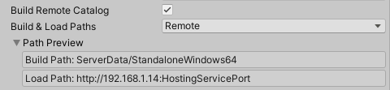
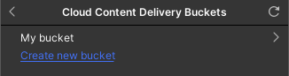

유니티 Addressables 문서 번역 4장 어드레서블의 사용

유니티/Addressables/유니티 문서/번역/


- [원격 콘텐츠 배포](#원격-콘텐츠-배포)
  - [원격 배포 사용 설정](#원격-배포-사용-설정)
    - [원격 카탈로그 사용 설정하기](#원격-카탈로그-사용-설정하기)
    - [원격 그룹 설정](#원격-그룹-설정)
  - [프로필을 사용하여 개발 지원](#프로필을-사용하여-개발-지원)
    - [일반적인 게임 플레이 및 기능 테스트를 위한 빌드](#일반적인-게임-플레이-및-기능-테스트를-위한-빌드)
    - [로컬 호스팅용 빌드](#로컬-호스팅용-빌드)
    - [CDN용 빌드](#cdn용-빌드)
    - [기타](#기타)
  - [에셋 번들 캐싱](#에셋-번들-캐싱)
  - [원격 콘텐츠 사전 다운로드](#원격-콘텐츠-사전-다운로드)
    - [PercentComplete 관련](#percentcomplete-관련)
  - [사용자 지정 URL 평가](#사용자-지정-url-평가)
- [클라우드 콘텐츠 전송과 어드레서블 에셋 시스템](#클라우드-콘텐츠-전송과-어드레서블-에셋-시스템)
  - [CCD URL로 프로필 구성](#ccd-url로-프로필-구성)
  - [프로필에서 클라우드 콘텐츠 전송 번들 위치 옵션 사용](#프로필에서-클라우드-콘텐츠-전송-번들-위치-옵션-사용)
  - [CCD URL로 그룹 구성](#ccd-url로-그룹-구성)
  - [어드레서블 콘텐츠 빌드, 업로드 및 릴리스](#어드레서블-콘텐츠-빌드-업로드-및-릴리스)
    - [CCD 대시보드/CLI에 사용](#ccd-대시보드cli에-사용)
    - [CCD 관리 패키지 사용](#ccd-관리-패키지-사용)
      - [CcdManager](#ccdmanager)
    - [빌드 이벤트 사용](#빌드-이벤트-사용)
      - [빌드 이벤트 추가하기](#빌드-이벤트-추가하기)
      - [버전 재정의 경고 비활성화하기](#버전-재정의-경고-비활성화하기)
- [런타임에 어드레서블 사용](#런타임에-어드레서블-사용)
- [어드레서블 초기화](#어드레서블-초기화)
  - [초기화 객체](#초기화-객체)
  - [캐시 초기화 객체](#캐시-초기화-객체)
- [메모리 관리](#메모리-관리)
  - [메모리가 지워지는 시기 이해](#메모리가-지워지는-시기-이해)
  - [에셋 이탈 방지](#에셋-이탈-방지)
  - [에셋 번들 메모리 오버헤드](#에셋-번들-메모리-오버헤드)
    - [타입트리 (TypeTrees)](#타입트리-typetrees)
    - [목차 (Table of contents)](#목차-table-of-contents)
    - [사전 로드 테이블 (Preload table)](#사전-로드-테이블-preload-table)
  - [에셋 번들 종속성 로드의 메모리 영향](#에셋-번들-종속성-로드의-메모리-영향)
- [어드레서블 에셋 로드하기](#어드레서블-에셋-로드하기)
  - [로드된 에셋과 키의 연관성](#로드된-에셋과-키의-연관성)
  - [위치별로 에셋 로드](#위치별로-에셋-로드)
  - [하위 객체의 로드 위치](#하위-객체의-로드-위치)
  - [비동기 로드](#비동기-로드)
  - [씬에서 어드레서블 사용](#씬에서-어드레서블-사용)
- [작업 (Operations)](#작업-operations)
  - [AsyncOperationHandle 인스턴스 해제하기](#asyncoperationhandle-인스턴스-해제하기)
  - [코루틴 및 IEnumerator 기반 연산 처리](#코루틴-및-ienumerator-기반-연산-처리)
    - [코루틴에서 작업 그룹화하기](#코루틴에서-작업-그룹화하기)
  - [이벤트 기반 작업 처리](#이벤트-기반-작업-처리)
  - [태스크 기반 작업 처리](#태스크-기반-작업-처리)
  - [연산 동기적으로 사용하기](#연산-동기적으로-사용하기)
  - [사용자 지정 연산](#사용자-지정-연산)
    - [작업 실행하기](#작업-실행하기)
    - [완료 처리](#완료-처리)
    - [작업 종료](#작업-종료)
  - [타입이 있는 연산 핸들과 타입이 없는 연산 핸들 사용하기](#타입이-있는-연산-핸들과-타입이-없는-연산-핸들-사용하기)
  - [작업 진행 상황 보고](#작업-진행-상황-보고)
- [단일 에셋 로드](#단일-에셋-로드)
- [여러 에셋 로드하기](#여러-에셋-로드하기)
- [에셋 레퍼런스 로드](#에셋-레퍼런스-로드)
- [씬 로드](#씬-로드)
- [동기식 워크플로](#동기식-워크플로)
  - [API](#api)
  - [Result](#result)
  - [성능](#성능)
  - [코드 샘플](#코드-샘플)
    - [씬](#씬)
    - [커스텀 오퍼레이션을 사용한 동기식 어드레서블](#커스텀-오퍼레이션을-사용한-동기식-어드레서블)
    - [WebGL](#webgl)
- [리소스 URL 변환](#리소스-url-변환)
  - [정적 프로필 변수](#정적-프로필-변수)
  - [ID 변환 함수](#id-변환-함수)
  - [웹 요청 오버라이드](#웹-요청-오버라이드)
- [종속성 사전 로드](#종속성-사전-로드)
  - [종속성 다운로드](#종속성-다운로드)
  - [진행 상황](#진행-상황)
  - [종속성 캐시 지우기](#종속성-캐시-지우기)
- [에셋 번들 로딩](#에셋-번들-로딩)
  - [UnityWebRequestForLocal번들](#unitywebrequestforlocal번들)
  - [다운로드 오류 처리](#다운로드-오류-처리)
- [어드레서블 에셋 언로드](#어드레서블-에셋-언로드)
- [런타임에 카탈로그 관리](#런타임에-카탈로그-관리)
  - [추가 카탈로그 로드](#추가-카탈로그-로드)
  - [카탈로그 업데이트](#카탈로그-업데이트)
- [런타임에 주소 가져오기](#런타임에-주소-가져오기)
- [수정 이벤트](#수정-이벤트)
  - [코드샘플](#코드샘플)
  - [각 ModificationEvent와 함께 전달된 데이터입니다:](#각-modificationevent와-함께-전달된-데이터입니다)


Addressables 1.21.12 기준 작성

---

# 원격 콘텐츠 배포

콘텐츠를 원격으로 배포하면 초기 앱 다운로드 크기와 설치 시간을 줄일 수 있습니다. 앱이나 게임을 다시 게시하지 않고 원격으로 배포된 에셋을 업데이트할 수도 있습니다.

원격 URL을 그룹의 로드 경로로 지정하면 어드레서블 시스템은 해당 URL에서 그룹의 에셋을 로드합니다. 원격 카탈로그 빌드 옵션을 활성화하면 어드레서블은 원격 카탈로그에서 원격 에셋의 주소를 조회하므로 사용자가 전체 게임이나 애플리케이션을 업데이트하고 다시 설치하지 않고도 어드레서블 에셋을 변경할 수 있습니다.

원격 배포를 활성화한 후에는 두 가지 방법으로 콘텐츠를 빌드할 수 있습니다:

- New Build > Default Build Script를 사용한 전체 콘텐츠 빌드: 모든 콘텐츠 번들 및 카탈로그를 빌드합니다. 전체 애플리케이션을 게시하거나 업데이트할 준비를 할 때는 항상 전체 빌드를 수행한 후에 플레이어를 다시 빌드하세요.
- Update a Previous Build 스크립트를 사용한 콘텐츠 업데이트 빌드: 모든 콘텐츠 번들과 카탈로그를 빌드하지만 설치된 애플리케이션이 변경된 번들만 다운로드하면 되도록 원격 카탈로그를 설정합니다.  Check for Content Update Restrictions 도구를 실행하여 업데이트를 빌드하기 전에 변경 사항을 식별하고 그룹을 준비하세요.

전체 빌드 또는 업데이트를 빌드한 후에는 원격 카탈로그, 카탈로그 해시 파일 및 원격 번들을 호스팅 서비스에 업로드해야 합니다.

원격 콘텐츠를 개발, 테스트 및 게시하는 데 도움이 되는 주소 지정 가능 프로필 설정에 대한 팁은 프로필을 사용하여 개발 지원하기를 참조하세요.

## 원격 배포 사용 설정
콘텐츠의 원격 배포를 활성화하려면 원격 카탈로그를 활성화하고 원격으로 호스팅하려는 에셋이 포함된 그룹을 설정해야 합니다.

### 원격 카탈로그 사용 설정하기
Addressable Asset Settings 인스펙터에서 원격 카탈로그를 활성화합니다(메뉴: Window > Asset Management > Addressables > Settings).

- Build Remote Catalog: enabled
- Build & Load Paths: Remote



*원격 카탈로그 활성화*

카탈로그와 함께 제공되는 해시 파일은 빌드 경로 설정에서 지정한 폴더에 빌드됩니다. 로드 경로 설정에서 지정한 URL에서 액세스할 수 있도록 이러한 파일을 업로드해야 합니다. 특별한 이유가 없는 한 원격 위치를 사용하여 카탈로그가 원격 번들과 동일한 경로에서 빌드되고 로드되도록 하세요.

### 원격 그룹 설정
그룹에 있는 에셋을 원격으로 호스팅할 수 있도록 그룹을 설정하려면 원격 위치를 사용하여 빌드 및 로드 경로를 설정합니다:


애플리케이션의 전체 리빌드를 게시하는 사이에 콘텐츠 업데이트를 게시하려는 경우 그룹에서 콘텐츠를 업데이트할 빈도에 따라 Update Restriction 값을 설정합니다.

특히 그룹 내 대부분의 에셋을 변경하지 않을 것으로 예상되는 경우 대규모 번들을 생성하는 그룹의 경우 Cannot Change Post Release을 선택합니다. 이 설정으로 그룹에서 에셋을 변경하면 어드레서블 도구가 변경된 에셋을 업데이트를 위한 새 그룹으로 이동합니다. 설치된 애플리케이션은 새 번들만 다운로드합니다.

자주 변경할 것으로 예상되는 에셋이 포함된 그룹의 경우 Can Change Post Release을 선택합니다. 이 설정으로 그룹에서 에셋을 변경하면 해당 에셋이 포함된 번들이 전체적으로 다시 빌드되고 설치된 애플리케이션에서 다시 다운로드됩니다. 업데이트 후 다운로드해야 하는 데이터의 양을 줄이려면 이 설정이 있는 그룹에서 생성되는 번들을 가능한 한 작게 유지하세요.

원격 콘텐츠 업데이트에 대한 자세한 내용은 콘텐츠 업데이트 빌드를 참조하세요.

Advanced Options 섹션에는 원격 호스팅 및 다운로드에 영향을 주는 몇 가지 옵션이 포함되어 있습니다(원격 호스팅을 활성화하는 데는 필요하지 않음). 자세한 내용은 고급 옵션을 참조하세요.

## 프로필을 사용하여 개발 지원

프로필은 로컬 및 원격 콘텐츠의 빌드 및 로드 경로를 설정하는 데 사용할 수 있는 변수를 정의합니다.

콘텐츠를 원격으로 배포하는 경우 일반적으로 빌드를 만드는 이유에 따라 원격 콘텐츠에 대해 서로 다른 URL(로드 경로)을 설정해야 합니다. 이러한 상황의 몇 가지 예는 다음과 같습니다:

### 일반적인 게임 플레이 및 기능 테스트를 위한 빌드

개발 초기 또는 호스트에 액세스하지 않고 테스트해야 하는 경우 모든 콘텐츠를 로컬 콘텐츠로 처리하는 것이 편리할 수 있습니다. 이러한 상황에서는 Built-In 위치를 사용하여 Local 및 Remote 프로필 변수를 설정합니다.


*로컬로 처리되는 모든 콘텐츠*

### 로컬 호스팅용 빌드

나중에 로컬 네트워크(또는 로컬 호스트)에 호스트를 설정할 때 호스트의 URL을 반영하도록 원격 그룹의 로드 경로를 변경해야 합니다. 예를 들어 에디터 호스팅을 사용하는 경우 Editor Hosting 위치를 사용하여 Remote 프로필 변수를 설정합니다.


*에디터 호스팅에서 원격 콘텐츠 제공*

### CDN용 빌드

프로덕션에 가까워질수록 스테이징 서버를 사용한 다음 프로덕션 CDN(콘텐츠 전송 네트워크)을 사용할 수 있습니다. 예를 들어 클라우드 콘텐츠 전송을 사용하는 경우 Cloud Content Delivery 위치를 사용하여 Remote 프로필 변수를 설정합니다.


*Unity 클라우드 콘텐츠 전송 서비스에서 호스팅되는 원격 콘텐츠*

### 기타

출시 후에도 베타 테스트 또는 기타 목적으로 다른 호스트 URL을 사용하고 싶을 수 있습니다.

빌드할 때마다 빌드 및 로드 경로를 직접 구성하는 대신 다른 프로필을 생성하고 변수를 적절히 설정할 수 있습니다. 그러면 경로를 잘못 구성할 염려 없이 콘텐츠 빌드 전에 프로필 간에 쉽게 전환할 수 있습니다.

스크립트를 사용하여 콘텐츠 빌드를 시작하는 경우 어드레서블 API를 사용하여 빌드에 대한 특정 프로필을 선택할 수 있습니다. 스크립트에서 어드레서블 빌드 시작하기를 참조하세요.

복잡한 URL이 있는 경우 빌드 또는 런타임에 평가되는 프로필 변수의 정적 필드 또는 속성을 참조할 수 있습니다. 예를 들어 CCD ProjectID를 문자열로 입력하는 대신 해당 정보를 정적 속성으로 제공하는 에디터 클래스를 생성하여 ```[CCDInfo.ProjectID]```로 참조할 수 있습니다. 자세한 내용은 프로필 변수 구문을 참조하세요. (InternalIdTransformFunc 함수는 복잡한 URL 요구 사항을 처리하는 추가 메서드를 제공합니다.)

>**_NOTE_**<BR>원격 URL 요구 사항을 정적 문자열로 표현할 수 없는 경우 런타임에 에셋 번들을 포함한 에셋의 URL을 다시 작성하는 방법에 대한 자세한 내용은 사용자 지정 URL 평가를 참조하세요.

## 에셋 번들 캐싱
기본적으로 어드레서블 빌드를 위해 생성된 에셋 번들은 다운로드된 후 클라이언트 디바이스에 캐시됩니다. 캐시된 번들은 업데이트되거나 캐시에서 삭제된 경우에만 다시 다운로드됩니다.

업데이트된 카탈로그는 이전 버전의 카탈로그에 있는 번들 항목을 제외할 수 있습니다. 이러한 항목이 캐시되면 해당 데이터는 더 이상 장치에서 필요하지 않습니다.

장치에 불필요한 캐시 데이터가 있는 경우 다음 세 가지 옵션 중 하나를 선택할 수 있습니다:

- 전체 번들 캐시를 삭제하려면 Caching.ClearCache를 사용합니다.
- 언제든지 더 이상 참조되지 않는 캐시 항목을 제거하려면 Addressables.CleanBundleCache를 사용합니다. 일반적으로 이 함수는 Addressables를 초기화한 후(Addressables 초기화 사용자 지정 참조) 또는 추가 카탈로그를 로드한 후(런타임에 카탈로그 관리 참조) 호출합니다.
- 카탈로그를 업데이트한 후 자동으로 Addressables.CleanBundleCache를 호출하려면 Addressables.UpdateCatalogs에서 autoCleanBundleCache 매개 변수를 사용합니다. 스크립트 예시는 런타임에 콘텐츠 업데이트 확인을 참조하세요.

그룹에 대한 캐싱을 비활성화하면 그룹에 대해 생성된 원격 번들은 다운로드할 때 언로드하거나 애플리케이션이 종료될 때까지 메모리에 저장됩니다. 다음에 애플리케이션이 번들을 로드할 때 Addressables가 번들을 다시 다운로드합니다.

그룹 인스펙터의 고급 옵션에서 Use Asset Bundle Cache 설정을 사용하여 그룹에서 생성된 번들을 캐시할지 여부를 제어할 수 있습니다.

에셋 번들 캐싱에 대한 자세한 내용은 에셋 번들 압축을 참조하십시오. 어드레서블 시스템은 그룹 설정에 따라 어드레서블 번들을 다운로드하는 데 사용하는 UnityWebRequests의 캐시 관련 파라미터를 설정합니다.

WebGL 에셋 번들에는 몇 가지 제한 사항이 있습니다. 자세한 내용은 WebGL 프로젝트 빌드 및 실행을 참조하십시오.

## 원격 콘텐츠 사전 다운로드

콘텐츠가 디스크에 캐시되어 애플리케이션에서 필요할 때 더 빠르게 액세스할 수 있도록 콘텐츠를 미리 다운로드하려는 경우 Addressables.DownloadDependenciesAsync 메서드를 사용할 수 있습니다. 이 메서드는 백그라운드 작업으로 어드레서블 엔티티와 모든 종속성을 다운로드합니다.

Addressables.DownloadDependenciesAsync 메서드를 호출하면 전달한 주소 또는 레이블에 대한 종속성을 로드합니다. 일반적으로 이 종속 요소는 에셋 번들입니다.

이 호출로 반환되는 AsyncOperationHandle 구조체에는 다운로드 진행률을 모니터링하고 표시하는 데 사용할 수 있는 PercentComplete 속성이 포함되어 있습니다. 콘텐츠가 로드될 때까지 앱이 대기하도록 할 수도 있습니다.

### PercentComplete 관련
PercentComplete는 단일 AsyncOperationHandle이 처리하는 기본 작업의 여러 측면을 고려합니다. 진행이 선형적이지 않거나 선형적인 것처럼 보이는 경우가 있을 수 있습니다. 이는 빠른 작업과 오래 걸리는 작업에 동일한 가중치를 부여하기 때문일 수 있습니다.

예를 들어, 원격 위치에서 로드하려는 에셋이 다운로드하는 데 적지 않은 시간이 걸리고 로컬 번들을 종속 요소로 사용하는 경우, 계속 진행하기 전에 퍼센트 완료가 50%로 점프하는 것을 볼 수 있습니다. 이는 로컬 번들이 원격 번들보다 훨씬 빠르게 로드될 수 있기 때문입니다. 그러나 시스템이 인식하는 것은 두 개의 작업이 완료되어야 한다는 것뿐입니다.

다운로드하기 전에 사용자에게 동의를 구하려면 Addressables.GetDownloadSize를 사용하여 지정된 주소 또는 레이블에서 콘텐츠를 다운로드하는 데 필요한 공간을 반환하세요. 이 경우 이전에 다운로드한 번들 중 Unity의 AssetBundle 캐시에 남아 있는 모든 번들이 고려됩니다.

앱용 에셋을 미리 다운로드하는 것이 유리할 수 있지만, 그렇지 않은 경우도 있습니다. 예를 들어

- 앱에 많은 양의 온라인 콘텐츠가 있지만 일반적으로 사용자가 콘텐츠의 일부만 상호 작용할 것으로 예상하는 경우.
- 앱이 작동하려면 온라인에 연결되어야 합니다. 앱의 모든 콘텐츠가 작은 번들로 구성된 경우 필요에 따라 콘텐츠를 다운로드하도록 선택할 수 있습니다.

콘텐츠가 로드될 때까지 기다리기 위해 완료율 값을 사용하는 대신 사전 로드 기능을 사용하여 다운로드가 시작되었음을 표시한 다음 계속 진행할 수 있습니다. 이렇게 구현하려면 에셋이 필요한 시간까지 로딩이 완료되지 않은 경우를 처리하기 위해 로딩 또는 대기 화면이 필요합니다.

## 사용자 지정 URL 평가
런타임에 에셋(일반적으로 에셋 번들)의 경로 또는 URL을 커스터마이즈해야 하는 몇 가지 시나리오가 있습니다. 가장 일반적인 예는 서명된 URL을 만드는 것입니다. 또 다른 예는 동적 호스트 결정입니다.

자세한 내용은 ID 변환 함수를 참조하세요.


---
# 클라우드 콘텐츠 전송과 어드레서블 에셋 시스템
어드레서블 에셋 시스템을 Unity 클라우드 콘텐츠 전송(CCD)과 함께 사용하여 원격 어드레서블 콘텐츠를 배포할 수 있습니다.

참고: 이 페이지의 목적은 어드레서블 에셋의 개념을 CCD에 연결하는 방법을 설명하는 것이며, 이러한 아이디어에 대한 심층적인 논의를 위한 것이 아닙니다. 이 페이지를 읽기 전에 어드레서블 시스템과 클라우드 콘텐츠 전송에 대해 잘 알고 있는지 확인하세요.

CCD와 함께 작동하도록 어드레서블 에셋을 설정하려면 다음과 같이 하세요:

1. CCD URL을 포함하도록 프로필을 구성합니다.
2. 에셋 번들을 빌드한 다음 CCD에 업로드합니다.

어드레서블 패키지 설치 및 구현에 대한 자세한 내용은 시작하기를 참조하세요.

기존 Unity 프로젝트에 어드레서블을 통합하는 방법은 어드레서블 시스템 업그레이드를 참조하세요.

원격 서버에서 어드레서블 콘텐츠를 호스팅할 수 있도록 프로젝트를 설정하는 방법에 대한 자세한 내용은 원격 콘텐츠 배포를 참조하세요.

CCD에 대한 자세한 내용은 Unity 클라우드 콘텐츠 전송을 참조하세요.

## CCD URL로 프로필 구성

>**_TIP_**<BR>프로파일에 저장된 BuildPath 및 LoadPath 변수는 어드레서블 시스템이 빌드 아티팩트를 생성하는 위치와 런타임에 에셋을 찾는 위치를 지정합니다. CCD와 함께 작동하도록 원격 경로를 구성합니다. (로컬 경로는 변경할 특별한 이유가 없는 한 표준 기본값을 그대로 둡니다.)

필요한 경우 프로필 창에서 빌드를 CCD에 게시하기 위한 새 프로필을 생성합니다. 이 프로필에서 원격 경로 변수를 구성하여 올바른 URL에서 콘텐츠에 액세스할 수 있도록 합니다.

원격 BuildPath 를 편리한 값으로 설정할 수 있습니다. 프로필이 여러 개 있는 경우, 특히 다른 원격 URL에서 호스팅하는 경우 빌드 아티팩트가 서로 섞이지 않도록 각 프로필에 고유한 빌드 경로를 사용하는 것이 좋습니다.

원격 LoadPath를 다음 두 경로 중 하나로 설정합니다:

- 배지를 사용하여 콘텐츠를 게시하는 경우:
```
https://(ProjectID).client-api.unity3dusercontent.com/client_api/v1/environments/(EnvironmentName)/buckets/(BucketID)/release_by_badge/(BadgeName)/entry_by_path/content/?path=
```
- 릴리스를 사용하여 게시하는 경우
```
https://(ProjectID).client-api.unity3dusercontent.com/client_api/v1/environments/(EnvironmentName)/buckets/(BucketID)/releases/(ReleaseID)/entry_by_path/content/?path=
```
- (ProjectID)는 CCD 프로젝트의 ID 문자열입니다.
- (EnvironmentName)은 프로젝트의 환경 이름입니다.
- (BucketID)는 프로젝트 내 CCD 버킷의 버킷 ID 문자열입니다.
- (ReleaseID)는 버킷 내 특정 릴리즈의 ID입니다.
- (BadgeName)은 특정 CCD 배지의 이름입니다.

>**_IMPORTANT_**<BR>원격 로드 경로를 변경할 때는 어드레서블 콘텐츠를 완전히 다시 빌드해야 합니다.

## 프로필에서 클라우드 콘텐츠 전송 번들 위치 옵션 사용
프로젝트가 Unity 클라우드 콘텐츠 전송 서비스를 사용하도록 설정된 경우 프로필의 원격 경로 쌍을 설정하여 지정된 버킷과 배지에 콘텐츠를 퍼블리시할 수 있습니다.

>**_IMPORTANT_**<BR>이 기능을 사용하려면 콘텐츠 전송 관리 API 패키지가 필요합니다.

CCD 번들 위치를 사용하도록 프로필 변수를 설정하려면 다음과 같이 하세요:

1. 프로필 창을 엽니다(메뉴: Window > Asset Management > Addressables > Profiles).
2. 변경할 프로필을 선택합니다.
3. Cloud Content Delivery Bundle Location를 사용하도록 Remote 변수를 변경합니다.

*클라우드 콘텐츠 전송 번들 위치 옵션*

4. Automatic (set using CcdManager) 혹은 Specify the Environment, Bucket, and Badge 옵션을 선택합니다.

*클라우드 콘텐츠 전송 번들 위치 옵션 2*
>**_NOTE_**<BR>CcdManager는 런타임에 로드할 환경, 버킷 및 배지를 어드레서블에 알리는 데 사용되는 정적 클래스입니다. CcdManager를 참조하세요.

   - 자동을 선택하는 경우 사용하려는 환경을 선택합니다.
   
   *클라우드 콘텐츠 전송 번들 위치 자동 환경 옵션*
   - 지정하도록 선택하는 경우 사용하려는 환경을 선택합니다.
   
   *클라우드 콘텐츠 전송 번들 위치 환경 옵션*

5. 사용할 버킷을 선택합니다.

*클라우드 콘텐츠 전송 번들 위치 버킷 옵션*
>**_NOTE_**<BR>버킷이 없는 경우 계속하기 전에 이 창이 표시됩니다.

*클라우드 콘텐츠 전송 번들 위치 버킷 옵션 없음*

6. 배지를 선택합니다.

*클라우드 콘텐츠 전송 번들 위치 배지 옵션*

CCD로 전달할 콘텐츠를 빌드할 때 이 프로필을 활성 프로필로 설정합니다.

프로필을 수정하는 방법에 대한 자세한 내용은 프로필을 참조하세요.

## CCD URL로 그룹 구성

인스펙터 창에서 Remote 을 Build & Load Path로 사용하도록 그룹을 구성합니다.


*그룹 빌드 및 로드 경로*

그룹을 수정하는 방법에 대한 자세한 내용은 그룹을 참조하세요.


## 어드레서블 콘텐츠 빌드, 업로드 및 릴리스

### CCD 대시보드/CLI에 사용
어드레서블 콘텐츠를 생성하고 CCD 프로젝트에 업로드하려면 다음과 같이 하세요:

1. CCD에 설정한 프로필을 활성 프로필로 설정합니다.
2. 어드레서블 콘텐츠를 빌드합니다.
   - 전체 콘텐츠를 빌드하는 경우 어드레서블 콘텐츠 빌드를 참조하세요.
   - 수정된 원격 콘텐츠로 기존 빌드를 업데이트하는 경우 콘텐츠 업데이트를 위한 빌드를 참조하세요.
3. CCD 대시보드 또는 명령줄 인터페이스를 사용하여 원격 빌드 경로에서 생성한 파일을 업로드합니다.
4. CCD 대시보드 또는 명령줄 인터페이스를 사용하여 릴리스를 만들고 배지를 업데이트합니다.

어드레서블 콘텐츠를 빌드하면 콘텐츠 카탈로그(.json), 해시 파일(.hash) 및 하나 이상의 에셋 번들(.bundle) 파일이 생성됩니다. 프로필 로드 경로에 사용된 URL에 해당하는 버킷에 이러한 파일을 업로드합니다.

로컬 콘텐츠를 변경한 경우 새 플레이어 빌드를 생성해야 합니다.

Unity 클라우드 빌드 서비스를 사용하는 경우 클라우드 빌드를 구성하여 콘텐츠를 CCD로 전송할 수 있습니다. 자세한 내용은 Unity 클라우드 빌드에서 어드레서블 사용하기를 참조하십시오.

### CCD 관리 패키지 사용
어드레서블 콘텐츠를 생성, 업로드 및 릴리스하여 CCD 프로젝트에 전송하려면 다음과 같이 하세요:

1. 그룹 창을 엽니다(메뉴: Window > Asset Management > Addressables > Groups).
2. Build & Release 옵션을 사용합니다.

CCD 관리 패키지는 기본 빌드 스크립트 동작을 사용하여 어드레서블 번들을 생성합니다. 그런 다음 드롭다운 창을 통해 CCD 버킷 및 배지에 연결된 경로 쌍과 연결된 모든 그룹은 관리 패키지에 의해 생성된 번들을 해당 원격 대상에 업로드합니다. 마지막으로 관리 패키지가 해당 원격 대상에 대한 릴리스를 생성하고 배지를 업데이트합니다.


*빌드 및 릴리스 옵션*

#### CcdManager
프로젝트 프로필 경로 쌍을 설정하고 CCD를 활용할 때 Automatic을 사용할 수 있는 옵션이 있습니다. 이 옵션은 런타임에 정적 프로퍼티를 설정하기 위해 CcdManager를 활용하여 어드레서블에 에셋 로드를 위해 어떤 환경, 버킷, 배지에 연락할지 알려줍니다. CcdManager에는 3가지 주요 프로퍼티가 있습니다: EnvironmentName, BucketId, Badge입니다. 어드레서블이 초기화되기 전에 런타임에 이러한 프로퍼티를 설정하면 어드레서블이 CCD 내에서 이러한 위치를 찾도록 지시할 수 있습니다. 환경, 버킷 및 배지에 대해 자세히 알아보려면 CCD 구성을 참조하세요.

CcdManager 속성 설정 예제 스니펫:

```
   CcdManager.EnvironmentName = ENV_NAME;
   CcdManager.BucketId = BUCKET_ID;
   CcdManager.Badge = BADGE;

   // Addressables call to load or instantiate asset
```

>**_NOTE_**<BR>모든 Addressables 호출은 시스템을 초기화하므로 경합 조건이나 예기치 않은 동작이 발생하지 않도록 모든 Addressables 호출 전에 CcdManager를 설정해야 합니다.


### 빌드 이벤트 사용
CCD는 빌드 및 업로드 서비스를 래핑하여 추가 기능을 제공하는 수단을 제공합니다.

#### 빌드 이벤트 추가하기
사전 업데이트 및 사전 빌드 이벤트 체인에 추가 이벤트를 추가할 수 있습니다.

```
#if (UNITY_EDITOR && ENABLE_CCD)
    using System.Threading.Tasks;
    using UnityEditor.AddressableAssets.Build;

    public class BuildHooks
    {

        static void AddBuildHook()
        {
            CcdBuildEvents.PrependPreBuildEvent(PrintBucketInformation);
            CcdBuildEvents.PrependPreUpdateEvent(PrintBucketInformation);
        }

        static async Task<bool> PrintBucketInformation(AddressablesDataBuilderInput input)
        {
            UnityEngine.Debug.Log($"Environment: {CcdManager.EnvironmentName}");
            UnityEngine.Debug.Log($"Bucket: {CcdManager.BucketId}");
            UnityEngine.Debug.Log($"Badge: {CcdManager.Badge}");
            return true;
        }
    }
#endif
```

#### 버전 재정의 경고 비활성화하기
플레이어 버전 재정의에 대한 경고가 표시되지만 현재 설정을 유지하려는 경우 해당 빌드 이벤트를 제거하여 경고를 비활성화할 수 있습니다.

```
#if (UNITY_EDITOR && ENABLE_CCD)
using UnityEditor;
using UnityEditor.AddressableAssets.Build;

public class DisableBuildWarning
{
    static void DisableWarning()
    {
        CcdBuildEvents.OnPreBuildEvents -= CcdBuildEvents.Instance.VerifyBuildVersion;
        CcdBuildEvents.OnPreUpdateEvents -= CcdBuildEvents.Instance.VerifyBuildVersion;
    }
}
#endif
```


---

# 런타임에 어드레서블 사용

어드레서블 에셋을 그룹으로 구성하고 에셋 번들에 빌드한 후에는 런타임에 에셋을 로드하고 인스턴스화하며 최종적으로 릴리스해야 합니다.

어드레서블은 참조 카운팅 시스템을 사용하여 에셋이 필요할 때만 메모리에 유지되도록 합니다. 참조 카운팅에 대한 자세한 내용과 특정 시간에 에셋이 사용하는 메모리 양을 최소화하는 방법은 메모리 관리를 참조하세요.

어드레서블은 어드레서블 에셋을 로드하고 인스턴스화하기 위한 여러 옵션과 API를 제공합니다. 자세한 내용과 예시는 어드레서블 에셋 로딩을 참조하세요:

- 단일 에셋 로드하기
- 여러 에셋 로드하기
- 에셋 레퍼런스 로드하기
- 씬 로드하기
- 위치별로 에셋 로드하기
- 어드레서블에서 오브젝트 인스턴스화하기
- 어드레서블 에셋 해제하기
- 씬에서 어드레서블 사용
- 종속성 미리 다운로드하기

어드레서블은 대부분의 로딩 작업에 비동기 연산을 사용합니다. 코드에서 연산을 처리하는 방법에 대한 자세한 내용은 오퍼레이션을 참조하십시오:

- AsyncOperationHandle 인스턴스 해제하기
- 코루틴 및 IEnumerator 기반 연산 처리
- 이벤트 기반 연산 처리
- 태스크 기반 연산 처리
- 연산 동기적으로 사용하기
- 사용자 정의 연산
- 입력된 연산과 입력되지 않은 연산 핸들 사용
- 작업 진행 상황 보고하기

다른 런타임 주제에 대한 정보는 다음을 참조하십시오:

- 초기화 사용자 지정하기
- 추가 카탈로그 로드하기
- 카탈로그 업데이트하기
- 런타임에 리소스 URL 수정하기
- 런타임에 에셋 주소 가져오기

---

# 어드레서블 초기화

어드레서블 시스템은 어드레서블을 처음 로드하거나 어드레서블 API를 호출할 때 런타임에 자체적으로 초기화됩니다. Addressables를 더 일찍 초기화하려면 Addressables.InitializeAsync를 호출하세요(초기화가 이미 수행된 경우 이 함수는 아무 작업도 수행하지 않습니다).

초기화 작업은 다음 작업을 수행합니다:

- 리소스 매니저와 리소스 로케이터를 설정합니다.
- 스트리밍 에셋에서 어드레서블이 생성한 구성 데이터를 로드합니다.
- 초기화 오브젝트 작업을 실행합니다.
- 콘텐츠 카탈로그를 로드합니다. 기본적으로 어드레서블은 먼저 콘텐츠 카탈로그의 업데이트를 확인하고 사용 가능한 경우 새 카탈로그를 다운로드합니다.

다음 Addressables 설정으로 초기화 동작을 변경할 수 있습니다:

- 수동으로만 카탈로그 업데이트: 어드레서블은 업데이트된 카탈로그를 자동으로 확인하지 않습니다. 수동으로 카탈로그를 업데이트하는 방법에 대한 자세한 내용은 카탈로그 업데이트하기를 참조하세요.
- 원격 카탈로그 빌드: 어드레서블은 원격 카탈로그가 없으면 원격 콘텐츠를 로드하려고 시도하지 않습니다.
- 사용자 지정 인증서 처리기: 원격 에셋 호스팅 서비스에 액세스하는 데 필요한 경우 사용자 지정 인증서 처리기를 식별합니다.
- 초기화 객체 목록: 초기화 작업 중에 호출되는 IObjectInitializationDataProvider 스크립터블 객체를 애플리케이션에 추가합니다.

초기화 작업을 시작하기 전에 다음 런타임 속성을 설정해야 합니다:

- 사용자 지정 URL 변환 함수
- ResourceManager 예외 처리기
- 프로필 변수의 사용자 지정 런타임 플레이스홀더에 사용되는 정적 속성

## 초기화 객체

어드레서블 에셋 설정에 객체를 첨부하여 런타임에 초기화 프로세스에 전달할 수 있습니다. 예를 들어, 런타임에 Unity의 캐시 세팅을 초기화하기 위해 CacheInitializationSettings 오브젝트를 생성할 수 있습니다. 고유한 유형의 초기화 오브젝트를 생성하려면 IObjectInitializationDataProvider 인터페이스를 구현하는 스크립터블 오브젝트를 생성합니다. 이 오브젝트를 사용하여 어드레서블이 런타임 데이터와 함께 포함하는 ObjectInitializationData 에셋을 생성합니다.

## 캐시 초기화 객체
런타임에 Unity의 캐시 설정을 초기화하려면 CacheInitializationSettings 오브젝트를 사용합니다.

어드레서블 시스템이 사용해야 하는 캐시 초기화 설정을 지정합니다:

1. CacheInitializationSettings 에셋을 생성합니다(메뉴: Assets > Addressables > Initialization > Cache Initialization Settings).
2. 프로젝트 패널에서 새 에셋 파일을 선택하여 인스펙터에서 설정을 확인합니다.


3. 원하는 대로 설정을 조정합니다.
4. 어드레서블 설정 인스펙터를 엽니다(메뉴: Window > Asset Management > Addressables > Settings).
5. 인스펙터의 Initialization Objects 섹션에서 + 버튼을 클릭하여 목록에 새 오브젝트를 추가합니다.
6. 파일 대화 상자에서 CacheInitializationSettings 에셋을 선택하고 Open을 클릭합니다.
7. 캐시 설정 개체가 목록에 추가됩니다.


런타임에 어드레서블이 초기화되면 이러한 설정이 기본 Unity 캐시에 적용됩니다. 이 설정은 어드레서블 시스템에서 다운로드한 에셋 번들뿐만 아니라 기본 캐시에 있는 모든 에셋 번들에 적용됩니다. Unity 캐시 시스템에 대한 자세한 내용은 캐싱을 참조하십시오.

>**_NOTE_**<BR>Unity 202.1 이하로 빌드되었거나 Android 9 이하에서 실행되는 Android 애플리케이션은 압축되지 않은 에셋 번들의 비디오만 재생할 수 있습니다. CacheInitializationSettings 오브젝트를 사용하여 번들 압축 옵션을 비활성화하여 캐시 재압축을 비활성화할 수 있습니다.

---

# 메모리 관리

어드레서블 시스템은 로드하는 모든 항목의 참조 카운트를 유지하여 에셋과 번들을 로드하는 데 사용되는 메모리를 관리합니다.

어드레서블이 로드되면 시스템은 참조 카운트를 증가시키고, 에셋이 해제되면 참조 카운트를 감소시킵니다. 어드레서블의 참조 카운트가 0으로 돌아오면 언로드할 수 있습니다. 어드레서블 에셋을 명시적으로 로드한 경우, 작업을 완료하면 에셋도 해제해야 합니다.

'메모리 누수'(더 이상 필요하지 않은 에셋이 메모리에 남아 있는 현상)를 방지하기 위한 기본 원칙은 로드 함수에 대한 모든 호출을 릴리스 함수에 대한 호출로 미러링하는 것입니다. 에셋 인스턴스 자체에 대한 참조 또는 원래 로드 작업에서 반환된 결과 핸들을 사용하여 에셋을 릴리스할 수 있습니다.

하지만 릴리스된 에셋이 메모리에서 즉시 언로드되는 것은 아닙니다. 에셋이 사용하는 메모리는 해당 에셋이 속한 에셋번들 역시 언로드될 때까지 해제되지 않습니다. (릴리스된 에셋은 Resources.UnloadUnusedAssets를 호출하여 언로드할 수도 있지만, 이 경우 작업 속도가 느려 프레임 속도 저하가 발생할 수 있습니다.)

에셋 번들에는 고유한 레퍼런스 수가 있습니다(시스템에서는 에셋 번들에 포함된 에셋을 종속성으로 처리하는 어드레서블처럼 취급합니다). 번들에서 에셋을 로드하면 번들의 레퍼런스 카운트가 증가하고 에셋을 해제하면 번들 레퍼런스 카운트가 감소합니다. 번들의 참조 카운트가 0으로 돌아간다는 것은 번들에 포함된 에셋이 아직 사용 중이 아니며 번들과 번들에 포함된 모든 에셋이 메모리에서 언로드되었다는 의미입니다.

이벤트 뷰어를 사용하여 런타임 메모리 관리를 모니터링하세요. 뷰어에는 에셋과 해당 종속 요소가 로드 및 언로드되는 시점이 표시됩니다.


## 메모리가 지워지는 시기 이해

에셋이 더 이상 참조되지 않는다고 해서(이벤트 뷰어에서 파란색 섹션의 끝으로 표시됨) 반드시 해당 에셋이 언로드된 것은 아닙니다. 일반적으로 적용 가능한 시나리오는 에셋 번들에 여러 개의 에셋이 있는 경우입니다. 예를 들어

- 에셋 번들(stuff)에 세 개의 에셋(tree, tank, cow)이 있습니다.
- tree가 로드되면 프로파일러는 tree에 대해 하나의 레퍼런스 카운트를 표시하고, stuff에 대해 하나의 레퍼런스 카운트를 표시합니다.
- 나중에 tank가 로드되면 프로파일러는 tree와 tank 모두에 대해 하나의 레퍼런스 카운트를 표시하고 stuff 에셋 번들에 대해 두 개의 레퍼런스 카운트를 표시합니다.
- tree를 해제하면 해당 트리의 레퍼런스 카운트가 0이 되고 파란색 막대가 사라집니다.

이 예제에서는 tree 에셋이 실제로 언로드되지 않았습니다. 에셋 번들 또는 그 일부 콘텐츠를 로드할 수는 있지만 에셋 번들을 부분적으로 언로드할 수는 없습니다. 에셋 번들 자체가 완전히 언로드될 때까지는 스터프 안의 에셋이 언로드되지 않습니다. 이 규칙의 예외는 엔진 인터페이스 Resources.UnloadUnusedAssets입니다. 위 시나리오에서 이 메서드를 실행하면 tree가 언로드됩니다. 어드레서블 시스템은 이러한 이벤트를 인식할 수 없으므로 프로파일러 그래프에는 어드레서블 리프레시 횟수만 반영됩니다(메모리가 정확히 어떤 것을 보유하고 있는지는 반영되지 않음). Resources.UnloadUnusedAssets를 사용하기로 선택한 경우 매우 느린 작업이므로 로딩 화면과 같이 장애가 표시되지 않는 화면에서만 호출해야 한다는 점에 유의하세요.

## 에셋 이탈 방지

에셋 이탈은 에셋 번들의 마지막 항목인 오브젝트를 릴리스한 다음 해당 에셋이나 번들의 다른 에셋을 즉시 다시 로드하는 경우 발생할 수 있는 문제입니다.

예를 들어, 자체 에셋 번들로 끌어온 cammo라는 텍스처를 공유하는 boat와 plane라는 두 개의 머티리얼이 있다고 가정해 보겠습니다. 레벨 1은 boat를 사용하고 레벨 2는 plane를 사용합니다. 레벨 1을 종료하면 boat를 해제하고 즉시 plane을 로드합니다. boat를 해제하면 어드레서블은 텍스처 cammo를 언로드합니다. 그런 다음 plane을 로드하면 어드레서블은 즉시 cammo를 다시 로드합니다.

이벤트 뷰어를 사용하면 에셋 로딩 및 언로드를 모니터링하여 에셋 이탈을 감지할 수 있습니다.

## 에셋 번들 메모리 오버헤드

에셋 번들을 로드할 때 Unity는 포함된 에셋에 사용되는 메모리 외에 번들의 내부 데이터를 저장하기 위해 메모리를 할당합니다. 로드된 에셋 번들에 대한 내부 데이터의 주요 유형은 다음과 같습니다:

- Loading cach: 에셋 번들 파일의 최근에 액세스한 페이지를 저장합니다. AssetBundle.memoryBudgetKB를 사용하여 크기를 제어할 수 있습니다.
- TypeTrees: 오브젝트의 직렬화된 레이아웃을 정의합니다.
- Table of contents: 번들에 있는 에셋을 나열합니다.
- Preload table: 각 에셋의 종속성을 나열합니다.

어드레서블 그룹과 에셋 번들을 구성할 때는 일반적으로 생성하고 로드하는 에셋 번들의 크기와 개수 사이에서 절충점을 찾아야 합니다. 한편으로는 에셋 번들의 개수가 적고 크기가 크면 에셋 번들의 총 메모리 사용량을 최소화할 수 있습니다. 반면에 작은 번들을 많이 사용하면 에셋과 에셋 번들을 더 쉽게 언로드할 수 있으므로 최대 메모리 사용량을 최소화할 수 있습니다.

디스크에 있는 에셋 번들의 크기는 런타임 시 크기와 동일하지 않지만, 디스크 크기를 빌드에서 에셋 번들의 메모리 오버헤드에 대한 대략적인 가이드로 사용할 수 있습니다. 빌드 레이아웃 보고서에서 에셋 번들 분석에 도움이 되는 번들 크기 및 기타 정보를 얻을 수 있습니다.

다음 섹션에서는 에셋 번들에 사용되는 내부 데이터와 가능한 경우 필요한 메모리 양을 최소화할 수 있는 방법에 대해 설명합니다.

### 타입트리 (TypeTrees)

타입트리는 데이터 유형 중 하나의 필드 레이아웃을 설명합니다.

에셋 번들의 각 직렬화된 파일에는 파일 내 각 오브젝트 유형에 대한 타입트리가 포함됩니다. TypeTree 정보를 사용하면 직렬화된 방식과 약간 다르게 역직렬화된 오브젝트를 로드할 수 있습니다. 타입트리 정보는 에셋 번들 간에 공유되지 않으며, 각 번들에는 포함된 오브젝트에 대한 완전한 타입트리 세트가 있습니다.

모든 타입트리는 에셋 번들이 로드될 때 로드되며 에셋 번들의 수명 기간 동안 메모리에 유지됩니다. 타입트리와 관련된 메모리 오버헤드는 직렬화된 파일의 고유 타입 수와 해당 타입의 복잡도에 비례합니다.

다음과 같은 방법으로 에셋 번들 타입트리의 메모리 요구량을 줄일 수 있습니다:

- 동일한 유형의 에셋을 동일한 번들에 함께 보관합니다.
- 타입트리 끄기 - 타입트리를 끄면 번들에서 이 정보를 제외하여 에셋 번들을 더 작게 만들 수 있습니다. 하지만 타입트리 정보가 없으면 이전 번들을 최신 버전의 Unity로 로드하거나 프로젝트에서 스크립트를 조금만 변경한 후 직렬화 오류 또는 정의되지 않은 동작이 발생할 수 있습니다.
- TypeTree 복잡성을 줄이기 위해 더 간단한 데이터 유형을 선호합니다.

타입트리를 비활성화한 상태와 활성화한 상태로 에셋 번들을 빌드하고 크기를 비교하여 타입트리가 에셋 번들의 크기에 미치는 영향을 테스트할 수 있습니다. 에셋 번들에서 타입트리를 비활성화하려면 BuildAssetBundleOptions.DisableWriteTypeTree를 사용하세요. 모든 플랫폼이 타입트리를 지원하는 것은 아니며 일부 플랫폼에서는 타입트리가 필요하므로 이 설정을 무시하세요.

프로젝트에서 타입트리를 비활성화하는 경우 새 플레이어를 빌드하기 전에 항상 로컬 어드레서블 그룹을 다시 빌드하세요. 콘텐츠를 원격으로 배포하는 경우 현재 플레이어를 제작할 때 사용한 것과 동일한 버전(패치 번호 포함)의 Unity로만 콘텐츠를 업데이트하고 사소한 코드 변경도 하지 마십시오. (여러 플레이어 버전, 업데이트 및 Unity 버전을 관리하는 경우 TypeTree를 비활성화하여 절약되는 메모리가 그만한 가치가 없을 수 있습니다.)

### 목차 (Table of contents)

목차는 명시적으로 포함된 각 에셋을 이름으로 조회할 수 있는 번들 내의 맵입니다. 에셋 수와 에셋이 매핑되는 문자열 이름의 길이에 따라 선형적으로 확장됩니다.

목차 데이터의 크기는 총 에셋 수를 기준으로 합니다. 지정된 시간에 로드되는 에셋 번들 수를 최소화하여 목차 데이터를 저장하는 데 필요한 메모리 양을 최소화할 수 있습니다.

### 사전 로드 테이블 (Preload table)

프리로드 테이블은 에셋이 참조하는 다른 모든 오브젝트의 목록입니다. 에셋 번들에서 에셋을 로드할 때 유니티는 프리로드 테이블을 사용하여 이러한 참조 오브젝트를 로드합니다.

예를 들어 프리팹에는 각 컴포넌트뿐만 아니라 참조할 수 있는 다른 에셋(머티리얼, 텍스처 등)에 대한 프리로드 항목이 있습니다. 각 프리로드 항목은 64비트이며 다른 에셋 번들의 오브젝트를 참조할 수 있습니다.

한 에셋이 다른 에셋을 참조하고 그 에셋이 다시 다른 에셋을 참조하는 경우, 프리로드 테이블은 두 에셋을 모두 로드하는 데 필요한 항목을 포함하므로 커질 수 있습니다. 두 에셋이 모두 세 번째 에셋을 참조하는 경우, 두 에셋의 프리로드 테이블에는 세 번째 에셋을 로드하기 위한 항목이 포함됩니다(참조된 에셋이 어드레서블인지 또는 동일한 에셋 번들에 있는지 여부에 관계없이).

예를 들어 에셋 번들에 두 개의 에셋(프리팹A와 프리팹B)이 있고 이 두 프리팹 모두 크기가 크고 여러 컴포넌트와 다른 에셋에 대한 레퍼런스를 포함하는 세 번째 프리팹(프리팹C)을 참조하는 상황을 생각해 봅시다. 이 에셋 번들에는 프리팹A와 프리팹B에 대한 두 개의 프리로드 테이블이 포함되어 있습니다. 이 테이블에는 해당 프리팹의 모든 오브젝트에 대한 항목뿐만 아니라 프리팹C의 모든 오브젝트와 프리팹C에서 참조하는 모든 오브젝트에 대한 항목도 포함되어 있습니다. 따라서 프리팹C를 로드하는 데 필요한 정보는 프리팹A와 프리팹B 모두에 중복됩니다. 이는 프리팹C가 에셋 번들에 명시적으로 추가되었는지 여부에 관계없이 발생합니다.

에셋을 구성하는 방식에 따라 에셋 번들의 프리로드 테이블이 상당히 커지고 중복된 항목이 많이 포함될 수 있습니다. 특히 위 상황의 프리팹C와 같이 복잡한 에셋을 모두 참조하는 로드 가능한 에셋이 여러 개 있는 경우 더욱 그렇습니다. 프리로드 테이블의 메모리 오버헤드가 문제라고 판단되면 로딩 가능한 에셋을 구조화하여 복잡한 로딩 종속성을 줄일 수 있습니다.

## 에셋 번들 종속성 로드의 메모리 영향

어드레서블 에셋을 로드하면 해당 종속성을 포함하는 모든 에셋 번들도 로드됩니다. 에셋 번들 종속성은 한 번들에 있는 에셋이 다른 번들에 있는 에셋을 참조할 때 발생합니다. 예를 들어 텍스처를 참조하는 머티리얼이 있습니다. 자세한 내용은 에셋 및 에셋 번들 종속성을 참조하십시오.

어드레서블은 번들 수준에서 번들 간의 종속성을 계산합니다. 한 에셋이 다른 번들에 있는 오브젝트를 참조하는 경우 전체 번들은 해당 번들에 대한 종속성을 갖습니다. 즉, 자체 종속성이 없는 첫 번째 번들에 있는 에셋을 로드하더라도 두 번째 에셋 번들은 여전히 메모리에 로드됩니다.

예시:

BundleA에는 어드레서블 에셋 RootAsset1과 RootAsset2가 포함되어 있습니다. RootAsset2는 BundleB에 포함된 DependencyAsset3을 참조합니다. RootAsset1이 BundleB에 대한 참조가 없더라도 RootAsset1이 BundleB에 대한 참조가 있는 BundleA에 있기 때문에 BundleB는 여전히 RootAsset1의 종속성입니다.

>**_NOTE_**<BR>어드레서블 1.13.0 이전에는 종속성 그래프가 지금처럼 철저하지 않았습니다. 위의 예시에서 RootAsset1은 BundleB에 대한 종속성이 없었을 것입니다. 이전 동작으로 인해 다른 에셋 번들에서 참조하는 에셋 번들을 언로드했다가 다시 로드할 때 참조가 끊어지는 문제가 발생했습니다. 이 수정으로 종속성 그래프가 충분히 복잡한 경우 메모리에 추가 데이터가 남을 수 있습니다.

필요한 것보다 많은 번들을 로드하지 않으려면 에셋 번들 간의 종속성을 가능한 한 단순하게 유지해야 합니다. 이를 위해 어드레서블에 포함된 몇 가지 진단 툴을 사용할 수 있습니다:

---

# 어드레서블 에셋 로드하기

어드레서블 클래스는 어드레서블 에셋을 로드하는 여러 메서드를 제공합니다. 에셋을 한 번에 하나씩 또는 일괄적으로 로드할 수 있습니다. 로드할 에셋을 식별하려면 단일 키 또는 키 목록을 로드 함수에 전달합니다. 키는 다음 객체 중 하나 일 수 있습니다:

- Address: 에셋에 할당된 주소가 포함된 문자열입니다.
- Label: 하나 이상의 에셋에 할당된 레이블이 포함된 문자열
- AssetReference 객체: AssetReference 인스턴스
- IResourceLocation 인스턴스: 에셋 및 해당 종속성을 로드하기 위한 정보를 포함하는 중간 객체입니다.

에셋 로딩 함수 중 하나를 호출하면 어드레서블 시스템은 다음 작업을 수행하는 비동기 작업을 시작합니다:

1. 지정된 키의 리소스 위치를 조회합니다(IResourceLocation 키 제외).
2. 종속성 목록을 수집합니다.
3. 필요한 원격 에셋 번들을 다운로드합니다.
4. 에셋 번들을 메모리에 로드합니다.
5. 작업의 결과 오브젝트를 로드된 오브젝트로 설정합니다.
6. 작업의 상태를 업데이트하고 완료 이벤트 리스너를 호출합니다.

로드 작업이 성공하면 상태가 성공으로 설정되고 로드된 오브젝트는 Result 오브젝트에서 액세스할 수 있습니다.

오류가 발생하면 예외가 작업 개체의 OperationException 멤버에 복사되고 상태가 Failed로 설정됩니다. 기본적으로 예외는 작업의 일부로 던져지지 않습니다. 그러나 예외를 처리하도록 처리기 함수를 ResourceManager.ExceptionHandler 속성에 할당할 수 있습니다. 또한 어드레서블 시스템 설정에서 런타임 예외 로그 옵션을 활성화하여 Unity 콘솔에 오류를 기록할 수 있습니다.

여러 개의 어드레서블 에셋을 로드할 수 있는 로드 함수를 호출할 때 단일 로드 작업이 실패할 경우 전체 작업을 중단할지 아니면 가능한 모든 에셋을 로드할지 여부를 지정할 수 있습니다. 두 경우 모두 작업 상태는 실패로 설정됩니다. (실패 시 전체 작업을 중단하려면 로드 함수를 호출할 때 releaseDependenciesOnFailure 매개 변수를 true로 설정합니다.)

비동기 작업 및 Unity 스크립트에서 비동기 코드 작성에 대한 자세한 내용은 작업을 참조하십시오.

## 로드된 에셋과 키의 연관성

하나의 작업에서 여러 에셋을 로드하는 경우 개별 에셋이 로드되는 순서가 로드 함수에 전달한 목록의 키 순서와 반드시 같을 수는 없습니다.

결합된 작업에서 에셋을 로드하는 데 사용된 키와 에셋을 연결해야 하는 경우 두 단계로 작업을 수행할 수 있습니다:

1. 에셋 키 목록으로 IResourceLocation 인스턴스를 로드합니다.
2. 개별 에셋을 해당 IResourceLocation 인스턴스를 키로 사용하여 로드합니다.

예를 들어, 키와 에셋을 연관시키기 위해 사전을 보관할 수 있도록 IResourceLocation 객체에는 키 정보가 포함되어 있습니다. LoadAssetsAsync와 같은 로딩 함수를 호출할 때 이 작업은 먼저 키에 해당하는 IResourceLocation 인스턴스를 조회한 다음 이를 사용하여 에셋을 로딩한다는 점에 유의하세요. IResourceLocation을 사용하여 에셋을 로드하면 첫 번째 단계를 건너뜁니다. 따라서 두 단계로 작업을 수행해도 작업이 크게 추가되지 않습니다.

다음 예제에서는 키 목록에 대한 에셋을 로드하고 해당 주소(PrimaryKey)를 기준으로 사전에 삽입합니다. 이 예에서는 먼저 지정된 키에 대한 리소스 위치를 로드합니다. 해당 작업이 완료되면 Completed 이벤트를 사용하여 각 위치에 대한 에셋을 로드하고 개별 작업 핸들을 사전에 삽입합니다. 작업 핸들은 에셋을 인스턴스화하는 데 사용할 수 있으며, 에셋이 더 이상 필요하지 않은 경우 해제할 수 있습니다.

```
using System.Collections;
using System.Collections.Generic;
using UnityEngine;
using UnityEngine.AddressableAssets;
using UnityEngine.Events;
using UnityEngine.ResourceManagement.AsyncOperations;
using UnityEngine.ResourceManagement.ResourceLocations;

internal class LoadWithLocation : MonoBehaviour
{
    public Dictionary<string, AsyncOperationHandle<GameObject>> operationDictionary;
    public List<string> keys;
    public UnityEvent Ready;

    IEnumerator LoadAndAssociateResultWithKey(IList<string> keys)
    {
        if (operationDictionary == null)
            operationDictionary = new Dictionary<string, AsyncOperationHandle<GameObject>>();

        AsyncOperationHandle<IList<IResourceLocation>> locations
            = Addressables.LoadResourceLocationsAsync(keys,
                Addressables.MergeMode.Union, typeof(GameObject));

        yield return locations;

        var loadOps = new List<AsyncOperationHandle>(locations.Result.Count);

        foreach (IResourceLocation location in locations.Result)
        {
            AsyncOperationHandle<GameObject> handle =
                Addressables.LoadAssetAsync<GameObject>(location);
            handle.Completed += obj => operationDictionary.Add(location.PrimaryKey, obj);
            loadOps.Add(handle);
        }

        yield return Addressables.ResourceManager.CreateGenericGroupOperation(loadOps, true);

        Ready.Invoke();
    }

    void Start()
    {
        Ready.AddListener(OnAssetsReady);
        StartCoroutine(LoadAndAssociateResultWithKey(keys));
    }

    private void OnAssetsReady()
    {
        float x = 0, z = 0;
        foreach (var item in operationDictionary)
        {
            Debug.Log($"{item.Key} = {item.Value.Result.name}");
            Instantiate(item.Value.Result,
                new Vector3(x++ * 2.0f, 0, z * 2.0f),
                Quaternion.identity, transform);
            if (x > 9)
            {
                x = 0;
                z++;
            }
        }
    }

    private void OnDestroy()
    {
        foreach (var item in operationDictionary)
        {
            Addressables.Release(item.Value);
        }
    }
}
```
로딩 함수는 ResourceManager.CreateGenericGroupOperation을 사용하여 그룹 작업을 생성한다는 점에 유의하세요. 이렇게 하면 모든 로드 작업이 완료된 후에도 함수가 계속 실행될 수 있습니다. 이 경우 함수는 "Ready" 이벤트를 전송하여 로드된 데이터를 사용할 수 있음을 다른 스크립트에 알립니다.


## 위치별로 에셋 로드
주소, 레이블 또는 AssetReference를 기준으로 어드레서블 에셋을 로드하면 어드레서블 시스템은 먼저 에셋의 리소스 위치를 조회하고 이러한 IResourceLocation 인스턴스를 사용하여 필요한 에셋 번들 및 모든 종속성을 다운로드합니다. 에셋 로드 작업은 두 단계로 수행할 수 있는데, 먼저 LoadResourceLocationsAsync로 IResourceLocation 오브젝트를 가져온 다음 해당 오브젝트를 키로 사용하여 에셋을 로드하거나 인스턴스화할 수 있습니다.

IResourceLocation 오브젝트에는 하나 이상의 에셋을 로드하는 데 필요한 정보가 포함되어 있습니다.

LoadResourceLocationsAsync 메서드는 절대 실패하지 않습니다. 지정된 키를 에셋의 위치로 확인할 수 없는 경우 빈 목록을 반환합니다. type 파라미터에 특정 유형을 지정하여 함수가 반환하는 에셋 위치의 유형을 제한할 수 있습니다.

다음 예제는 "knight" 또는 "villager"으로 레이블이 지정된 모든 에셋의 위치를 로드합니다:

```
AsyncOperationHandle<IList<IResourceLocation>> handle
    = Addressables.LoadResourceLocationsAsync(
        new string[] {"knight", "villager"},
        Addressables.MergeMode.Union);

yield return handle;

//...

Addressables.Release(handle);
```

## 하위 객체의 로드 위치
서브오브젝트의 위치는 런타임에 생성되어 콘텐츠 카탈로그의 크기를 줄이고 런타임 성능을 개선합니다. 서브오브젝트가 있는 에셋의 키로 LoadResourceLocationsAsync를 호출하고 유형을 지정하지 않으면 이 함수는 모든 서브오브젝트와 메인 오브젝트(해당되는 경우)에 대한 IResourceLocation 인스턴스를 생성합니다. 마찬가지로 서브오브젝트가 있는 에셋을 가리키는 AssetReference에 사용할 서브오브젝트를 지정하지 않으면 시스템은 모든 서브오브젝트에 대해 IResourceLocations를 생성합니다.

예를 들어 "myFBXObject"라는 주소로 FBX 에셋의 위치를 로드하면 게임 오브젝트, 메시, 머티리얼 세 가지 에셋에 대한 위치를 얻을 수 있습니다. 대신 주소에 유형을 ```"myFBXObject[Mesh]"```로 지정하면 메시 오브젝트만 가져올 수 있습니다. LoadResourceLocationsAsync 함수의 type 파라미터를 사용하여 유형을 지정할 수도 있습니다.

## 비동기 로드
어드레서블 시스템 API는 비동기식이며 작업 진행 및 완료를 관리하는 데 사용할 수 있는 AsyncOperationHandle을 반환합니다. 어드레서블은 콘텐츠 위치에 구애받지 않도록 설계되었습니다. 콘텐츠를 먼저 다운로드하거나 시간이 오래 걸릴 수 있는 다른 방법을 사용해야 할 수 있습니다. 동기 실행을 강제하려면 자세한 내용은 동기식 어드레서블을 참조하세요.

에셋을 처음 로드할 때는 최소 한 프레임 후에 처리가 완료됩니다. 아래와 같이 다른 방법을 사용하여 로드가 완료될 때까지 기다릴 수 있습니다. 콘텐츠가 이미 로드된 경우 실행 시간은 아래 표시된 다양한 비동기 로드 옵션마다 다를 수 있습니다.

- Coroutine: 실행이 계속되기 전에 항상 최소 한 프레임 이상 지연됩니다.
- Completed callbac: 콘텐츠가 아직 로드되지 않은 경우 최소 한 프레임이며, 그렇지 않은 경우 동일한 프레임에서 콜백이 호출됩니다.
- 대기 중인 AsyncOperationHandle.Task: 콘텐츠가 아직 로드되지 않은 경우 최소 한 프레임이며, 그렇지 않으면 동일한 프레임에서 실행이 계속됩니다.

```
using System.Collections;
using UnityEngine;
using UnityEngine.AddressableAssets;
using UnityEngine.ResourceManagement.AsyncOperations;

internal class AsynchronousLoading : MonoBehaviour
{
    private string address = "tree";
    private AsyncOperationHandle loadHandle;

    // always minimum of 1 frame
    IEnumerator LoadAssetCoroutine()
    {
        loadHandle = Addressables.LoadAssetAsync<GameObject>(address);
        yield return loadHandle;
    }

    // minimum of 1 frame for new asset loads
    // callback called in current frame for already loaded assets
    void LoadAssetCallback()
    {
        loadHandle = Addressables.LoadAssetAsync<GameObject>(address);
        loadHandle.Completed += h =>
        {
            // Loaded here
        };
    }

    // minimum of 1 frame for new asset loads
    // await completes in current frame for already loaded assets
    async void LoadAssetWait()
    {
        loadHandle = Addressables.LoadAssetAsync<GameObject>(address);
        await loadHandle.Task;
    }

    private void OnDestroy()
    {
        Addressables.Release(loadHandle);
    }
}
```

## 씬에서 어드레서블 사용
씬 자체가 어드레서블인 경우, 다른 에셋과 마찬가지로 씬에서 어드레서블 에셋을 사용할 수 있습니다. 씬에 프리팹 및 기타 에셋을 배치하고 컴포넌트 프로퍼티에 에셋을 할당하는 등의 작업을 수행할 수 있습니다. 어드레서블이 아닌 에셋을 사용하는 경우 해당 에셋은 씬의 암시적 종속 요소가 되며 빌드 시스템은 콘텐츠 빌드 시 씬과 동일한 에셋 번들에 해당 에셋을 패킹합니다. (어드레서블 에셋은 해당 에셋이 속한 그룹에 따라 자체 에셋 번들에 패킹됩니다.)

>**_NOTE_**<BR>두 곳 이상에서 사용되는 암시적 종속성은 여러 에셋 번들과 빌트인 씬 데이터에 중복될 수 있습니다. 분석 툴의 중복 번들 종속성 확인 규칙을 사용하여 원치 않는 에셋 중복을 찾을 수 있습니다.

씬이 어드레서블이 아닌 경우 씬 계층구조에 직접 추가하는 어드레서블 에셋은 암시적 종속성이 되며, 해당 에셋이 어드레서블 그룹에도 존재하더라도 Unity는 빌트인 씬 데이터에 해당 에셋의 사본을 포함합니다. 씬의 게임 오브젝트에서 컴포넌트에 할당된 머티리얼과 같은 에셋도 마찬가지입니다.

커스텀 컴포넌트 클래스에서 AssetReference 필드를 사용하여 어드레서블이 아닌 씬에서 어드레서블 에셋을 할당할 수 있습니다. 그렇지 않으면 주소와 레이블을 사용하여 스크립트에서 런타임에 에셋을 로드할 수 있습니다. 씬이 어드레서블인지 여부에 관계없이 코드에서 AssetReference를 로드해야 한다는 점에 유의하세요.

---

# 작업 (Operations)

어드레서블의 많은 태스크는 결과를 반환하기 전에 정보를 로드하거나 다운로드해야 합니다. 프로그램 실행을 차단하지 않기 위해 어드레서블은 이러한 작업을 비동기 연산으로 구현합니다.

결과를 사용할 수 있을 때까지 제어권을 반환하지 않는 동기식 연산과 달리 비동기식 연산은 거의 즉시 호출 함수에 제어권을 반환합니다. 그러나 결과는 나중에 어느 정도 시간이 지나야 사용할 수 있습니다. LoadAssetAsync와 같은 함수를 호출하면 로드된 에셋을 직접 반환하지 않습니다. 대신, 로드된 에셋을 사용할 수 있게 되면 로드된 에셋에 액세스하는 데 사용할 수 있는 AsyncOperationHandle 오브젝트를 반환합니다.

다음 기술을 사용하여 다른 스크립트가 처리를 계속할 수 있도록 허용하면서 비동기 작업의 결과를 기다릴 수 있습니다.

- 코루틴 및 IEnumerator 루프
- 이벤트
- 태스크

>**_NOTE_**<BR>현재 스레드를 차단하여 비동기 작업이 완료될 때까지 기다릴 수 있습니다. 이렇게 하면 성능 문제와 프레임 속도 저하가 발생할 수 있습니다. 동기적으로 연산 사용을 참조하십시오.

## AsyncOperationHandle 인스턴스 해제하기
LoadAssetsAsync와 같은 메서드는 연산 결과와 결과 및 연산 객체 자체를 해제하는 방법을 모두 제공하는 AsyncOperationHandle 인스턴스를 반환합니다. 결과를 사용하려는 기간 동안 핸들 객체를 유지해야 합니다. 상황에 따라 한 프레임일 수도 있고, 레벨이 끝날 때까지일 수도 있고, 애플리케이션의 수명까지일 수도 있습니다. 작업 핸들 및 관련 어드레서블 에셋을 해제하려면 Addressables.Release 함수를 사용합니다.

오퍼레이션 핸들을 해제하면 오퍼레이션에 의해 로드된 모든 애셋의 레퍼런스 수가 감소하고 오퍼레이션 핸들 오브젝트 자체가 무효화됩니다. 어드레서블 시스템의 참조 카운팅에 대한 자세한 내용은 메모리 관리를 참조하세요.

제한된 범위를 넘어서는 연산 결과를 사용할 필요가 없는 경우 핸들을 즉시 해제할 수 있습니다. UnloadSceneAsync와 같은 몇 가지 어드레서블 메서드를 사용하면 작업이 완료되면 자동으로 작업 핸들을 해제할 수 있습니다.

작업이 실패한 경우에도 작업 핸들을 해제해야 합니다. 일반적으로 어드레서블은 실패한 작업 중에 로드한 모든 에셋을 해제하지만, 핸들을 해제해도 핸들의 인스턴스 데이터는 여전히 지워집니다. 여러 에셋을 로드하는 LoadAssetsAsync와 같은 일부 함수는 로드할 수 있는 모든 에셋을 유지하거나 로드 작업의 일부가 실패한 경우 모든 것을 실패하고 해제할 수 있는 옵션을 제공한다는 점에 유의하세요.


## 코루틴 및 IEnumerator 기반 연산 처리
AsyncOperationHandle은 IEnumerator 인터페이스를 구현하며 연산이 완료될 때까지 반복을 계속합니다. 코루틴에서 연산 핸들을 반환하여 다음 반복을 기다릴 수 있습니다. 완료되면 실행 흐름은 다음 문으로 계속 이어집니다. 게임 오브젝트를 로드하고 필요한 에셋을 인스턴스화하는 데 좋은 방법인 MonoBehaviour Start 함수를 코루틴으로 구현할 수 있다는 점을 기억해 두세요.

다음 스크립트는 Start 함수 코루틴을 사용하여 프리팹을 해당 게임 오브젝트의 자식으로 로드합니다. 이 스크립트는 작업이 완료될 때까지 AsyncOperationHandle을 생성한 다음 동일한 핸들을 사용하여 프리팹을 인스턴스화합니다.

```
using System.Collections;
using UnityEngine;
using UnityEngine.AddressableAssets;
using UnityEngine.ResourceManagement.AsyncOperations;

internal class LoadWithIEnumerator : MonoBehaviour
{
    public string address;
    AsyncOperationHandle<GameObject> opHandle;

    public IEnumerator Start()
    {
        opHandle = Addressables.LoadAssetAsync<GameObject>(address);

        // yielding when already done still waits until the next frame
        // so don't yield if done.
        if (!opHandle.IsDone)
            yield return opHandle;

        if (opHandle.Status == AsyncOperationStatus.Succeeded)
        {
            Instantiate(opHandle.Result, transform);
        }
        else
        {
            Addressables.Release(opHandle);
        }
    }

    void OnDestroy()
    {
        Addressables.Release(opHandle);
    }
}
```
Addressables.LoadAssetsAsync는 일단 시작되면 취소할 수 없습니다. 그러나 완료되기 전에 핸들을 해제하면 핸들 참조 횟수가 줄어들고 로드가 완료되면 자동으로 해제됩니다.

자세한 내용은 코루틴을 참조하세요.

### 코루틴에서 작업 그룹화하기
게임 로직의 다음 단계로 넘어가기 전에 여러 연산을 수행해야 하는 상황이 발생할 수 있습니다. 예를 들어 레벨을 시작하기 전에 여러 프리팹 및 기타 에셋을 로드하고 싶을 수 있습니다.

오퍼레이션이 모두 애셋을 로드하는 경우, Addressables.LoadAssetsAsync 함수를 한 번 호출하여 결합할 수 있습니다. 이 메서드의 AsyncOperationhandle은 LoadAssetAsync와 동일하게 작동하며, 코루틴에서 핸들을 반환하여 오퍼레이션의 모든 에셋이 로드될 때까지 기다릴 수 있습니다. 또한 콜백 함수를 LoadAssetsAsync에 전달하면 특정 에셋 로드가 완료되면 오퍼레이션이 해당 함수를 호출할 수 있습니다. 예시는 여러 에셋 로드를 참조하십시오.

또 다른 옵션은 모든 멤버가 완료될 때 완료되는 그룹 작업을 생성하기 위해 ResourceManager.CreateGenericGroupOperation을 사용하는 것입니다.

## 이벤트 기반 작업 처리
비동기 작업 처리의 완료 이벤트에 델리게이트 함수를 추가할 수 있습니다. 작업이 완료되면 델리게이트 함수가 호출됩니다.

다음 스크립트는 코루틴 및 IEnumerator 기반 연산 처리의 예제와 동일한 기능을 수행하지만 코루틴 대신 이벤트 델리게이트를 사용합니다.

```
using UnityEngine;
using UnityEngine.AddressableAssets;
using UnityEngine.ResourceManagement.AsyncOperations;

internal class LoadWithEvent : MonoBehaviour
{
    public string address;
    AsyncOperationHandle<GameObject> opHandle;

    void Start()
    {
        // Create operation
        opHandle = Addressables.LoadAssetAsync<GameObject>(address);
        // Add event handler
        opHandle.Completed += Operation_Completed;
    }

    private void Operation_Completed(AsyncOperationHandle<GameObject> obj)
    {
        if (obj.Status == AsyncOperationStatus.Succeeded)
        {
            Instantiate(obj.Result, transform);
        }
        else
        {
            Addressables.Release(obj);
        }
    }

    void OnDestroy()
    {
        Addressables.Release(opHandle);
    }
}
```
이벤트 델리게이트에 전달된 핸들 인스턴스는 원래 함수 호출에서 반환된 핸들 인스턴스와 동일하다는 점에 유의하세요. 둘 중 하나를 사용하여 작업의 결과와 상태에 액세스하고 궁극적으로 작업 핸들과 로드된 에셋을 해제할 수 있습니다.

## 태스크 기반 작업 처리
AsyncOperationHandle은 비동기 함수를 호출하고 결과를 처리하는 코드를 시퀀싱하기 위해 C# 비동기 및 대기 키워드와 함께 사용할 수 있는 Task 오브젝트를 제공합니다.

다음 예제는 키 목록을 사용하여 어드레서블 에셋을 로드합니다. 이 태스크 기반 접근 방식과 코루틴 또는 이벤트 기반 접근 방식의 차이점은 호출 함수의 시그니처에 있으며, 호출 함수의 시그니처에는 비동기 키워드를 포함해야 하고 작업 핸들의 태스크 속성과 함께 await 키워드를 사용해야 한다는 점입니다. 이 경우 호출 함수인 Start()는 작업이 완료되는 동안 작업을 일시 중단합니다. 그런 다음 실행이 재개되고 예제는 로드된 모든 프리팹을 그리드 패턴으로 인스턴스화합니다.

```
using System.Collections.Generic;
using UnityEngine;
using UnityEngine.AddressableAssets;
using UnityEngine.ResourceManagement.AsyncOperations;

internal class LoadWithTask : MonoBehaviour
{
    // Label or address strings to load
    public List<string> keys = new List<string>() {"characters", "animals"};

    // Operation handle used to load and release assets
    AsyncOperationHandle<IList<GameObject>> loadHandle;

    public async void Start()
    {
        loadHandle = Addressables.LoadAssetsAsync<GameObject>(
            keys, // Either a single key or a List of keys 
            addressable =>
            {
                // Called for every loaded asset
                Debug.Log(addressable.name);
            }, Addressables.MergeMode.Union, // How to combine multiple labels 
            false); // Whether to fail if any asset fails to load

        // Wait for the operation to finish in the background
        await loadHandle.Task;

        // Instantiate the results
        float x = 0, z = 0;
        foreach (var addressable in loadHandle.Result)
        {
            if (addressable != null)
            {
                Instantiate<GameObject>(addressable,
                    new Vector3(x++ * 2.0f, 0, z * 2.0f),
                    Quaternion.identity,
                    transform); // make child of this object

                if (x > 9)
                {
                    x = 0;
                    z++;
                }
            }
        }
    }

    private void OnDestroy()
    {
        Addressables.Release(loadHandle);
        // Release all the loaded assets associated with loadHandle
        // Note that if you do not make loaded addressables a child of this object,
        // then you will need to devise another way of releasing the handle when
        // all the individual addressables are destroyed.
    }
}
```

>**_IMPORTANT_**<BR>멀티태스킹을 지원하지 않는 Unity WebGL 플랫폼에서는 AsyncOperationHandle.Task 프로퍼티를 사용할 수 없습니다.

작업 기반 작업 처리를 사용하는 경우 WhenAll과 같은 C# 작업 클래스 메서드를 사용하여 병렬로 실행할 작업과 순서대로 실행할 작업을 제어할 수 있습니다. 다음 예제는 다음 작업으로 이동하기 전에 둘 이상의 작업이 완료될 때까지 기다리는 방법을 보여줍니다:

```
// Load the Prefabs
var prefabOpHandle = Addressables.LoadAssetsAsync<GameObject>(
    keys, null, Addressables.MergeMode.Union, false);

// Load a Scene additively
var sceneOpHandle
    = Addressables.LoadSceneAsync(nextScene,
        UnityEngine.SceneManagement.LoadSceneMode.Additive);

await System.Threading.Tasks.Task.WhenAll(prefabOpHandle.Task, sceneOpHandle.Task);
```

## 연산 동기적으로 사용하기
반환, 이벤트 대기 또는 async await를 사용하지 않고도 연산이 완료될 때까지 기다릴 수 있으며, 연산의 WaitForCompletion 메서드를 호출하면 됩니다. 이 메서드는 현재 프로그램 실행 스레드가 현재 범위에서 계속하기 전에 연산이 완료될 때까지 기다리는 동안 현재 프로그램 실행 스레드를 차단합니다.

데이터를 다운로드해야 하는 작업과 같이 상당한 시간이 소요될 수 있는 작업에서는 WaitForCompletion을 호출하지 마십시오. WaitForCompletion을 호출하면 프레임이 끊기고 UI 응답성이 저하될 수 있습니다.

Unity 2020.1 이하 버전에서는 대기 중인 다른 모든 비동기 연산이 완료될 때까지 기다리므로 이 메서드를 호출하는 단일 연산에 필요한 지연 시간보다 실행 지연 시간이 훨씬 길어질 수 있습니다. Unity 2020.2 이상에서는 적어도 이미 다운로드한 에셋을 로드할 때는 성능에 미치는 영향이 덜 두드러질 수 있습니다.

다음 예제에서는 주소별로 프리팹 에셋을 로드하고 작업이 완료될 때까지 기다린 다음 프리팹을 인스턴스화합니다:

```
using UnityEngine;
using UnityEngine.AddressableAssets;
using UnityEngine.ResourceManagement.AsyncOperations;

internal class LoadSynchronously : MonoBehaviour
{
    public string address;
    AsyncOperationHandle<GameObject> opHandle;

    void Start()
    {
        opHandle = Addressables.LoadAssetAsync<GameObject>(address);
        opHandle.WaitForCompletion(); // Returns when operation is complete

        if (opHandle.Status == AsyncOperationStatus.Succeeded)
        {
            Instantiate(opHandle.Result, transform);
        }
        else
        {
            Addressables.Release(opHandle);
        }
    }

    void OnDestroy()
    {
        Addressables.Release(opHandle);
    }
}
```

## 사용자 지정 연산
사용자 지정 연산을 만들려면 AsyncOperationBase 클래스를 확장하고 해당 가상 메서드를 재정의하세요.

파생된 오퍼레이션을 ResourceManager.StartOperation 메서드에 전달하여 오퍼레이션을 시작하고 AsyncOperationHandle 구조체를 수신할 수 있습니다. ResourceManager는 이렇게 시작된 작업을 등록하고 어드레서블 이벤트 뷰어에 표시합니다.

### 작업 실행하기
선택적 종속 연산이 완료되면 리소스 관리자는 사용자 지정 연산에 대한 AsyncOperationBase.Execute 메서드를 호출합니다.

### 완료 처리
사용자 지정 작업이 완료되면 사용자 지정 작업 개체에서 AsyncOperationBase.Complete를 호출합니다. Execute 메서드 내에서 호출하거나 호출 외부로 연기할 수 있습니다. AsyncOperationBase.Complete는 리소스 관리자에게 작업이 완료되었음을 알립니다. 리소스 관리자는 사용자 지정 작업의 관련 인스턴스에 대해 연결된 AsyncOperationHandle.Completed 이벤트를 호출합니다.

### 작업 종료
리소스 관리자는 사용자 지정 작업 AsyncOperationBase.ReferenceCount가 0에 도달하면 사용자 지정 작업에 대한 AsyncOperationBase.Destroy 메서드를 호출합니다. AsyncOperationBase.ReferenceCount는 이를 참조하는 AsyncOperationHandle이 Addressables.Release를 사용하여 해제되거나 사용자 지정 연산에 의해 내부적으로 AsyncOperationBase.DecrementReferenceCount가 호출되면 감소됩니다. 사용자 정의 연산과 관련된 메모리 또는 리소스를 해제해야 하는 위치는 AsyncOperationBase.Destroy입니다.

## 타입이 있는 연산 핸들과 타입이 없는 연산 핸들 사용하기
연산을 시작하는 대부분의 어드레서블 메서드는 일반 ```AsyncOperationHandle<T>``` 구조체를 반환하므로 AsyncOperationHandle.Completed 이벤트와 AsyncOperationHandle.Result 객체에 대한 유형 안전성을 보장합니다. 또한 일반적이지 않은 AsyncOperationHandle 구조체를 사용하여 원하는 대로 두 핸들 유형 간에 변환할 수도 있습니다.

비일반 핸들을 잘못된 유형의 일반 핸들로 형 변환하려고 하면 런타임 예외가 발생합니다. 예를 들어

```
// Load asset using typed handle:
AsyncOperationHandle<Texture2D> textureHandle = Addressables.LoadAssetAsync<Texture2D>("mytexture");

// Convert the AsyncOperationHandle<Texture2D> to an AsyncOperationHandle:
AsyncOperationHandle nonGenericHandle = textureHandle;

// Convert the AsyncOperationHandle to an AsyncOperationHandle<Texture2D>:
AsyncOperationHandle<Texture2D> textureHandle2 = nonGenericHandle.Convert<Texture2D>();

// This will throw and exception because Texture2D is required:
AsyncOperationHandle<Texture> textureHandle3 = nonGenericHandle.Convert<Texture>();
```

## 작업 진행 상황 보고
AsyncOperationHandle에는 작업 진행 상황을 모니터링하고 보고하는 데 사용할 수 있는 두 가지 메서드가 있습니다:

- GetDownloadStatus는 DownloadStatus 구조체를 반환합니다. 이 구조체에는 다운로드된 바이트 수와 아직 다운로드해야 하는 바이트 수에 대한 정보가 포함되어 있습니다. DownloadStatus.Percent는 다운로드된 바이트의 백분율을 보고합니다.
- AsyncOperationHandle.PercentComplete는 완료된 모든 하위 작업의 동일한 가중치가 적용된 집계 백분율을 반환합니다. 예를 들어 한 작업에 5개의 하위 작업이 있는 경우 각 하위 작업은 전체의 20%를 차지합니다. 이 값에는 개별 하위 작업에서 다운로드해야 하는 데이터의 양은 고려되지 않습니다.

예를 들어 Addressables.DownloadDependenciesAsync를 호출하고 5개의 AssetBundle을 다운로드해야 하는 경우 GetDownloadStatus는 모든 하위 작업의 총 바이트 수에서 지금까지 다운로드된 바이트 수가 몇 퍼센트인지 알려줍니다. PercentComplete는 작업의 크기에 관계없이 완료된 작업 수의 백분율을 알려줍니다.

반면에 LoadAssetAsync를 호출했는데 에셋을 로드하기 전에 하나의 번들을 다운로드해야 하는 경우 다운로드 백분율은 오해의 소지가 있을 수 있습니다. 작업이 추가적으로 수행해야 할 하위 작업이 있기 때문에 작업이 완료되기 전에 GetDownloadStatus에서 얻은 값이 100%에 도달할 것입니다. 다운로드 하위 작업이 완료되면 PercentComplete의 값은 50%가 되고 실제 메모리 로드가 완료되면 100%가 됩니다.

---

# 단일 에셋 로드

일반적으로 주소가 키인 단일 어드레서블 에셋을 로드하려면 LoadAssetAsync 메서드를 사용합니다:

```
using System.Collections;
using UnityEngine;
using UnityEngine.AddressableAssets;
using UnityEngine.ResourceManagement.AsyncOperations;

internal class LoadAddress : MonoBehaviour
{
    public string key;
    AsyncOperationHandle<GameObject> opHandle;

    public IEnumerator Start()
    {
        opHandle = Addressables.LoadAssetAsync<GameObject>(key);
        yield return opHandle;

        if (opHandle.Status == AsyncOperationStatus.Succeeded)
        {
            GameObject obj = opHandle.Result;
            Instantiate(obj, transform);
        }
    }

    void OnDestroy()
    {
        Addressables.Release(opHandle);
    }
}
```

>**_NOTE__**<BR>LoadAssetAsync를 호출할 때 주소뿐만 아니라 레이블이나 다른 유형의 키를 사용할 수 있습니다. 그러나 키가 둘 이상의 에셋으로 확인되면 가장 먼저 발견된 에셋만 로드됩니다. 예를 들어 여러 에셋에 레이블을 적용하여 이 메서드를 호출하면 Addressables는 해당 에셋 중 가장 먼저 위치한 에셋을 반환합니다.

---

# 여러 에셋 로드하기
한 번의 작업으로 두 개 이상의 어드레서블 에셋을 로드하려면 LoadAssetsAsync 메서드를 사용합니다. 이 함수를 사용할 때 레이블과 같은 단일 키 또는 키 목록을 지정할 수 있습니다.

여러 키를 지정하는 경우 병합 모드를 지정하여 각 키와 일치하는 에셋 세트가 결합되는 방식을 결정할 수 있습니다:

- Union: 모든 키와 일치하는 에셋 포함
- Intersection: 모든 키와 일치하는 에셋 포함
- UseFirst: 유효한 위치로 확인되는 첫 번째 키의 에셋만 포함

```
using System.Collections;
using System.Collections.Generic;
using UnityEngine;
using UnityEngine.AddressableAssets;
using UnityEngine.ResourceManagement.AsyncOperations;

internal class LoadMultiple : MonoBehaviour
{
    // Label strings to load
    public List<string> keys = new List<string>() {"characters", "animals"};

    // Operation handle used to load and release assets
    AsyncOperationHandle<IList<GameObject>> loadHandle;

    // Load Addressables by Label
    public IEnumerator Start()
    {
        float x = 0, z = 0;
        loadHandle = Addressables.LoadAssetsAsync<GameObject>(
            keys,
            addressable =>
            {
                //Gets called for every loaded asset
                Instantiate<GameObject>(addressable,
                    new Vector3(x++ * 2.0f, 0, z * 2.0f),
                    Quaternion.identity,
                    transform);

                if (x > 9)
                {
                    x = 0;
                    z++;
                }
            }, Addressables.MergeMode.Union, // How to combine multiple labels 
            false); // Whether to fail and release if any asset fails to load

        yield return loadHandle;
    }

    private void OnDestroy()
    {
        Addressables.Release(loadHandle);
        // Release all the loaded assets associated with loadHandle
        // Note that if you do not make loaded addressables a child of this object,
        // then you will need to devise another way of releasing the handle when
        // all the individual addressables are destroyed.
    }
}
```

releaseDependenciesOnFailure 파라미터를 사용하여 로드 오류를 처리하는 방법을 지정할 수 있습니다. true이면 단일 에셋 로드 중 오류가 발생하면 작업이 실패합니다. 작업과 성공적으로 로드한 모든 에셋은 릴리스됩니다.

false이면 작업은 로드할 수 있는 모든 오브젝트를 로드하고 작업을 해제하지 않습니다. 실패한 경우에도 작업은 여전히 실패 상태로 완료됩니다. 또한 반환되는 에셋 목록에는 실패한 에셋이 표시될 수 있는 null 값이 있습니다.

사용하려면 세트로 로드해야 하는 에셋 그룹을 로드할 때 releaseDependenciesOnFailure를 true로 설정합니다. 예를 들어 게임 레벨의 에셋을 로드하는 경우 필요한 에셋 중 일부만 로드하는 것보다 전체적으로 작업을 실패하는 것이 좋습니다.

---

# 에셋 레퍼런스 로드

AssetReference 클래스에는 자체 로드 메서드인 LoadAssetAsync가 있습니다.

```
UnityEngine을 사용합니다;
using UnityEngine.AddressableAssets;
using UnityEngine.ResourceManagement.AsyncOperations;

내부 클래스 LoadFromReference : MonoBehaviour
{
    // 에디터에서 할당
    public AssetReference 참조;

    // 시작 시 로드 작업 시작
    void Start()
    {
        비동기 작업 핸들 handle = reference.LoadAssetAsync<게임 오브젝트>();
        handle.Completed += Handle_Completed;
    }

    // 완료 시 로드된 프리팹을 인스턴스화합니다.
    private void Handle_Completed(AsyncOperationHandle obj)
    {
        if (obj.Status == AsyncOperationStatus.Succeeded)
        {
            Instantiate(reference.Asset, transform);
        }
        else
        {
            Debug.LogError("AssetReference를 로드하지 못했습니다.");
        }
    }

    // 부모 오브젝트 소멸 시 에셋 해제
    private void OnDestroy()
    {
        reference.ReleaseAsset();
    }
}
```
AssetReference 오브젝트를 Addressables.LoadAssetAsync 메서드의 키로 사용할 수도 있습니다. 에셋 레퍼런스에 할당된 에셋의 인스턴스를 여러 개 스폰해야 하는 경우, 각 인스턴스를 해제하는 데 사용할 수 있는 작업 핸들을 제공하는 Addressables.LoadAssetAsync를 사용하면 됩니다.

에셋 레퍼런스 사용에 대한 자세한 내용은 에셋 레퍼런스 문서를 참조하세요.

---

# 씬 로드
주소 또는 다른 주소 지정 키 오브젝트로 주소 지정 씬 에셋을 로드하려면 Addressables.LoadSceneAsync 메서드를 사용합니다.

>**_NOTE_**<BR>Addressables.LoadSceneAsync는 내부적으로 Unity 엔진 SceneManager.LoadSceneAsync 메서드를 사용합니다. SceneManager.LoadSceneAsync의 동작에 영향을 미치는 API(예: Application.backgroundLoadingPriority)는 대부분 Addressables.LoadSceneAsync에 동일한 방식으로 영향을 미칩니다.

메서드의 나머지 파라미터는 SceneManager.LoadSceneAsync 메서드와 함께 사용되는 파라미터에 해당합니다:

- loadMode: 로드된 씬을 현재 씬에 추가할지 아니면 현재 씬을 언로드하고 대체할지 여부입니다.
- loadSceneParameters: 2D 및/또는 3D 물리 씬을 생성할지 여부를 지정하기 위해 씬을 로드할 때 사용되는 localPhysicsMode 외에 loadMode를 포함합니다.
- activateOnLoad: 로드가 완료되는 즉시 씬을 활성화할지, 아니면 SceneInstance 객체의 ActivateAsync 메서드를 호출할 때까지 기다릴지 여부입니다. AsyncOperation.allowSceneActivation 옵션에 해당합니다. 기본값은 true입니다.
- priority: 씬을 로드하는 데 사용되는 비동기 작업의 우선순위입니다. AsyncOperation.priority 옵션에 해당합니다. 기본값은 100입니다.

>**_WARNING_**<BR>activateOnLoad 파라미터를 거짓으로 설정하면 씬을 활성화할 때까지 다른 어드레서블 에셋의 로딩을 포함한 AsyncOperation 대기열이 차단됩니다. 씬을 활성화하려면 LoadSceneAsync가 반환한 SceneInstance의 ActivateAsync 메서드를 호출합니다. 자세한 내용은 AsyncOperation.allowSceneActivation을 참조하세요.

다음 예제는 씬을 추가적으로 로드합니다. 씬을 로드하는 컴포넌트는 작업 핸들을 저장하고 부모 게임 오브젝트가 소멸될 때 이를 사용하여 씬을 언로드 및 해제합니다.

```
using UnityEngine;
using UnityEngine.AddressableAssets;
using UnityEngine.ResourceManagement.AsyncOperations;
using UnityEngine.ResourceManagement.ResourceProviders;
using UnityEngine.SceneManagement;

internal class LoadSceneByAddress : MonoBehaviour
{
    public string key; // address string
    private AsyncOperationHandle<SceneInstance> loadHandle;

    void Start()
    {
        loadHandle = Addressables.LoadSceneAsync(key, LoadSceneMode.Additive);
    }

    void OnDestroy()
    {
        Addressables.UnloadSceneAsync(loadHandle);
    }
}
```
추가 예제는 어드레서블-샘플 리포지토리의 씬 로딩 프로젝트를 참조하십시오.

LoadSceneMode.Single로 씬을 로드하면 Unity 런타임이 현재 씬을 언로드하고 Resources.UnloadUnusedAssets를 호출합니다. 자세한 내용은 어드레서블 에셋 해제하기를 참조하십시오.

>**_NOTE_**<BR>에디터에서는 씬을 사용할 수 없는 원격 번들에 패키징되어 있고 재생 모드 스크립트를 Use Existing Build으로 설정한 경우에도 현재 프로젝트의 씬을 언제든지 로드할 수 있습니다. 에디터는 에셋 데이터베이스를 사용하여 씬을 로드합니다.

---

# 동기식 워크플로
동기식 어드레서블 API는 Unity 에셋 로딩 워크플로를 더욱 밀접하게 미러링하는 데 도움이 됩니다. 이제 AsyncOperationHandles 에는 비동기 작업을 강제로 완료하고 작업 결과를 반환하는 WaitForCompletion()이라는 메서드가 추가되었습니다.

## API
TObject WaitForCompletion()

## Result
WaitForCompletion의 결과는 호출된 비동기 작업의 결과입니다. 연산이 실패하면 default(TObject)를 반환합니다.

연산이 실패하지 않을 때 결과에 대해 default(TObject)를 얻을 수 있습니다. 완료 시 AsyncOperationHandles를 자동으로 해제하는 비동기 연산이 이러한 경우입니다. Addressables.InitializeAsync() 및 autoReleaseHandle 매개변수가 true로 설정된 모든 API는 연산 자체가 성공했더라도 default(TObject)를 반환합니다.

## 성능
Resources.Load 또는 Instantiate를 직접 호출할 때와 비교했을 때 WaitForCompletion을 호출하면 런타임에 성능에 영향을 미칠 수 있다는 점에 유의할 필요가 있습니다. 에셋 번들이 로컬이거나 이전에 다운로드되어 캐시된 경우 이러한 성능 영향은 무시할 수 있을 정도일 수 있습니다. 하지만 개별 프로젝트 설정에서는 그렇지 않을 수도 있습니다.

엔진에서 비동기 작업이 처리되는 방식으로 인해 현재 활성화된 모든 에셋 로드 작업은 에셋 로드 작업에서 WaitForCompletion이 호출될 때 완료됩니다. 예기치 않은 멈춤을 방지하려면 현재 작업 수를 알고 있고 모든 활성 작업이 동기적으로 완료되도록 하려는 의도가 있을 때 WaitForCompletion을 사용하세요.

WaitForCompletion을 사용할 때 성능에 영향을 줍니다. 2021.2.0 이상을 사용하는 경우 이러한 영향은 미미합니다. 이전 버전을 사용하면 WaitForCompletion이 호출될 때 로드되는 엔진 에셋 로드 호출 수에 따라 지연이 발생할 수 있습니다.

원격 에셋 번들을 가져와 다운로드하는 작업에서 WaitForCompletion을 호출하는 것은 권장하지 않습니다. 하지만 특정 상황에 맞는다면 가능할 수도 있습니다.

## 코드 샘플

```
void Start()
{
    //Basic use case of forcing a synchronous load of a GameObject
    var op = Addressables.LoadAssetAsync<GameObject>("myGameObjectKey");
    GameObject go = op.WaitForCompletion();

    //Do work...

    Addressables.Release(op);
}
```

### 씬

엔진 제한으로 인해 씬을 동기적으로 완료할 수 없습니다. 활성화온로드가 true로 설정되어 있어도 Addressables.LoadSceneAsync에서 반환된 연산에 대해 WaitForCompletion을 호출하면 씬이 완전히 로드되지 않습니다. 종속성과 에셋이 완료될 때까지 기다리지만 씬 활성화는 비동기적으로 수행해야 합니다. 이 작업은 장면 핸들을 사용하거나 아래 그림과 같이 SceneInstance의 ActivateAsync에서 AsyncOperation을 통해 수행할 수 있습니다.

```
IEnumerator LoadScene(string myScene)
{
    var sceneHandle = Addressables.LoadSceneAsync(myScene, LoadSceneMode.Additive);
    SceneInstance sceneInstance = sceneHandle.WaitForCompletion();
    yield return sceneInstance.ActivateAsync();

    //Do work... the scene is now complete and integrated
}
```

>**_NOTE_**<BR>씬 언로드는 동기적으로 완료할 수 없습니다. 씬 언로드 시 WaitForCompleted를 호출해도 씬이나 에셋이 언로드되지 않으며 콘솔에 경고가 기록됩니다.

>**_NOTE_**<BR>SceneManager API를 통한 메인 스레드의 씬 통합에 대한 제한 사항으로 인해 씬 로딩과 관련하여 WaitForCompletion을 호출할 때 에디터 또는 플레이어가 잠길 수 있습니다. 이 문제는 주로 두 개의 씬을 연속으로 로드할 때 두 번째 씬 로드 요청이 해당 AsyncOperationHandle에서 WaitForCompletion을 호출할 때 나타납니다. 씬 로딩이 메인 스레드에 완전히 통합되는 데 추가 프레임이 걸리고 WaitForCompletion이 메인 스레드를 잠그기 때문에, 필요한 모든 작업이 완료되지 않았음에도 불구하고 첫 번째 씬이 완전히 로드되었다는 알림을 Addressables가 SceneManager로부터 받는 상황에 직면할 수 있습니다. 이 시점에서 씬은 완전히 로드되었지만 씬이 싱글 모드에서 로드된 경우 SceneManager는 메인 스레드에서 UnloadUnusedAssets를 호출하려고 시도합니다. 그런 다음 두 번째 씬 로드 요청은 메인 스레드를 WaitForCompletion으로 잠그지만, 다음 씬 로드를 시작하기 전에 SceneManager가 UnloadUnusedAssets를 완료해야 하므로 로드를 시작할 수 없습니다. 이 교착 상태를 피하려면 연속된 씬을 비동기식으로 로드하거나 씬 로드 요청 사이에 충분한 지연 시간을 추가하는 것이 좋습니다.

### 커스텀 오퍼레이션을 사용한 동기식 어드레서블
어드레서블은 InvokeWaitForCompletion의 고유한 구현을 지원하는 커스텀 AsyncOperations를 지원합니다. 이 메서드를 재정의하여 사용자 정의 동기 연산을 구현할 수 있습니다.

사용자 정의 연산은 ChainOperations 및 GroupsOperations와 함께 작동합니다. 연쇄 연산을 동기적으로 완료해야 하는 경우 사용자 지정 연산이 InvokeWaitForCompletion을 구현하고 사용자 지정 연산을 사용하여 ChainOperation을 생성해야 합니다. 마찬가지로 그룹 작업은 사용자 지정 작업을 포함한 비동기 작업 컬렉션이 함께 완료되도록 하는 데 적합합니다. ChainOperation과 GroupOperation은 모두 의존하는 연산에 대한 InvokeWaitForCompletion 구현에 의존하는 고유한 InvokeWaitForCompletion 구현을 가지고 있습니다.

### WebGL
WebGL은 WaitForCompletion을 지원하지 않습니다. WebGL에서는 모든 파일이 웹 요청을 사용하여 로드됩니다. 다른 플랫폼에서는 웹 요청이 백그라운드 스레드에서 시작되고 메인 스레드는 웹 요청이 완료될 때까지 기다리는 동안 타이트한 루프로 회전합니다. 이것이 웹 요청이 사용될 때 기다림 완료에 대해 어드레서블이 수행하는 방식입니다.

WebGL은 단일 스레드이므로 타이트 루프가 웹 요청을 차단하고 작업이 완료되지 않도록 허용하지 않습니다. 웹 요청이 생성된 프레임과 동일한 프레임에서 완료되면 WaitForCompletion은 아무런 문제가 없습니다. 그러나 이것이 사실이라고 보장할 수는 없으며 대부분의 경우 그렇지 않을 가능성이 높습니다.

---

# 리소스 URL 변환
어드레서블은 런타임에 에셋을 로드하는 데 사용하는 URL을 수정하는 다음과 같은 방법을 제공합니다:

- 프로필 변수의 정적 프로퍼티
- ID 트랜스폼 함수 구현
- WebRequestOverride 메서드 구현하기

## 정적 프로필 변수
RemoteLoadPath 프로필 변수를 정의할 때 정적 속성을 사용하여 카탈로그, 카탈로그 해시 파일 및 에셋 번들을 포함하여 애플리케이션이 원격 콘텐츠를 로드하는 URL의 전체 또는 일부를 지정할 수 있습니다. 프로필 변수에 속성 이름을 지정하는 방법에 대한 자세한 내용은 프로필 변수 구문을 참조하십시오. 정적 속성 값은 어드레서블이 초기화되기 전에 설정해야 합니다. 초기화 후에 값을 변경하면 효과가 없습니다.

## ID 변환 함수
Addressables.ResourceManager 객체의 InternalIdTransformFunc 프로퍼티에 함수를 할당하여 어드레서블이 에셋을 로드하는 URL을 개별적으로 변경할 수 있습니다. 관련 작업이 시작되기 전에 함수를 할당해야 하며, 그렇지 않으면 기본 URL이 사용됩니다.

특히 원격 호스팅과 관련하여 TransformInternalId를 사용하면 상당한 유연성을 확보할 수 있습니다. 단일 IResourceLocation이 주어지면 런타임에 지정된 서버를 가리키도록 ID를 변환할 수 있습니다. 이는 서버 IP 주소가 변경되거나 애플리케이션 에셋의 다양한 변형을 제공하기 위해 다른 URL을 사용하는 경우에 특히 유용합니다.

리소스 관리자는 에셋을 조회할 때 트랜스폼인터널아이디 함수를 호출하여 해당 에셋의 IResourceLocation 인스턴스를 함수에 전달합니다. 이 IResourceLocation의 InternalId 속성을 변경하고 수정된 객체를 ResourceManager에 반환할 수 있습니다.

다음 예시는 에셋 번들의 모든 URL에 쿼리 문자열을 추가하는 방법을 보여줍니다:

```
using UnityEngine.ResourceManagement.ResourceLocations;
using UnityEngine.ResourceManagement.ResourceProviders;
using UnityEngine.AddressableAssets;

static class IDTransformer
{
    //Implement a method to transform the internal ids of locations
    static string MyCustomTransform(IResourceLocation location)
    {
        if (location.ResourceType == typeof(IAssetBundleResource)
            && location.InternalId.StartsWith("http", System.StringComparison.Ordinal))
            return location.InternalId + "?customQueryTag=customQueryValue";

        return location.InternalId;
    }

    //Override the Addressables transform method with your custom method.
    //This can be set to null to revert to default behavior.
    [RuntimeInitializeOnLoadMethod]
    static void SetInternalIdTransform()
    {
        Addressables.InternalIdTransformFunc = MyCustomTransform;
    }
}
```

## 웹 요청 오버라이드
Addressables 오브젝트의 WebRequestOverride 프로퍼티에 함수를 할당하여 에셋 번들 또는 카탈로그 json 파일과 같은 파일을 다운로드하는 데 사용되는 UnityWebRequest를 개별적으로 수정할 수 있습니다. 관련 작업이 시작되기 전에 함수를 할당해야 하며, 그렇지 않으면 기본 UnityWebRequest가 사용됩니다.

리소스 관리자는 UnityWebRequest.SendWebRequest가 호출되기 전에 WebRequestOverride 함수를 호출합니다. 다운로드에 대한 UnityWebRequest를 함수에 전달합니다.

다음 예시는 에셋 번들 및 카탈로그의 모든 URL에 쿼리 문자열을 추가하는 방법을 보여줍니다:

```
using UnityEngine;
using UnityEngine.Networking;
using UnityEngine.AddressableAssets;

internal class WebRequestOverride : MonoBehaviour
{
    //Register to override WebRequests Addressables creates to download
    private void Start()
    {
        Addressables.WebRequestOverride = EditWebRequestURL;
    }

    //Override the url of the WebRequest, the request passed to the method is what would be used as standard by Addressables.
    private void EditWebRequestURL(UnityWebRequest request)
    {
        if (request.url.EndsWith(".bundle", StringComparison.OrdinalIgnoreCase))
            request.url = request.url + "?customQueryTag=customQueryValue";
        else if (request.url.EndsWith(".json", StringComparison.OrdinalIgnoreCase) || request.url.EndsWith(".hash", StringComparison.OrdinalIgnoreCase))
            request.url = request.url + "?customQueryTag=customQueryValue";
    }
}
```

# 종속성 사전 로드
콘텐츠를 원격으로 배포할 때 애플리케이션에 필요한 종속 요소를 미리 다운로드하여 체감 성능을 개선할 수 있습니다. 예를 들어, 플레이어가 게임을 처음 시작할 때 필수 콘텐츠를 다운로드하여 게임 플레이 도중 콘텐츠를 기다릴 필요가 없도록 할 수 있습니다.


## 종속성 다운로드
Addressables.DownloadDependenciesAsync 메서드를 사용하여 어드레서블 키를 로드하는 데 필요한 모든 종속성을 앱과 함께 설치된 로컬 콘텐츠 또는 다운로드 캐시에서 사용할 수 있는지 확인할 수 있습니다.

```
string key = "assetKey";

// Check the download size
AsyncOperationHandle<long> getDownloadSize = Addressables.GetDownloadSizeAsync(key);
yield return getDownloadSize;

//If the download size is greater than 0, download all the dependencies.
if (getDownloadSize.Result > 0)
{
    AsyncOperationHandle downloadDependencies = Addressables.DownloadDependenciesAsync(key);
    yield return downloadDependencies;
}
```

>**_TIP_**<BR>사전 다운로드하려는 에셋 세트가 있는 경우, 에셋에 "사전 로드"와 같은 동일한 레이블을 할당하고 해당 레이블을 Addressables.DownloadDependenciesAsync를 호출할 때 키로 사용할 수 있습니다. 어드레서블은 아직 사용할 수 없는 경우 해당 레이블이 있는 에셋이 포함된 모든 에셋 번들(에셋의 종속성이 포함된 번들과 함께)을 다운로드합니다.

## 진행 상황
AsyncOperationHandle 인스턴스는 진행률을 얻는 두 가지 방법을 제공합니다:

- AsyncOperationHandle.PercentComplete: 완료된 하위 작업의 백분율을 보고합니다. 예를 들어, 작업이 작업을 수행하기 위해 6개의 하위 작업을 사용하는 경우 PercentComplete는 그 중 3개의 작업이 완료되면 전체 작업이 50% 완료되었음을 나타냅니다(각 작업이 로드하는 데이터의 양은 중요하지 않음).
- AsyncOperationHandle.GetDownloadStatus: 총 다운로드 크기 기준으로 백분율을 보고하는 DownloadStatus 구조체를 반환합니다. 예를 들어, 작업에 6개의 하위 작업이 있지만 첫 번째 작업이 총 다운로드 크기의 50%를 차지하는 경우 첫 번째 작업이 완료되면 GetDownloadStatus는 작업이 50% 완료되었음을 나타냅니다.

다음 예제는 다운로드 중에 상태를 확인하고 진행률 이벤트를 전송하기 위해 GetDownloadStatus를 사용하는 방법을 보여줍니다:

```
using System.Collections;
using UnityEngine;
using UnityEngine.AddressableAssets;
using UnityEngine.Events;
using UnityEngine.ResourceManagement.AsyncOperations;

internal class PreloadWithProgress : MonoBehaviour
{
    public string preloadLabel = "preload";
    public UnityEvent<float> ProgressEvent;
    public UnityEvent<bool> CompletionEvent;
    private AsyncOperationHandle downloadHandle;

    IEnumerator Start()
    {
        downloadHandle = Addressables.DownloadDependenciesAsync(preloadLabel, false);
        float progress = 0;

        while (downloadHandle.Status == AsyncOperationStatus.None)
        {
            float percentageComplete = downloadHandle.GetDownloadStatus().Percent;
            if (percentageComplete > progress * 1.1) // Report at most every 10% or so
            {
                progress = percentageComplete; // More accurate %
                ProgressEvent.Invoke(progress);
            }

            yield return null;
        }

        CompletionEvent.Invoke(downloadHandle.Status == AsyncOperationStatus.Succeeded);
        Addressables.Release(downloadHandle); //Release the operation handle
    }
}
```

하나 이상의 에셋을 로드하기 위해 다운로드해야 하는 데이터의 양을 확인하려면 Addressables.GetDownloadSizeAsync를 호출하면 됩니다:

```
AsyncOperationHandle<long> getDownloadSize =
    Addressables.GetDownloadSizeAsync(key);
```

완료된 작업의 결과는 다운로드해야 하는 바이트 수입니다. 어드레서블이 이미 필요한 모든 에셋 번들을 캐시한 경우, 결과는 0입니다.

결과 객체를 읽은 후에는 항상 다운로드 작업 핸들을 해제하세요. 다운로드 작업의 결과에 액세스할 필요가 없는 경우 다음 예시와 같이 autoReleaseHandle 파라미터를 true로 설정하여 핸들을 자동으로 해제할 수 있습니다:

```
using System.Collections;
using UnityEngine;
using UnityEngine.AddressableAssets;

internal class Preload : MonoBehaviour
{
    public IEnumerator Start()
    {
        yield return Addressables.DownloadDependenciesAsync("preload", true);
    }
}
```

## 종속성 캐시 지우기

어드레서블이 캐시한 에셋 번들을 지우려면 어드레서블.클리어디펜던시 캐시비동기(Addressables.ClearDependencyCacheAsync)를 호출하세요. 이 함수는 키로 식별된 애셋과 해당 애셋의 종속성이 포함된 번들을 포함한 캐시된 애셋 번들을 지웁니다.

ClearDependencyCacheAsync는 지정된 키와 관련된 에셋 번들만 지웁니다. 콘텐츠 카탈로그를 업데이트하여 키가 더 이상 존재하지 않거나 동일한 에셋 번들에 더 이상 종속되지 않도록 한 경우, 더 이상 참조되지 않는 이러한 번들은 캐시 설정에 따라 만료될 때까지 캐시에 남아 있습니다.

모든 에셋 번들을 지우려면 UnityEngine.Caching 클래스의 함수를 사용하면 됩니다.

---

# 에셋 번들 로딩

어드레서블 시스템은 에셋을 에셋 번들에 패킹하고 개별 에셋을 로드할 때 "백그라운드에서" 이러한 번들을 로드합니다. BundledAssetGroupSchema 클래스에 노출되는 에셋 번들의 로드 방식을 제어할 수 있습니다. 이러한 옵션은 스크립팅 API를 통해 설정하거나 AddressablesAssetGroup 인스펙터의 인스펙터 내 고급 옵션에서 설정할 수 있습니다.

## UnityWebRequestForLocal번들

어드레서블은 두 가지 엔진 API를 통해 에셋 번들을 로드할 수 있습니다: UnityWebRequest.GetAssetBundle과 AssetBundle.LoadFromFileAsync입니다. 기본 동작은 에셋 번들이 로컬 스토리지에 있는 경우 AssetBundle.LoadFromFileAsync를 사용하고, 에셋 번들 경로가 URL인 경우 UnityWebRequest를 사용하는 것입니다.

이 동작을 재정의하여 로컬 에셋 번들에 대해 UnityWebRequest를 사용하려면 BundledAssetGroupSchema.UseUnityWebRequestForLocalBundles를 true로 설정하면 됩니다. 또한 BundledAssetGroupSchema GUI를 통해서도 설정할 수 있습니다.

이러한 상황에는 다음과 같은 몇 가지가 포함됩니다:

1. 배송되는 게임 패키지를 가능한 한 작게 만들고 싶어서 LZMA 압축을 사용하는 로컬 에셋 번들을 배송하는 경우. 이 경우 UnityWebRequest를 사용하여 해당 에셋 번들 LZ4를 로컬 디스크 캐시에 재압축할 수 있습니다.
2. Android 게임을 출시할 때 APK에 기본 APK 압축으로 압축된 에셋 번들이 포함되어 있습니다.
3. 디스크 검색을 피하기 위해 전체 로컬 에셋 번들을 메모리에 로드하고 싶습니다. UnityWebRequest를 사용하면서 캐싱을 비활성화하면 전체 에셋 번들 파일이 메모리 캐시에 로드됩니다. 이렇게 하면 런타임 메모리 사용량이 증가하지만 초기 에셋 번들 로드 후 디스크 찾기가 제거되므로 로딩 성능이 향상될 수 있습니다. 위의 상황 1과 2 모두 플레이어 장치에 에셋 번들이 두 번(원본과 캐시된 표현) 존재하게 됩니다. 즉, 초기 로드(압축 해제 및 캐시에 복사)가 후속 로드(캐시에서 로드)보다 느려집니다.

## 다운로드 오류 처리
다운로드가 실패하면 RemoteProviderException에 오류를 처리하는 방법을 결정하는 데 사용할 수 있는 오류가 포함됩니다. RemoteProviderException은 비동기 작업 처리 예외 또는 내부 예외입니다. 아래 그림과 같습니다:

```
using UnityEngine;
using UnityEngine.AddressableAssets;
using UnityEngine.ResourceManagement.AsyncOperations;
using UnityEngine.ResourceManagement.Exceptions;

internal class HandleDownloadError : MonoBehaviour
{
    private AsyncOperationHandle m_Handle;

    void LoadAsset()
    {
        m_Handle = Addressables.LoadAssetAsync<GameObject>("addressKey");
        m_Handle.Completed += handle =>
        {
            string dlError = GetDownloadError(m_Handle);
            if (!string.IsNullOrEmpty(dlError))
            {
                // handle what error
            }
        };
    }

    string GetDownloadError(AsyncOperationHandle fromHandle)
    {
        if (fromHandle.Status != AsyncOperationStatus.Failed)
            return null;

        RemoteProviderException remoteException;
        System.Exception e = fromHandle.OperationException;
        while (e != null)
        {
            remoteException = e as RemoteProviderException;
            if (remoteException != null)
                return remoteException.WebRequestResult.Error;
            e = e.InnerException;
        }

        return null;
    }
}
```

---
# 어드레서블 에셋 언로드
어드레서블 시스템은 참조 카운팅을 사용하여 에셋이 사용 중인지 여부를 결정하므로 로드하거나 인스턴스화한 모든 에셋은 작업이 끝나면 해제해야 합니다. 자세한 내용은 메모리 관리를 참조하십시오.

씬을 언로드하면 해당 씬이 속한 에셋 번들이 언로드됩니다. 이렇게 하면 원래 씬에서 다른 씬으로 이동한 게임 오브젝트를 포함하여 씬과 연관된 에셋이 언로드됩니다.

Unity는 LoadSceneMode.Single 모드를 사용하여 씬을 로드할 때 UnloadUnusedAssets를 자동으로 호출합니다. 씬과 해당 에셋이 언로드되지 않도록 하려면 씬을 수동으로 언로드할 때까지 씬 로드 작업 핸들에 대한 레퍼런스를 유지해야 합니다. 로드 작업 핸들에서 ResourceManager.Acquire를 사용하면 이 작업을 수행할 수 있습니다. Object.DontDestroyOnLoad 또는 HideFlags.DontUnloadUnusedAsset과 같이 에셋을 보존하는 기존 방법은 작동하지 않습니다.

씬에서 별도로 로드한 개별 어드레서블 및 해당 작업 핸들은 해제되지 않습니다. 이러한 에셋을 해제하려면 Resources.UnloadUnusedAssets 또는 UnloadAsset을 호출해야 합니다. (단, 트랙 핸들이 기본값인 true로 설정된 상태에서 Addressables.InstantiateAsync를 사용하여 인스턴스화한 모든 어드레서블 에셋은 자동으로 해제된다는 점은 예외입니다.)

---

# 런타임에 카탈로그 관리
기본적으로 Addressables 시스템은 런타임에 카탈로그를 자동으로 관리합니다. 원격 카탈로그를 사용하여 애플리케이션을 빌드한 경우 Addressables 시스템은 새 카탈로그를 업로드했는지 자동으로 확인하고, 업로드한 경우 새 버전을 다운로드하여 메모리에 로드합니다.

런타임에 추가 카탈로그를 로드할 수 있습니다. 예를 들어 별도의 호환 가능한 프로젝트에서 생성한 카탈로그를 로드하여 해당 프로젝트에서 제작한 어드레서블 에셋을 로드할 수 있습니다. (여러 프로젝트에서 콘텐츠 로드하기를 참조하세요.)

어드레서블 시스템의 기본 카탈로그 업데이트 동작을 변경하려면 자동 확인을 끄고 업데이트를 수동으로 확인할 수 있습니다. 카탈로그 업데이트를 참조하십시오.

## 추가 카탈로그 로드
Addressables.LoadContentCatalogAsync를 사용하여 호스팅 서비스 또는 로컬 파일 시스템에서 추가 콘텐츠 카탈로그를 로드할 수 있습니다. 로드하려는 카탈로그의 위치를 제공하기만 하면 됩니다. 카탈로그 로드 작업이 완료되면 새 카탈로그의 키를 사용하여 모든 어드레서블 로드 함수를 호출할 수 있습니다.

카탈로그와 동일한 URL에 카탈로그 해시 파일을 제공하면 Addressables가 보조 카탈로그를 캐시합니다. 클라이언트 애플리케이션이 나중에 카탈로그를 로드할 때 해시가 변경된 경우에만 새 버전의 카탈로그를 다운로드합니다.

>**_NOTE_**
<BR>&bull; 해시 파일은 동일한 위치에 있어야 하며 카탈로그와 동일한 이름을 가져야 합니다. 경로의 유일한 차이점은 확장자뿐이어야 합니다.
<BR>&bull; LoadContentCatalogAsync에는 autoReleaseHandle 매개변수가 함께 제공됩니다. 시스템에서 새 원격 카탈로그를 다운로드하려면 로드하려는 카탈로그를 가리키는 LoadContentCatalogAsync에 대한 모든 이전 호출을 해제해야 합니다. 그렇지 않으면 시스템이 작업 캐시에서 콘텐츠 카탈로그 로드 작업을 선택합니다. 캐시된 작업이 선택되면 새 원격 카탈로그는 다운로드되지 않습니다. true로 설정하면 autoReleaseHandle 매개 변수를 통해 작업이 완료된 후에도 작업 캐시에 남아 있지 않도록 할 수 있습니다.

카탈로그를 로드한 후에는 언로드할 수 없습니다. 그러나 로드된 카탈로그는 업데이트할 수 있습니다. 카탈로그를 업데이트하기 전에 카탈로그를 로드한 작업에 대한 작업 핸들을 해제해야 합니다. 자세한 내용은 카탈로그 업데이트하기를 참조하세요.

일반적으로 카탈로그를 로드한 후에는 작업 핸들을 붙잡고 있을 이유가 없습니다. 다음 예제와 같이 카탈로그를 로드할 때 autoReleaseHandle 매개 변수를 true로 설정하면 자동으로 해제할 수 있습니다:

```
public IEnumerator Start()
{
    //Load a catalog and automatically release the operation handle.
    AsyncOperationHandle<IResourceLocator> handle
        = Addressables.LoadContentCatalogAsync("path_to_secondary_catalog", true);
    yield return handle;

    //...
}
```

>**_NOTE_**<BR>주소 지정 설정의 카탈로그 다운로드 시간 제한 속성을 사용하여 카탈로그 다운로드 시간 제한을 지정할 수 있습니다.

## 카탈로그 업데이트
카탈로그 해시 파일을 사용할 수 있는 경우 Addressables는 카탈로그를 로드할 때 해시를 확인하여 제공된 URL의 버전이 카탈로그의 캐시된 버전보다 최신 버전인지 확인합니다. 원하는 경우 기본 카탈로그 확인을 끄고 카탈로그를 업데이트하려는 경우 Addressables.UpdateCatalogs 함수를 호출할 수 있습니다. LoadContentCatalogAsync를 사용하여 카탈로그를 수동으로 로드한 경우 작업 핸들을 해제해야 카탈로그를 업데이트할 수 있습니다.

UpdateCatalog 함수를 호출하면 작업이 완료될 때까지 다른 모든 Addressable 요청이 차단됩니다. 작업이 완료된 직후 UpdateCatalogs가 반환한 작업 핸들을 해제하거나 autoRelease 매개 변수를 true로 설정할 수 있습니다.

카탈로그 목록을 제공하지 않고 UpdateCatalog를 호출하면 Addressables는 현재 로드된 모든 카탈로그에 업데이트가 있는지 확인합니다.

```
IEnumerator UpdateCatalogs()
{
    AsyncOperationHandle<List<IResourceLocator>> updateHandle
        = Addressables.UpdateCatalogs();

    yield return updateHandle;
    Addressables.Release(updateHandle);
}
```

Addressables.CheckForCatalogUpdates를 직접 호출하여 업데이트가 있는 카탈로그 목록을 가져온 다음 업데이트를 수행할 수도 있습니다:

```
IEnumerator CheckCatalogs()
{
    List<string> catalogsToUpdate = new List<string>();
    AsyncOperationHandle<List<string>> checkForUpdateHandle
        = Addressables.CheckForCatalogUpdates();
    checkForUpdateHandle.Completed += op => { catalogsToUpdate.AddRange(op.Result); };

    yield return checkForUpdateHandle;

    if (catalogsToUpdate.Count > 0)
    {
        AsyncOperationHandle<List<IResourceLocator>> updateHandle
            = Addressables.UpdateCatalogs(catalogsToUpdate);
        yield return updateHandle;
        Addressables.Release(updateHandle);
    }

    Addressables.Release(checkForUpdateHandle);
}
```

>**_IMPORTANT_**<BR>관련 에셋 번들에서 콘텐츠를 이미 로드한 상태에서 카탈로그를 업데이트하면 로드된 에셋 번들과 업데이트된 버전 간에 충돌이 발생할 수 있습니다. 어드레서블 설정에서 고유 번들 ID 옵션을 활성화하면 런타임에 번들 ID 충돌이 발생할 가능성을 없앨 수 있습니다. 하지만 이 옵션을 활성화하면 콘텐츠 업데이트를 수행할 때 일반적으로 더 많은 에셋 번들을 리빌드해야 합니다. 자세한 내용은 콘텐츠 업데이트 빌드를 참조하십시오. 또 다른 옵션은 업데이트해야 하는 모든 콘텐츠와 에셋 번들을 먼저 언로드하는 것인데, 이 경우 작업이 느려질 수 있습니다.

---

# 런타임에 주소 가져오기

기본적으로 Addressables는 사용자가 에셋에 할당하는 주소를 해당 IResourceLocation 인스턴스의 PrimaryKey 값으로 사용합니다. (에셋이 속한 Addressables 그룹의 Include Addresses in Catalog 옵션을 비활성화하면 PrimaryKey는 GUID, 레이블 또는 빈 문자열이 될 수 있습니다.) AssetReference 또는 레이블로 로드하는 에셋의 주소를 가져오려면 먼저 위치별로 에셋 로딩에 설명된 대로 에셋의 위치를 로드하면 됩니다. 그런 다음 IResourceLocation 인스턴스를 사용하여 PrimaryKey 값에 액세스하고 에셋을 로드할 수 있습니다.

다음 예제는 MyRef1이라는 AssetReference 객체에 할당된 에셋의 주소를 가져옵니다:

```
var opHandle = Addressables.LoadResourceLocationsAsync(MyRef1);
yield return opHandle;

if (opHandle.Status == AsyncOperationStatus.Succeeded &&
    opHandle.Result != null &&
    opHandle.Result.Count > 0)
{
    Debug.Log("address is: " + opHandle.Result[0].PrimaryKey);
}
```

레이블은 여러 에셋을 가리키는 경우가 많습니다. 다음 예시는 여러 프리팹 에셋을 로드하고 기본 키 값을 사용하여 사전에 추가하는 방법을 보여줍니다:

```
Dictionary<string, GameObject> _preloadedObjects
    = new Dictionary<string, GameObject>();

private IEnumerator PreloadHazards()
{
    //find all the locations with label "SpaceHazards"
    var loadResourceLocationsHandle
        = Addressables.LoadResourceLocationsAsync("SpaceHazards", typeof(GameObject));

    if (!loadResourceLocationsHandle.IsDone)
        yield return loadResourceLocationsHandle;

    //start each location loading
    List<AsyncOperationHandle> opList = new List<AsyncOperationHandle>();

    foreach (IResourceLocation location in loadResourceLocationsHandle.Result)
    {
        AsyncOperationHandle<GameObject> loadAssetHandle
            = Addressables.LoadAssetAsync<GameObject>(location);
        loadAssetHandle.Completed +=
            obj => { _preloadedObjects.Add(location.PrimaryKey, obj.Result); };
        opList.Add(loadAssetHandle);
    }

    //create a GroupOperation to wait on all the above loads at once. 
    var groupOp = Addressables.ResourceManager.CreateGenericGroupOperation(opList);

    if (!groupOp.IsDone)
        yield return groupOp;

    Addressables.Release(loadResourceLocationsHandle);

    //take a gander at our results.
    foreach (var item in _preloadedObjects)
    {
        Debug.Log(item.Key + " - " + item.Value.name);
    }
}
```

---

# 수정 이벤트

수정 이벤트는 AddressableAssetGroup 이나 AddressableAssetEntry 가 추가 또는 제거되는 등 특정 데이터가 조작될 때 어드레서블 시스템의 일부에 신호를 보내는 데 사용됩니다.

수정 이벤트는 어드레서블 내부의 SetDirty 호출의 일부로 트리거됩니다. SetDirty는 에셋이 AssetDatabase에 의해 다시 직렬화되어야 하는 시기를 나타내는 데 사용됩니다. 이 SetDirty의 일부로 두 개의 수정 이벤트 콜백이 트리거될 수 있습니다:

- ```public static event Action<AddressableAssetSettings, ModificationEvent, object> OnModificationGlobal```
- ```public Action<AddressableAssetSettings, ModificationEvent, object> OnModification { get; set; }```

각각 정적 또는 인스턴스 접근자를 통해 AddressableAssetSettings에서 찾을 수 있습니다.

## 코드샘플
```
AddressableAssetSettings.OnModificationGlobal += (settings, modificationEvent, data) =>
        {
            if(modificationEvent == AddressableAssetSettings.ModificationEvent.EntryAdded)
            {
                //Do work
            }
        };

        AddressableAssetSettingsDefaultObject.Settings.OnModification += (settings, modificationEvent, data) =>
        {
            if (modificationEvent == AddressableAssetSettings.ModificationEvent.EntryAdded)
            {
                //Do work
            }
        };
```
수정 이벤트는 이벤트와 관련된 데이터에 대한 일반 객체를 전달합니다. 다음은 수정 이벤트와 함께 전달되는 데이터 유형 목록입니다.

## 각 ModificationEvent와 함께 전달된 데이터입니다:
- GroupAdded 이 이벤트와 함께 전달된 데이터는 추가된 주소 지정 가능 에셋 그룹 또는 그룹 목록입니다.
- GroupRemoved 이 이벤트와 함께 전달된 데이터는 제거된 어드레서블 에셋 그룹 또는 그룹 목록입니다.
- GroupRenamed 이 이벤트와 함께 전달된 데이터는 이름이 변경된 어드레서블 에셋 그룹 또는 그룹 목록입니다.
- GroupSchemaAdded 이 이벤트와 함께 전달된 데이터는 스키마가 추가된 어드레서블 에셋 그룹 또는 그룹 목록입니다.
- GroupSchemaRemoved 이 이벤트와 함께 전달된 데이터는 스키마가 제거된 어드레서블 에셋 그룹 또는 그룹 목록입니다.
- GroupSchemaModified 이 이벤트와 함께 전달된 데이터는 수정된 어드레서블 에셋 그룹 스키마입니다.
- GroupTemplateAdded 이 이벤트와 함께 전달된 데이터는 추가된 그룹 템플릿 오브젝트인 스크립터블 오브젝트(일반적으로 IGroupTemplate를 구현하는 오브젝트)입니다.
- GroupTemplateRemoved 이 이벤트와 함께 전달된 데이터는 제거된 그룹 템플릿 오브젝트인 스크립터블 오브젝트(일반적으로 IGroupTemplate를 구현하는 스크립터블 오브젝트)입니다.
- GroupTemplateSchemaAdded 이 이벤트와 함께 전달된 데이터는 스키마가 추가된 어드레서블에셋그룹템플릿입니다.
- GroupTemplateSchemaRemoved 이 이벤트와 함께 전달된 데이터는 스키마가 제거된 어드레서블에셋그룹템플릿입니다.
- EntryCreated 이 이벤트와 함께 전달된 데이터는 생성된 어드레서블 에셋 엔트리입니다.
- EntryAdded 이 이벤트와 함께 전달된 데이터는 추가된 어드레서블 에셋 엔트리 또는 엔트리 목록입니다.
- EntryMoved 이 이벤트와 함께 전달된 데이터는 한 그룹에서 다른 그룹으로 이동한 어드레서블 에셋 엔트리 또는 엔트리 목록입니다.
- EntryRemoved 이 이벤트와 함께 전달된 데이터는 제거된 어드레서블 에셋 엔트리 또는 엔트리 목록입니다.
- LabelAdded 이 이벤트와 함께 전달된 데이터는 추가된 문자열 레이블입니다.
- LabelRemoved 이 이벤트와 함께 전달된 데이터는 제거된 문자열 레이블입니다.
- ProfileAdded 이 이벤트와 함께 전달된 데이터는 추가된 ```[빌드프로필]```입니다.
- ProfileRemoved 이 이벤트와 함께 전달된 데이터는 제거된 프로필 ID의 문자열입니다.
- ProfileModified 이 이벤트와 함께 전달된 데이터는 수정된 ```[빌드프로필]```이며, 빌드프로필 배치를 수정한 경우 null입니다.
- ActiveProfileSet 활성 프로필로 설정된 프로필 ID의 문자열인 경우 이 이벤트와 함께 전달된 데이터입니다.
- EntryModified 이 이벤트와 함께 전달된 데이터는 수정된 어드레서블 에셋 엔트리 또는 엔트리 목록입니다.
- BuildSettingsChanged 이 이벤트와 함께 전달된 데이터는 수정된 어드레서블 에셋 빌드 설정 오브젝트입니다.
- ActiveBuildScriptChanged 이 이벤트와 함께 전달된 데이터는 활성 빌더로 설정된 IDataBuilder 빌드 스크립트입니다.
- DataBuilderAdded 이 이벤트와 함께 전달된 데이터는 데이터 빌더 목록에 추가된 스크립터블 오브젝트(일반적으로 IDataBuilder를 구현하는 오브젝트)입니다.
- DataBuilderRemoved 이 이벤트와 함께 전달된 데이터는 데이터 빌더 목록에서 제거된 스크립터블 오브젝트(일반적으로 IDataBuilder를 구현하는 스크립터블 오브젝트)입니다.
- InitializationObjectAdded 이 이벤트와 함께 전달된 데이터는 스크립터블 오브젝트(일반적으로 IObjectInitializationDataProvider를 구현하는 스크립터블 오브젝트)로, InitializationObject 목록에 추가되었습니다.
- InitializationObjectRemoved 이 이벤트와 함께 전달된 데이터는 스크립터블 오브젝트(일반적으로 IObjectInitializationDataProvider를 구현하는 오브젝트)로, 초기화 오브젝트 목록에서 제거된 것입니다.
- ActivePlayModeScriptChanged 이 이벤트와 함께 전달된 데이터는 새로운 활성 플레이 모드 데이터 빌더로 설정된 IDataBuilder입니다.
- BatchModification 이 이벤트와 함께 전달된 데이터는 null입니다. 이 이벤트는 주로 여러 개의 수정 이벤트가 동시에 발생하여 더티로 표시해야 하는 AddressableAssetSettings 오브젝트를 나타내는 데 사용됩니다.
- HostingServicesManagerModified 전달된 데이터는 호스팅 서비스 관리자 또는 수정된 Http 호스팅 서비스입니다.
GroupMoved 이 이벤트와 함께 전달된 데이터는 주소 지정이 가능한 에셋 그룹의 전체 목록입니다.
- CertificateHandlerChanged 이 이벤트와 함께 전달된 데이터는 사용할 인증서 처리기의 새 System.Type입니다.

