유니티 Addressables 문서 번역 5장 진단 도구

유니티/Addressables/유니티 문서/번역/


- [진단 도구](#진단-도구)
- [프로파일러 모듈 (Profiler Module)](#프로파일러-모듈-profiler-module)
  - [요구 사항](#요구-사항)
  - [프로파일러 모듈 열기](#프로파일러-모듈-열기)
  - [모듈 보기](#모듈-보기)
  - [콘텐츠 트리 보기](#콘텐츠-트리-보기)
  - [릴리스된 에셋](#릴리스된-에셋)
  - [콘텐츠 필터링](#콘텐츠-필터링)
  - [콘텐츠 세부 정보 검사](#콘텐츠-세부-정보-검사)
- [이벤트 뷰어](#이벤트-뷰어)
  - [어드레서블 이벤트 보기](#어드레서블-이벤트-보기)
  - [독립형 플레이어에서 어드레서블 이벤트 보기](#독립형-플레이어에서-어드레서블-이벤트-보기)
  - [이벤트 뷰어 창](#이벤트-뷰어-창)
  - [에셋 수명 차트](#에셋-수명-차트)
- [분석 도구](#분석-도구)
  - [분석 사용](#분석-사용)
    - [분석 작업](#분석-작업)
    - [지우기 단계](#지우기-단계)
    - [수정 작업](#수정-작업)
  - [제공된 분석 규칙](#제공된-분석-규칙)
    - [수정 가능한 규칙](#수정-가능한-규칙)
      - [중복 번들 종속성 확인](#중복-번들-종속성-확인)
    - [수정할 수 없는 규칙](#수정할-수-없는-규칙)
      - [해결 가능한 중복 종속성에 대한 리소스 확인](#해결-가능한-중복-종속성에-대한-리소스-확인)
      - [씬을 주소 지정 가능한 중복 종속성으로 확인](#씬을-주소-지정-가능한-중복-종속성으로-확인)
      - [번들 레이아웃 미리보기](#번들-레이아웃-미리보기)
  - [분석 확장](#분석-확장)
    - [애널라이즈 룰 객체](#애널라이즈-룰-객체)
      - [새로고침 분석](#새로고침-분석)
      - [FixIssues](#fixissues)
      - [ClearAnalysis](#clearanalysis)
    - [GUI에 사용자 지정 규칙 추가](#gui에-사용자-지정-규칙-추가)
      - [AnalyzeRule 클래스](#analyzerule-클래스)
- [어드레서블 리포트](#어드레서블-리포트)
  - [요구사항](#요구사항)
  - [개요](#개요)
  - [The Summary Tab](#the-summary-tab)
  - [The Explore Tab](#the-explore-tab)
  - [The Potential Issues View](#the-potential-issues-view)
  - [The Inspector Panel](#the-inspector-panel)
  - [The References Panel](#the-references-panel)


Addressables 1.21.12 기준 작성

---

# 진단 도구

어드레서블 패키지는 어드레서블 설정, 성능 및 빌드 결과를 분석하기 위한 다음 툴을 제공합니다:

- 분석 도구: 에셋 중복을 찾아 수정하고 시스템이 그룹 내 에셋을 번들로 묶는 방식을 확인하는 데 사용할 수 있는 유틸리티 및 보고서 세트를 제공합니다. 보고서 및 유틸리티에는 다음이 포함됩니다(자체 분석 규칙 클래스를 생성하여 추가 보고서를 생성할 수도 있습니다):
   - 중복 번들 종속성 확인
   - 주소 지정 가능한 중복 종속성에 대한 리소스 확인
   - 씬에서 주소 지정 가능한 중복 종속성 확인
   - 번들 레이아웃 미리보기
- 프로파일러 모듈: 어드레서블 에셋, 에셋 번들, 오브젝트 로딩 및 언로딩의 런타임 프로파일 프로파일러 모듈 통합을 제공합니다.
- 이벤트 뷰어: 에셋 로딩 및 언로딩을 포함한 어드레서블 작업의 런타임 프로필 보기를 제공합니다.
- 빌드 레이아웃 보고서: 어드레서블이 그룹의 에셋을 에셋 번들에 패킹하는 방법을 설명합니다.
- 빌드 프로파일 로그: Chromium 기반 브라우저에서 볼 수 있는 빌드 시간 프로파일링 파일을 제공합니다.


---

# 프로파일러 모듈 (Profiler Module)

어드레서블 프로파일러는 어드레서블에서 어떤 콘텐츠를 로드할지 결정하는 데 사용할 수 있는 Unity 에디터 프로파일러 모듈입니다.

## 요구 사항
- 기본 프로파일러 사용은 2021 이상부터 지원됩니다. 자세한 프로파일러 정보를 보려면 2022.2 이상이 필요합니다. 이 문서의 모든 정보는 에디터 버전 2022.2에 대한 것입니다.

- 빌드 보고서가 활성화되어 있어야 하며 프로파일링 중인 런타임에 빌드 보고서가 필요합니다. 빌드 보고서를 활성화하려면 에디터 환경설정으로 이동하여 어드레서블 환경설정을 선택합니다. 그런 다음 "빌드 레이아웃 디버그"를 활성화합니다.

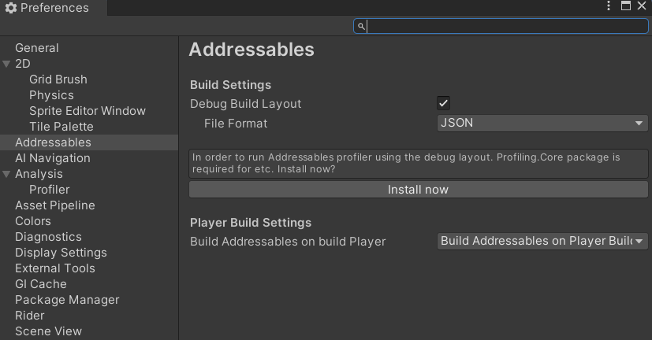

- 실행 중인 콘텐츠에 대한 정보를 수집하려면 디버그 빌드 레이아웃을 위한 빌드 시간 데이터 수집 정보가 필요합니다. 이러한 파일은 /Library/com.unity.addressables/buildReports 폴더에 저장됩니다. 빌드할 때마다 이 디렉터리에 새 빌드 보고서 파일이 생성됩니다. 프로파일러를 실행할 때 프로파일러 타겟에서 들어오는 모든 프로파일러 데이터가 동기화되고 빌드 리포트 폴더에서 해당 런타임에 대한 빌드 리포트 파일을 찾습니다. 빌드 보고서가 존재하지 않는 경우(예: 프로젝트가 다른 머신을 사용하여 빌드된 경우). 그러면 프로파일러에 해당 데이터에 대한 정보가 표시되지 않습니다. "파일 시스템에서 찾기"를 선택하면 파일 선택 창이 열립니다. 이 창을 사용하여 디스크의 다른 곳에서 빌드 보고서 파일을 찾을 수 있습니다.

- 프로파일러를 실행하려면 Unity 프로파일링 코어 API 패키지가 필요합니다. 이 패키지를 설치하려면 패키지 관리자를 통해 설치하거나 디버그 빌드 레이아웃을 활성화할 때 어드레서블 환경설정 창을 통해 설치합니다.

- 에디터에서 실행. 프로파일러 모듈은 플레이 모드 스크립트, "에셋 데이터베이스 사용(가장 빠름)" 또는 "그룹 시뮬레이션(고급)"을 지원하지 않습니다. 콘텐츠를 빌드하고 "기존 빌드 사용" 기반 플레이 모드 스크립트를 사용해야 합니다.

## 프로파일러 모듈 열기

프로파일러를 활성화하려면 프로파일러 창을 엽니다. 창 > 분석 > 프로파일러를 선택합니다. 프로파일러 창의 오른쪽 상단에서 프로파일러 모듈이라고 표시된 드롭다운 버튼을 선택합니다. 주소 지정 가능 에셋이라는 옵션을 활성화합니다.

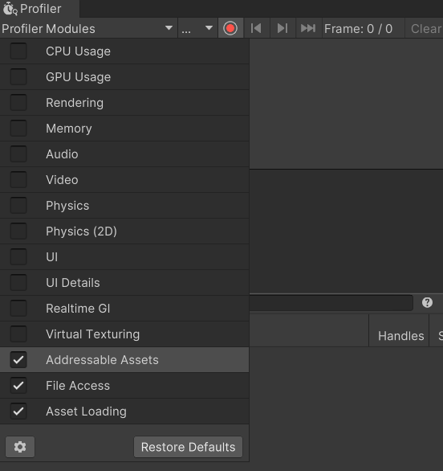


## 모듈 보기

모듈 뷰를 사용하면 특정 프레임에 로드된 에셋 번들, 에셋, 씬 및 카탈로그의 수를 관찰할 수 있습니다.

아래에는 1개의 카탈로그에서 3개의 에셋과 1개의 씬, 6개의 에셋 번들이 있습니다.

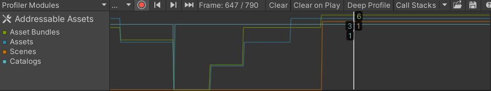

프레임을 선택하면 세부 정보 창이 해당 프레임에 대한 정보로 채워집니다. 로드된 콘텐츠에 대한 트리 보기를 표시합니다. 표시되는 콘텐츠를 수정하려면 다음과 같이 하세요. 세부 정보 창 도구 모음 드롭다운 버튼 "보기"를 선택합니다. 보기 옵션을 제공합니다.

- Groups: 트리 보기에 그룹을 포함합니다.
- Asset Bundle: 트리 뷰에 에셋 번들을 포함합니다.
- Assets: 트리 뷰에 에셋을 포함합니다.
- Objects: 에셋 내에 로드된 오브젝트를 포함합니다.
- Assets not loaded: 로드된 번들 내에 있지만 실제로 로드되지는 않은 에셋도 표시됩니다.

디테일 패널은 두 개의 영역으로 구성됩니다. 왼쪽에는 콘텐츠의 트리 보기가 있으며, 로드된 콘텐츠를 볼 때 사용되며 보다 심층적인 콘텐츠로 확장됩니다. 오른쪽에는 트리 보기에서 선택한 콘텐츠에 대한 세부 정보를 표시하는 세부 정보 검사기가 있습니다.

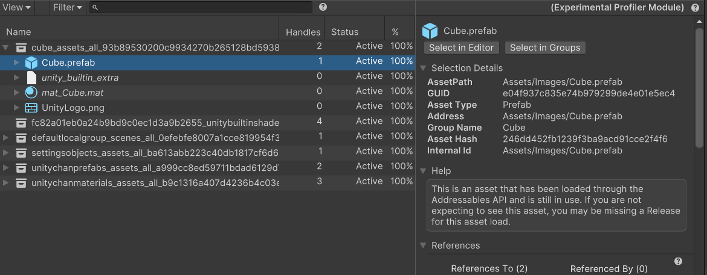


## 콘텐츠 트리 보기

트리 보기 열은 기본 설정에 따라 활성화 또는 비활성화할 수 있습니다. 상황에 맞게 트리 보기 헤더를 클릭하면 사용 가능한 열 목록이 표시됩니다.

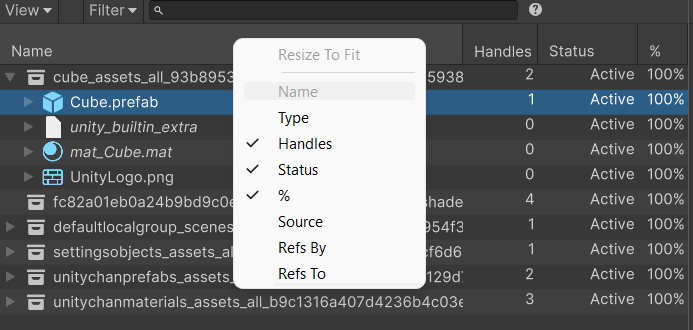

각 열은 행의 콘텐츠에 따라 정보를 표시합니다.

- Name: 그룹 이름, 에셋 번들 파일 이름, 에셋은 에셋의 주소, 주소가 사용되지 않는 경우 에셋 경로입니다. 객체는 객체 이름 또는 씬의 에셋 유형입니다.
- Type: 에셋 또는 오브젝트의 유형입니다.
- Handles: 콘텐츠에 활성 상태로 유지되고 있는 어드레서블 핸들 수입니다. 이를 참조 수라고도 합니다. 로드하는 동안 콘텐츠에 추가 핸들이 있습니다.
- Status: 현재 콘텐츠의 상태입니다:
   - Queued: 에셋 번들이 다운로드 대기열에 있는 경우입니다.
   - Downloading: 에셋 번들을 다운로드 중일 때입니다.
   - Loading: 콘텐츠가 백그라운드에서 로드 중인 경우입니다.
   - Active: 콘텐츠가 로드되어 사용 중일 때입니다.
   - Released: 콘텐츠가 릴리스되었지만(콘텐츠에 대한 활성 핸들이 더 이상 없음) 아직 메모리에 남아 있을 수 있는 경우입니다. 메모리 관리 참조
- %: 상태가 다운로드 또는 로드 중인 경우 다운로드 또는 로드 작업의 진행률을 백분율로 표시합니다.
- Source: 에셋 번들만 해당하며, 둘 중 하나를 표시합니다:
   - Local: 에셋 번들이 디스크의 로컬 파일에서 로드되었습니다.
   - Cache: 에셋 번들을 이전에 다운로드하여 디스크에 캐시했습니다. 캐시된 파일에서 로드되었습니다.
   - Download: 에셋 번들이 캐시되지 않았으므로 다운로드해야 합니다.
- Refs By: 이 콘텐츠 요소를 참조하는 다른 요소의 수입니다.
- Refs To: 콘텐츠가 참조하는 다른 요소의 수입니다.


## 릴리스된 에셋

어드레서블에서 콘텐츠가 릴리스된 경우입니다. 에셋 번들의 모든 콘텐츠가 릴리스될 때까지 메모리에 남아 있을 수 있으며, 에셋 번들 내의 에셋에 종속성을 가질 수 있는 다른 에셋 번들도 릴리스됩니다.

다음 스크린샷은 "cube_assets_all.bundle"에 릴리스된 일부 콘텐츠와 아직 사용 중인 다른 콘텐츠(UnityLogo.png)가 있는 것을 보여줍니다. 출시 콘텐츠는 글꼴 색이 희미해져 쉽게 구분할 수 있습니다.

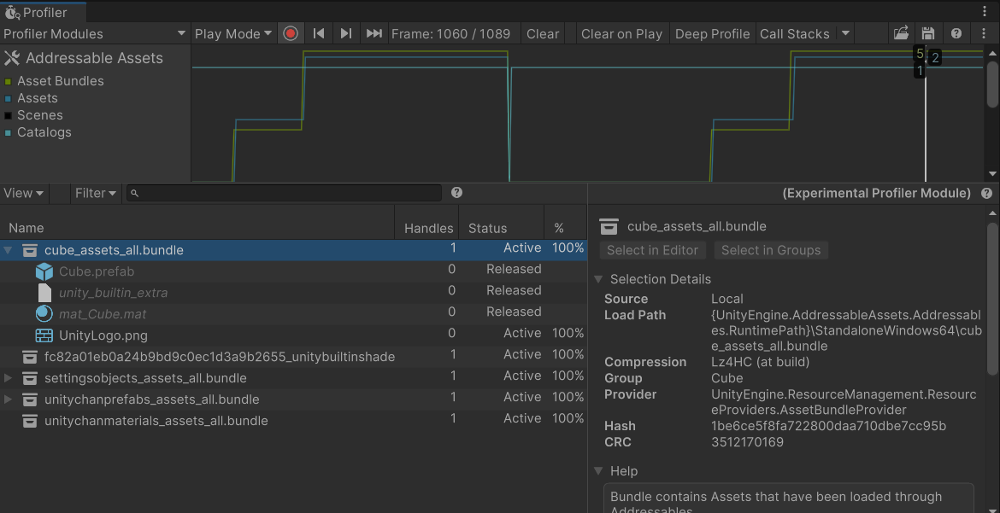

## 콘텐츠 필터링

세부정보 보기 도구 모음에는 검색창이 있습니다. 콘텐츠 이름으로 필터링하는 데 사용할 수 있습니다. 다른 필드는 아래와 같이 검색 필터 구문을 사용하여 필터링할 수 있습니다:

필터 구문은 :입니다. 여기서 필드는 숫자 필드입니다. "핸즈:3"과 같이 기본 등호는 =입니다. 숫자 앞에 기호를 포함하여 ">"보다 크거나 "<"보다 작도록 변경할 수 있습니다(예: ">"). "Handles:>2".

각 필터는 공백 없이 열 이름으로 작성하거나 아래와 같이 속기 태그를 사용하여 작성할 수 있습니다.

- Handles: "h"
- Type: "assetType", "t"
- Status: "s"
- RefsTo: "rt", "r"
- RefsBy: "rb", "p"
- Source: "번들소스", "bs", "b"

유형 필터는 포함 유형별로 필터링하는 데에도 사용할 수 있습니다. 명시적 - 에셋이 어드레서블을 통해 그룹에 명시적으로 포함된 경우. 또는 암시적은 다른 포함이 에셋을 참조하기 때문에 에셋이 에셋 번들에 포함된 경우입니다. 예: "유형: 명시적"

## 콘텐츠 세부 정보 검사

인스펙터 창을 사용하여 콘텐츠에 대한 자세한 정보를 수집할 수 있습니다. 콘텐츠가 로드되는 방법과 선택한 요소에 대한 참조에 대한 도움말을 확인할 수 있습니다.

아래는 로드된 에셋 번들에 대한 인스펙터의 예시입니다.

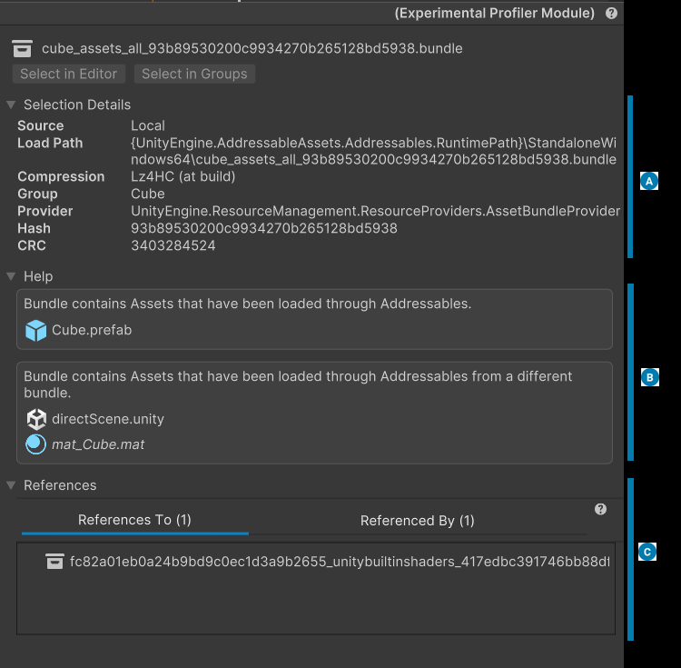

A. 자세한 정보를 포함합니다. 선택한 요소에 대한 자세한 정보를 얻는 데 사용할 수 있습니다.

B. 알아두면 유용할 수 있는 정보를 포함합니다. 의도하지 않은 설정에 대한 힌트를 포함합니다.

C. 다른 에셋 번들에 대한 참조를 포함합니다. 여기서는 이 에셋 번들에는 다른 에셋 번들 하나를 참조하는 콘텐츠가 있고, 이 요소를 참조하는 콘텐츠가 있는 다른 에셋 번들이 하나 더 있음을 알 수 있습니다.

---

# 이벤트 뷰어

Addressables Event Viewer 창을 사용하여 어드레서블 에셋의 메모리 관리를 모니터링할 수 있습니다. 이 창에는 애플리케이션이 에셋을 로드하고 언로드하는 시기가 표시되며 모든 어드레서블 시스템 작업의 참조 횟수가 표시됩니다. 이 창에는 애플리케이션 프레임 속도와 할당된 총 관리 메모리 양에 대한 대략적인 보기도 표시됩니다. 이 차트를 사용하여 에셋 로드 및 해제와 같은 어드레서블 이벤트가 애플리케이션 성능에 미치는 영향을 감지하고, 해제하지 않은 에셋을 감지할 수 있습니다.

Use Existing Build 플레이 모드 스크립트를 사용하면 플레이 모드의 이벤트 뷰어에서 가장 정확한 정보를 얻을 수 있습니다. Use Asset Database 스크립트는 에셋 간의 공유 종속성을 고려하지 않으며, 그룹 시뮬레이션 스크립트는 참조 수를 덜 정확하게 모니터링합니다.

>**_IMPORTANT_**<BR>이벤트 뷰어에서 데이터를 보려면 주소 지정이 가능한 에셋 설정 오브젝트의 인스펙터에서 프로파일러 이벤트 전송 설정을 활성화하고 새 콘텐츠 빌드를 만들어야 합니다.

## 어드레서블 이벤트 보기
Event Viewer 창에서 어드레서블 에셋 수명 차트 및 이벤트를 봅니다:

1. 어드레서블 설정에서 Send Profiler Events 활성화: a. 어드레서블 설정 인스펙터를 엽니다(메뉴: Window > Asset Management > Addressables > Settings). b. Diagnostics 에서 Send Profiler Events 옵션을 확인합니다.

2. 어드레서블 그룹 창에서 Default Build Script를 사용하여 어드레서블 콘텐츠를 다시 빌드합니다.

3. Event Viewer를 엽니다(메뉴: Window > Asset Management > Addressables > Event Viewer).
   
4. 에디터에서 플레이 모드로 들어갑니다.


## 독립형 플레이어에서 어드레서블 이벤트 보기

이벤트 뷰어를 독립형 플레이어에 연결하려면 에디터에서 플레이 모드로 전환하는 마지막 단계를 제외하고 어드레서블 이벤트 보기의 단계를 따르세요. 대신 다음과 같은 추가 단계를 수행합니다:

1. Build Settings 창을 엽니다(메뉴: File > Build Settings).
2. Development Build 옵션을 선택합니다.
3. Autoconnect Profiler 옵션을 선택합니다.
4. Unity Profiler window를 엽니다(메뉴: Window > Analysis > Profiler).
5. 빌드 설정 창에서 Build and Run을 클릭합니다.

이벤트 뷰어가 스탠드얼론 플레이어에 자동으로 연결되고 발생하는 어드레서블 이벤트가 표시됩니다.

Unity 프로파일러 사용에 대한 자세한 내용은 프로파일러 개요를 참조하세요.

## 이벤트 뷰어 창

에디터에서 창에 액세스하려면 Window > Asset Management > Addressables > Event Viewer를 선택합니다.

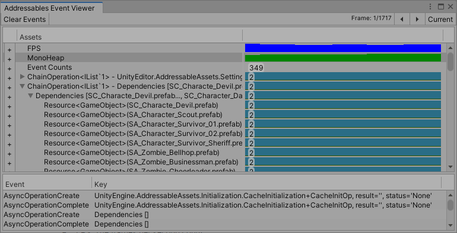

이벤트 뷰어 창

창에는 세 개의 섹션이 있습니다:

- 도구 모음:
   - Clear Events 버튼: 기록된 모든 프레임을 지우고 창에 있는 모든 것을 지웁니다.
   - Unhide All Hidden Events: 숨긴 모든 에셋 또는 작업 라이프사이클을 정상적으로 표시된 상태로 되돌립니다. 숨겨진 이벤트가 있을 때만 표시됩니다.
   - Frame 카운터: 프레임 커서의 위치와 기록된 프레임 수를 표시합니다. (도구 모음에 프레임 카운터가 표시되지 않으면 프레임 커서가 현재 프레임에 있는 것입니다.)
   - Frame Step(<>) 버튼: 레코딩된 프레임에서 프레임 커서를 단계적으로 이동합니다. (키보드 화살표 키를 사용할 수도 있습니다.)
   - 현재 버튼: 프레임 커서를 현재 프레임으로 이동합니다.
- Assets 표시: 어드레서블 작업 및 에셋과 관련된 프로파일러 및 수명 차트를 표시합니다.
   - FPS 차트: 애플리케이션 프레임 속도입니다.
   - MonoHeap 차트: 사용 중인 관리 메모리 양입니다.
   - Event Counts: 한 프레임에서 발생한 어드레서블 이벤트의 수(이벤트 목록에서 이벤트 보기).
   - Instantiation Counts: 프레임 내 Addressables.InstantiateAsync에 대한 호출 횟수입니다.
   - 오퍼레이션 및 에셋 수명 차트: 시스템이 오퍼레이션 또는 에셋을 로드하고 해제하는 시기를 표시하고 참조 횟수를 표시합니다. 에셋 수명 차트를 참조하세요.
- Event 목록: 프레임에서 발생한 어드레서블 오퍼레이션 이벤트를 표시합니다.

창의 차트 영역을 클릭하여 애플리케이션을 일시 중지하고 frame cursor 위치를 설정할 수 있습니다. 프레임 커서가 창에 세로선으로 표시되고 선택한 프레임에 대한 요약 정보가 표시됩니다.

>**_NOTE_**<BR>FPS 및 모노힙 차트에는 어드레서블 에셋과 관련된 요소뿐만 아니라 성능에 영향을 미치는 모든 요소가 포함됩니다.

## 에셋 수명 차트
에셋 수명 차트에는 에셋 또는 작업이 생성된 시기, 현재 참조 개수, 삭제된 시기가 표시됩니다.

에셋 또는 작업의 수명을 보여주는 표시 줄을 확장하려면 Assets 목록에서 해당 항목의 + 버튼을 클릭합니다.

항목의 하위 작업 또는 하위 에셋을 보려면 상위 개체의 확장 아이콘(>)을 클릭합니다.

에셋 또는 작업을 마우스 오른쪽 버튼으로 클릭하고 컨텍스트 메뉴에서 Hide Selected Events 를 선택하면 차트에서 해당 에셋 또는 작업의 라이프 라인을 제거할 수 있습니다. 툴바에서 Unhide All Hidden Events 버튼을 클릭하면 숨겨진 이벤트의 라이프라인이 표시됩니다.

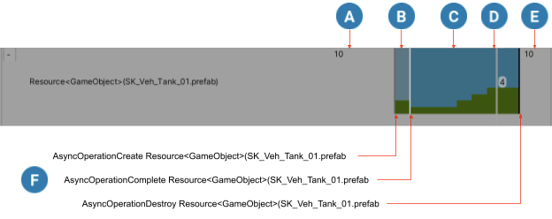

*에셋 수명 예시 및 관련 어드레서블 이벤트*

수명 차트에는 다음 정보가 표시됩니다:
A. 에셋이 로드되기 전(표시되지 않음).
B. 에셋 로드가 진행 중입니다(흐린 파란색).
C. 에셋이 로드됨(파란색). 녹색 막대는 에셋의 현재 참조 횟수를 표시합니다.
D. 선택한 프레임에 대한 정보를 표시하는 이벤트 뷰어 프레임 커서. 이 경우 커서는 선택한 프레임 동안 이 에셋의 참조 횟수가 4임을 나타냅니다.
E. 에셋이 소멸되고 언로드된 후(표시되지 않음).
F. 특정 프레임과 관련된 이벤트(이벤트는 프레임 커서 위치에만 표시됨).

---

# 분석 도구

분석은 프로젝트의 어드레서블 레이아웃에 대한 정보를 수집하는 도구입니다. 경우에 따라 분석은 프로젝트의 상태를 정리하기 위해 적절한 조치를 취할 수 있습니다. 다른 경우, 분석은 어드레서블 레이아웃에 대해 더 많은 정보에 기반한 결정을 내릴 수 있도록 도와주는 정보 제공 도구일 뿐입니다.

## 분석 사용
에디터에서 Addressables Analyze 창(Window > Asset Management > Addressables > Analyze)을 열거나, Addressables Groups 창에서 Tools > Window > Analyze 버튼을 클릭하여 열 수 있습니다.

분석 창에는 분석 규칙 목록과 함께 다음 작업이 표시됩니다:

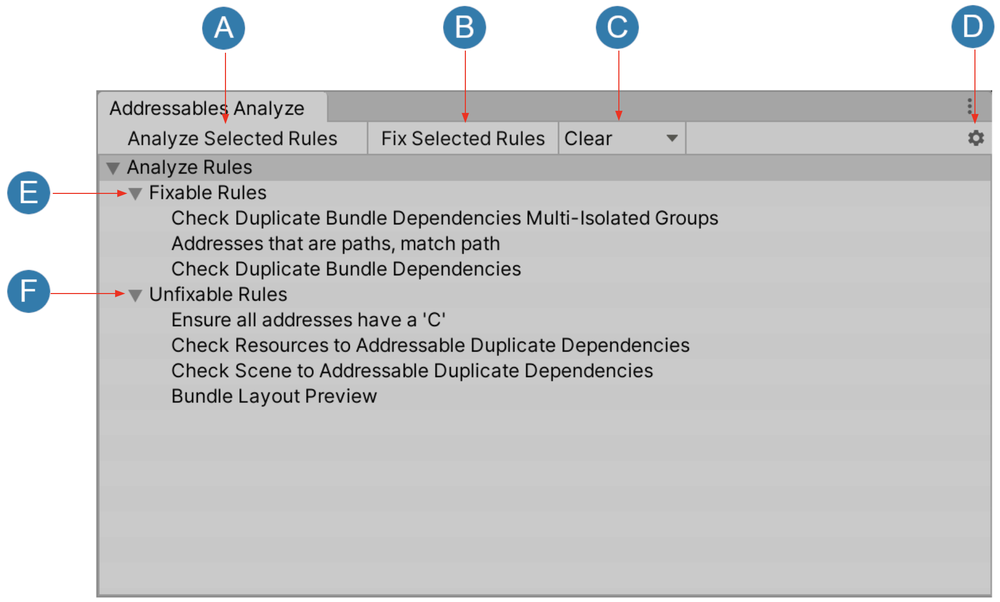

A. 선택한 규칙 또는 그 하위 규칙에 대한 분석을 시작합니다.
B. 선택한 규칙 또는 해당 하위 규칙에 대해 수정 작업을 수행합니다(수정 가능한 규칙이어야 함).
C. 선택한 규칙 또는 하위 규칙에 대한 결과를 지우는 지우기 옵션을 엽니다.
D. 저장된 분석 결과를 가져오거나 결과를 디스크로 내보내는 옵션을 엽니다.
E. 수정 가능한 규칙은 "수정 가능한 규칙" 항목 아래에 표시됩니다.
F. 수정할 수 없는 규칙은 "수정할 수 없는 규칙" 항목 아래에 표시됩니다.

### 분석 작업
분석 작업은 규칙에 필요한 정보를 수집합니다. 규칙 또는 규칙 집합에 대해 이 작업을 실행하여 빌드, 종속성 맵 등에 대한 데이터를 수집합니다. 각 규칙은 필요한 모든 데이터를 수집하여 AnalyzeResult 객체 목록으로 다시 보고해야 합니다.

분석 단계에서는 데이터나 프로젝트의 상태를 수정하기 위한 어떠한 작업도 수행해서는 안 됩니다. 이 단계에서 수집한 데이터에 따라 수정 작업이 적절한 조치일 수 있습니다. 그러나 일부 규칙에는 분석 단계만 포함되어 있는데, 이는 수집된 정보를 기반으로 합리적으로 적절하고 보편적인 조치를 취할 수 없기 때문입니다. 해결 가능한 중복 종속성에 대한 씬 확인 및 해결 가능한 중복 종속성에 대한 리소스 확인이 이러한 규칙의 예입니다.

순전히 정보 제공용이며 수정 작업을 포함하지 않는 규칙은 수정 불가능한 규칙(Unfixable Rules)으로 분류됩니다. 수정 작업이 있는 규칙은 수정 가능한 규칙(Fixable Rules)으로 분류됩니다.

### 지우기 단계
지우기 작업은 분석에서 수집한 모든 데이터를 제거하고 그에 따라 TreeView 를 업데이트합니다.

### 수정 작업
수정 가능한 규칙(Fixable Rules)의 경우 수정 작업을 실행하도록 선택할 수 있습니다. 수정 작업은 분석 단계에서 수집된 데이터를 사용하여 필요한 수정을 수행하고 문제를 해결합니다.

제공된 중복 번들 종속성 확인 규칙은 수정 가능한 규칙의 예입니다. 이 규칙의 분석을 통해 감지된 문제는 문제를 해결하기 위해 취할 수 있는 합리적으로 적절한 조치가 있기 때문에 수정할 수 있습니다.


## 제공된 분석 규칙

### 수정 가능한 규칙
#### 중복 번들 종속성 확인
이 규칙은 BundledAssetGroupSchemas로 모든 그룹을 스캔하고 에셋 그룹 레이아웃을 투영하여 잠재적으로 중복된 에셋이 있는지 확인합니다. 기본적으로 전체 빌드를 트리거해야 하므로 이 검사는 시간과 성능이 많이 소요됩니다.

문제: 에셋 중복은 서로 다른 그룹의 에셋이 종속성을 공유하는 경우(예: 서로 다른 어드레서블 그룹에 존재하는 머티리얼을 공유하는 두 개의 프리팹)에 발생합니다. 해당 머티리얼(및 해당 종속 요소)은 프리팹이 포함된 두 그룹으로 모두 끌어올려집니다. 이를 방지하려면 머티리얼을 프리팹 중 하나 또는 자체 공간에 어드레서블로 표시하여 머티리얼과 해당 종속 요소를 별도의 어드레서블 그룹에 배치해야 합니다.

해결: 이 검사에서 문제가 발견되면 이 규칙에 대한 수정 작업을 실행하여 모든 종속 에셋을 이동할 새 어드레서블 그룹을 생성합니다.

예외: 오브젝트가 여러 개 포함된 애셋이 있는 경우, 서로 다른 그룹이 애셋의 일부만 가져올 수 있고 실제로는 중복되지 않을 수 있습니다. 메시가 많은 FBX가 그 예입니다. 한 메시가 "GroupA"에 있고 다른 메시가 "GroupB"에 있는 경우, 이 규칙은 FBX가 공유된 것으로 간주하고 수정 작업을 실행하면 자체 그룹으로 추출합니다. 이 에지 케이스에서 수정 작업을 실행하면 두 그룹 모두 전체 FBX 에셋을 보유하지 않게 되므로 실제로는 해롭습니다.

또한 에셋 중복이 항상 문제가 되는 것은 아닙니다. 동일한 사용자 집합이 에셋을 요청하지 않는 경우(예: 지역별 에셋), 중복 종속성이 필요하지 않거나 적어도 중요하지 않을 수 있습니다. 각 프로젝트는 고유하므로 중복된 에셋 종속성을 수정하는 것은 사례별로 평가해야 합니다.

### 수정할 수 없는 규칙
#### 해결 가능한 중복 종속성에 대한 리소스 확인
이 규칙은 빌드된 어드레서블 데이터와 Resources 폴더에 있는 에셋 간에 에셋 또는 에셋 종속성이 중복되는지 감지합니다.

문제: 이러한 중복은 데이터가 애플리케이션 빌드와 어드레서블 빌드에 모두 포함된다는 것을 의미합니다.

해결 방법: 이 규칙은 적절한 조치가 존재하지 않으므로 수정할 수 없습니다. 이 규칙은 순전히 정보 제공용이며 중복에 대해 경고합니다. 진행 방법과 취해야 할 조치(있는 경우)는 사용자가 결정해야 합니다. 수동으로 수정할 수 있는 한 가지 예는 문제가 있는 에셋을 Resources 폴더 밖으로 이동하여 주소 지정이 가능하도록 설정하는 것입니다.

#### 씬을 주소 지정 가능한 중복 종속성으로 확인
이 규칙은 에디터 씬 목록의 씬과 어드레서블 간에 공유되는 에셋 또는 에셋 종속성을 감지합니다.

문제: 이러한 중복은 데이터가 애플리케이션 빌드와 어드레서블 빌드에 모두 포함된다는 의미입니다.

해결 방법: 순전히 정보 제공용이며 중복에 대해 경고합니다. 진행 방법과 취해야 할 조치(있는 경우)를 결정해야 합니다. 수동으로 해결할 수 있는 한 가지 예는 빌드 설정에서 참조가 중복된 빌트인 씬을 가져와 어드레서블 씬으로 만드는 것입니다.

#### 번들 레이아웃 미리보기
이 규칙은 어드레서블로 명시적으로 표시된 에셋이 어드레서블 빌드에서 어떻게 배치되는지 보여줍니다. 이러한 명시적 에셋이 주어지면 어떤 에셋이 암시적으로 참조되어 빌드에 포함되는지도 표시됩니다.

이 규칙에 의해 수집된 데이터는 특정 문제를 나타내지 않습니다. 순전히 정보 제공용입니다.


## 분석 확장
각 고유한 프로젝트에는 사전 패키지로 제공되는 것 외에 추가적인 분석 규칙이 필요할 수 있습니다. 어드레서블 에셋 시스템을 사용하면 자신만의 사용자 지정 규칙 클래스를 만들 수 있습니다.

예시는 어드레서블-샘플 리포지토리의 사용자 지정 애널리틱스 규칙 프로젝트를 참조하세요.

### 애널라이즈 룰 객체
다음 프로퍼티를 재정의하여 AnalyzeRule 클래스의 새 자식 클래스를 만듭니다:

- CanFix는 규칙이 수정 가능한 것으로 간주되는지 여부를 Analyze에 알려줍니다.
- ruleName은 Analyze window에서 이 규칙에 표시되는 표시 이름입니다.

또한 아래에 자세히 설명된 다음 메서드를 재정의해야 합니다:

- ```List<AnalyzeResult> RefreshAnalysis(AddressableAssetSettings settings)```
- void FixIssues(AddressableAssetSettings settings)
- void ClearAnalysis()

>**_TIP_**<BR>규칙이 수정 불가능으로 지정된 경우 FixIssues 메서드를 재정의할 필요가 없습니다.


#### 새로고침 분석
분석 작업입니다. 이 메서드에서는 원하는 계산을 수행하고 잠재적인 수정에 필요한 데이터를 캐시합니다. 반환 값은 ```List<AnalyzeResult>``` 목록입니다. 데이터를 수집한 후 분석의 각 항목에 대해 첫 번째 매개변수에는 데이터를 문자열로, 두 번째 매개변수에는 MessageType을 경고 또는 오류로 지정하기 위해 메시지 유형을 선택적으로 지정하는 새 AnalyzeResult를 만듭니다. 생성한 개체 목록을 반환합니다.

특정 분석 결과 개체에 대한 TreeView 에서 자식 요소를 만들어야 하는 경우 부모 항목과 모든 자식을 kDelimiter로 구분할 수 있습니다. 부모 항목과 자식 항목 사이에 구분 기호를 포함하십시오.

#### FixIssues
수정 작업입니다. 분석 단계에 대한 응답으로 수행해야 할 적절한 작업이 있는 경우 여기에서 실행합니다.

#### ClearAnalysis
분석 지우기 작업입니다. 분석 단계에서 캐시한 모든 데이터를 이 함수에서 정리하거나 제거할 수 있습니다. TreeView 가 데이터 부족을 반영하도록 업데이트됩니다.

### GUI에 사용자 지정 규칙 추가
사용자 지정 규칙이 분석 창에 표시되려면 ```AnalyzeSystem.RegisterNewRule<RuleType>()```을 사용하여 GUI 클래스에 등록해야 합니다. 예를 들면 다음과 같습니다:

```
using UnityEditor;
using UnityEditor.AddressableAssets.Build;
using UnityEditor.AddressableAssets.Build.AnalyzeRules;

class MyRule : AnalyzeRule
{
    // Rule code...
}

// Register rule
[InitializeOnLoad]
class RegisterMyRule
{
    static RegisterMyRule()
    {
        AnalyzeSystem.RegisterNewRule<MyRule>();
    }
}
```

#### AnalyzeRule 클래스
사용자 정의 규칙을 더 빠르게 설정할 수 있도록 Addressables에는 다음과 같은 클래스가 포함되어 있으며, 이 클래스는 AnalyzeRule에서 상속됩니다:

- BundleRuleBase는 분석 규칙 작업을 처리하기 위한 베이스 클래스입니다. 여기에는 번들 및 리소스 종속성에 대한 정보를 검색하는 몇 가지 기본 메서드가 포함되어 있습니다.
- Check bundle duplicates 클래스는 번들 종속성 중복을 확인하는 데 도움이 됩니다. 몇 가지 사용자 정의 작업을 수행하려면 FixIssues 메서드 구현을 재정의하세요.
   - CheckBundleDupeDependencies는 BundleRuleBase를 상속하며, 번들 종속성에서 중복 여부를 확인하는 AnalyzeRule용 추가 메서드와 이러한 중복을 해결하는 메서드를 포함합니다.
   - CheckResourcesDupeDependencies는 동일하지만 리소스 종속성에 따라 다릅니다.
   - CheckSceneDupeDependencies는 동일하지만 씬 종속성에 따라 다릅니다.

---

# 어드레서블 리포트
어드레서블 리포트는 어드레서블 빌드에 빌드된 콘텐츠에 대한 정보를 자세히 볼 수 있는 툴입니다.

어드레서블 리포트 창을 열려면 Window > Asset Management > Addressables로 이동하여 Addressables Report를 선택합니다.

## 요구사항
- 어드레서블 보고서를 사용하려면 Unity 에디터 버전 2022.2 이상을 사용해야 합니다. 어드레서블 보고서를 사용하고 싶지만 현재 사용 중인 에디터 버전이 2022.2 미만인 경우, 해당 빌드 보고서가 1.21.8 이상의 어드레서블 버전에서 빌드되었다면 이전 버전의 Unity 에디터에서 빌드된 빌드 보고서를 가져와서 2022.2 이상의 에디터 버전을 사용하는 프로젝트에 임포트할 수 있습니다.
- 또한 어드레서블 리포트가 작동하려면 어드레서블 빌드에서 생성된 빌드 리포트가 필요합니다. 빌드 보고서 생성을 활성화하려면 Edit > Preferences > Addressables로 이동하여 "빌드 레이아웃 디버그"를 활성화합니다.
- 기본적으로 어드레서블 보고서는 모든 빌드 후에 자동으로 열립니다. 이 기능을 비활성화하려면 dit > Preferences > Addressables로 이동하여 빌드 후 Open Addressables Report After Build를 선택 취소합니다.

## 개요

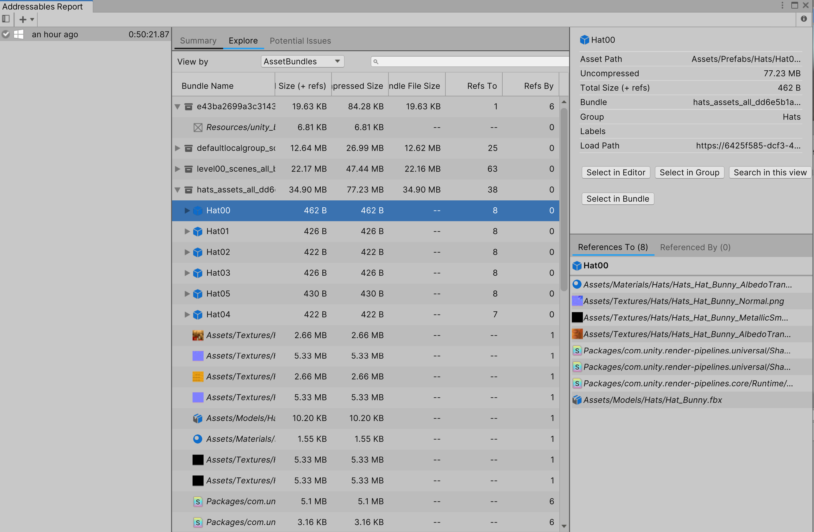

|View|Description|
|---|---|
|The Summary tab|어드레서블 빌드 및 해당 콘텐츠에 대한 개괄적인 개요를 제공합니다.|
|The Explore Tab|어드레서블 빌드의 일부로 빌드된 모든 콘텐츠에 대한 자세한 분석을 제공합니다.|
|The Potential Issues Tab|현재 빌드 보고서에서 빌드 성능을 저해하거나 바람직하지 않을 수 있는 문제를 검색합니다.|

어드레서블 리포트 창 상단에 있는 탭을 선택하여 세 가지 보기 사이를 전환합니다.

왼쪽 사이드바 패널에는 현재 프로젝트 내에서 감지된 모든 빌드 보고서 목록이 표시됩니다. 왼쪽 사이드바에서 빌드 보고서를 선택하면 해당 보고서가 어드레서블 리포트 창에 로드됩니다.

오른쪽 사이드바는 인스펙터 패널로, 탐색 또는 잠재적 이슈 뷰에서 정보를 보는 동안 에셋 또는 에셋 번들에 대한 자세한 정보를 볼 수 있습니다.

---

## The Summary Tab

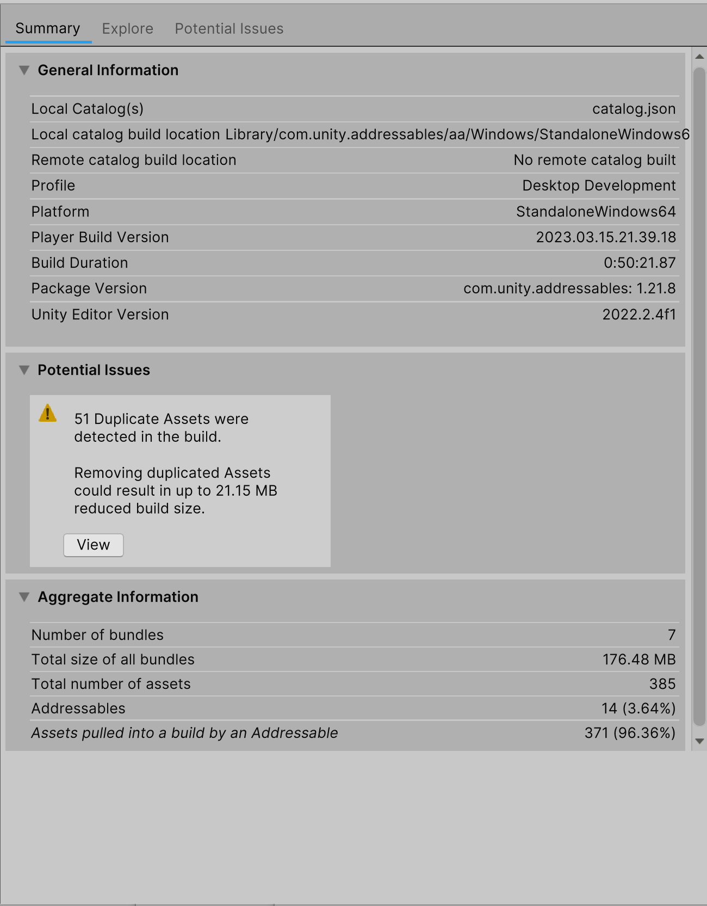

요약 탭에는 현재 선택한 빌드 보고서에 대한 일반 정보와 빌드 내에서 감지된 잠재적 문제에 대한 정보가 포함되어 있습니다. 이 정보에는 빌드에 의해 생성된 카탈로그의 위치, 현재 빌드가 어떤 프로파일로 빌드되었는지, 빌드에 걸린 시간, 빌드가 생성된 어드레서블 패키지와 Unity 에디터의 버전이 포함됩니다.

요약 탭에는 빌드의 일부로 생성된 에셋 번들의 수, 빌드된 번들의 크기, 빌드에 포함된 에셋 수 등 빌드에 대한 몇 가지 높은 수준의 집계 정보도 포함되어 있습니다.

어드레서블 에셋이 빌드에 가져온 에셋의 수는 이 뷰에서 중요한 속성입니다. 이 카운트에는 어드레서블 에셋이 참조하지만 어드레서블로 표시되지 않은 에셋이 포함됩니다. 이러한 에셋은 빌드에 포함되어야 해당 에셋에 종속된 에셋이 로드될 수 있습니다.

서로 다른 번들에 있는 여러 개의 어드레서블 에셋이 동일한 비 어드레서블 에셋에 종속되어 있는 경우, 해당 비 어드레서블 에셋은 여러 번들에 중복된다는 점에 유의하세요. 중복된 에셋에 대한 자세한 내용은 중복된 에셋 보기를 참조하세요.


---

## The Explore Tab


탐색 탭에는 현재 선택한 빌드 보고서에 대한 자세한 정보가 포함되어 있습니다. 보기 기준 드롭다운을 사용하여 빌드 보고서에서 에셋이 구성되는 방식을 변경할 수 있습니다.

네 가지 항목 유형별로 탐색 보기를 정렬할 수 있습니다:

- 에셋 번들: 어드레서블 빌드의 일부로 빌드된 모든 에셋 번들을 표시합니다. 에셋 번들을 펼치면 해당 번들에 포함된 에셋이 표시됩니다. 이것이 기본 보기입니다.
- 에셋: 어드레서블 빌드의 일부로 빌드된 모든 에셋을 표시합니다. 에셋을 확장하면 확장된 에셋에 종속된 모든 에셋과 번들이 표시됩니다.
- 레이블: 어드레서블 빌드의 일부로 빌드된 모든 에셋을 에셋에 부착된 레이블별로 정렬하여 표시합니다. 에셋을 확장하면 확장된 에셋에 종속된 에셋 및 번들이 표시됩니다.
- 그룹: 어드레서블 빌드의 일부로 빌드된 모든 에셋 번들을 번들을 생성한 그룹별로 정렬하여 표시합니다. Pack Together By Label 또는 Pack Separately 그룹 설정을 사용하는 경우 단일 그룹에서 여러 개의 에셋 번들을 생성할 수 있습니다.

빌드 보고서 창의 검색창을 사용하여 탐색 및 잠재적 이슈 탭 내에서 검색할 수 있습니다. 이렇게 하면 검색창에 입력된 텍스트를 기준으로 현재 뷰의 모든 에셋이 필터링됩니다.

탐색 탭에서 에셋을 선택하면 인스펙터 패널에서 해당 정보가 열립니다.

---

## The Potential Issues View

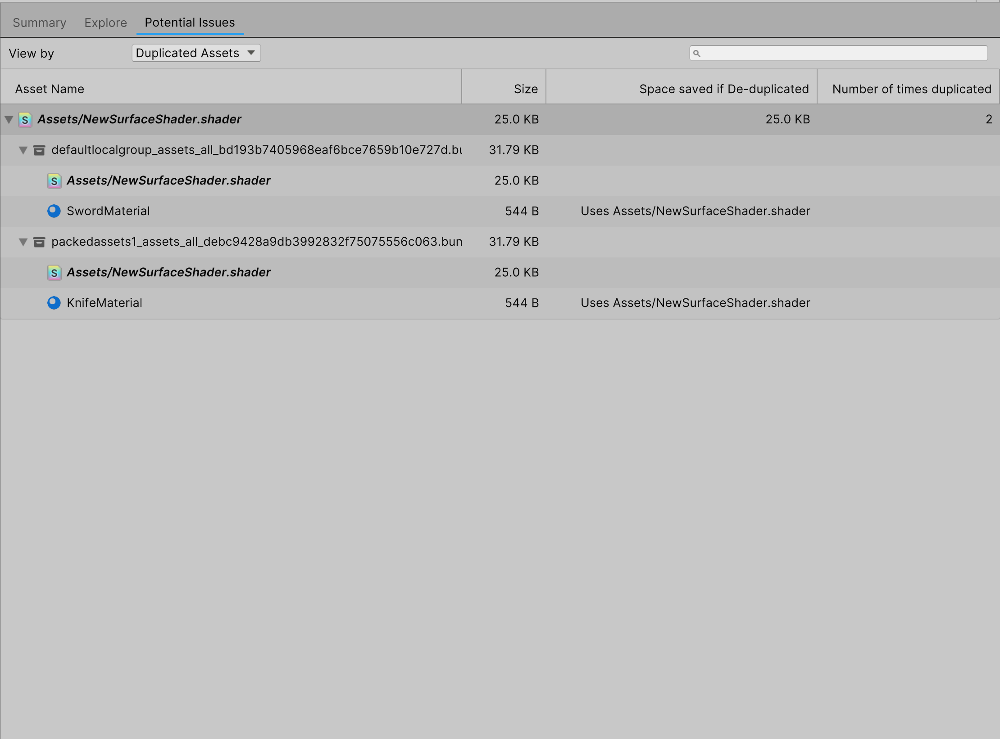

잠재적 이슈 탭은 선택한 빌드 보고서에서 빌드 과정에서 발생했을 수 있는 잠재적 이슈나 문제를 검색하고, 분석 규칙과 유사하게 이러한 문제가 어떻게 발생했는지 확인할 수 있습니다. 현재 잠재적 이슈 뷰에는 하나의 뷰만 있습니다.

Duplicated Assets View에는 빌드의 여러 번들 간에 중복된 주소 지정이 불가능한 모든 에셋의 목록이 표시됩니다. 이는 주소 지정이 가능한 두 에셋이 서로 다른 번들에 있지만 둘 다 주소 지정이 가능한 것으로 표시되지 않은 공통 에셋을 참조할 때 종종 발생합니다.

이러한 종류의 문제는 문제의 어드레서블 에셋을 동일한 번들로 이동하거나 중복된 에셋을 어드레서블로 설정하면 해결할 수 있습니다. 어떤 방법으로 문제를 해결하든 빌드 종속성에 영향을 미칩니다. 일반적으로 에셋 중복에 미치는 영향을 최소화하는 방법을 사용해야 합니다.

잠재적 문제 탭에서 에셋을 선택하면 인스펙터 패널에 해당 정보가 열립니다.


---

## The Inspector Panel

인스펙터 패널을 사용하면 탐색 뷰 내에서 특정 에셋 또는 에셋 번들에 대한 자세한 정보를 볼 수 있습니다. 탐색 탭 또는 잠재적 문제 탭에서 에셋 또는 에셋 번들을 마우스 왼쪽 버튼으로 클릭하면 선택한 에셋 또는 에셋 번들로 인스펙터 패널이 업데이트됩니다.

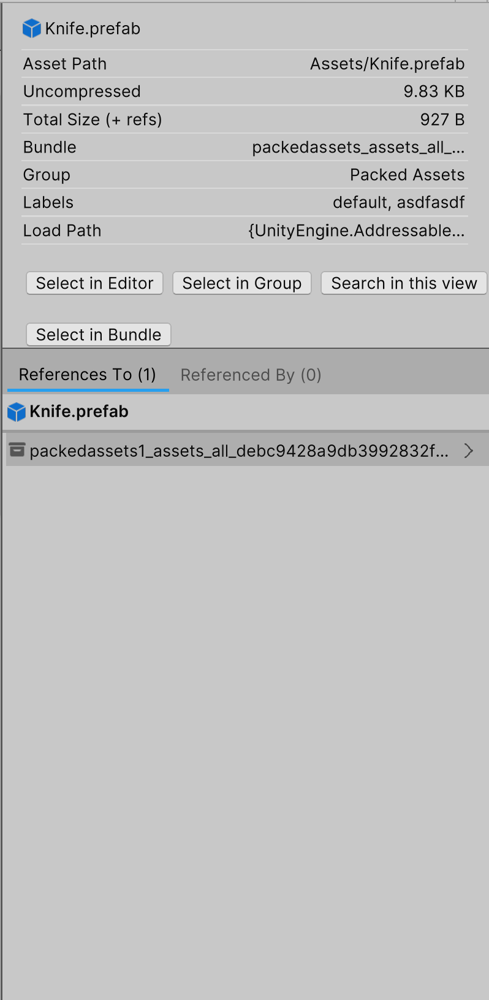

검사기 패널에는 두 가지 주요 섹션이 있습니다: 요약 패널과 레퍼런스 패널입니다.

요약 패널에서는 파일 크기, 에셋이 포함된 그룹, 에셋과 연관된 레이블 등 에셋 또는 에셋 번들에 대한 정보를 한 곳에서 찾을 수 있습니다. 또한 요약 패널에는 에셋 또는 에셋번들 선택 여부에 따라 빌드 리포트와 에디터 내 다양한 위치로 이동하는 데 사용할 수 있는 버튼이 있습니다.

버튼은 다음과 같습니다:

- 에디터에서 선택: Unity 에디터에서 에셋을 선택합니다.
- 그룹에서 선택: 탐색 창의 그룹 뷰에서 현재 선택된 에셋을 선택합니다. 현재 그룹 뷰에 있지 않은 경우 그룹 뷰로 이동합니다.
- 번들에서 선택: 탐색 창의 에셋 번들 보기에서 현재 선택된 에셋을 선택합니다. 현재 에셋 번들 보기에 있지 않은 경우 에셋 번들 보기로 이동합니다.
- 이 보기에서 검색합니다: 검색창에서 에셋의 이름을 검색합니다.

## The References Panel

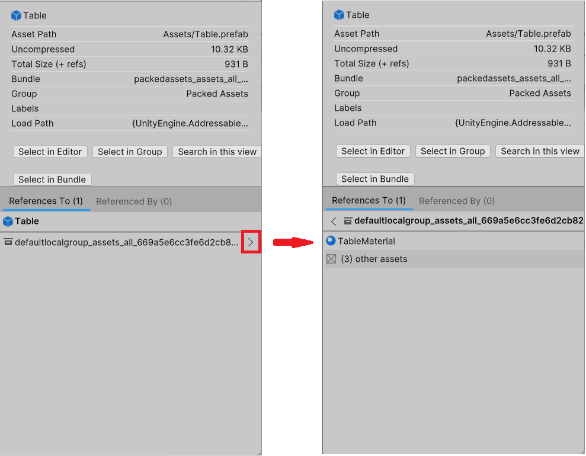

레퍼런스 패널에는 특정 에셋을 둘러싼 종속성 체인이 표시됩니다.

- References To 탭에는 선택한 항목이 종속된 모든 에셋 및 에셋 번들 목록이 포함되어 있습니다. 예를 들어 셰이더를 참조하는 머티리얼이 있는 경우 탐색 보기에서 해당 머티리얼을 선택하면 이 탭에 셰이더가 표시됩니다.
- Referenced By 탭에는 선택한 항목에 종속된 모든 에셋 및 에셋 번들 목록이 포함됩니다. 예를 들어 셰이더를 참조하는 머티리얼이 있는 경우 탐색 보기에서 셰이더를 선택하면 셰이더가 참조하는 머티리얼이 이 탭에 나타납니다.

레퍼런스 패널에 표시된 에셋 또는 에셋 번들 옆의 화살표를 선택하여 최상위 에셋의 종속성을 순환합니다. 예를 들어, 위 이미지에서 Table 에는 defaultlocalgroup_assets_all... 번들에 대한 참조가 있습니다. 화살표를 선택하면 이 종속성을 생성하는 에셋이 TableMaterial이며, defaultlocalgroup_assets_all... 번들에는 Table의 종속성이 아닌 다른 세 개의 에셋도 포함되어 있음을 알 수 있습니다.

주소 지정이 불가능하지만 주소 지정이 가능한 다른 에셋에 의해 번들로 끌어온 에셋 옆에는 물음표 아이콘이 표시됩니다. 이 아이콘을 클릭하면 동일한 번들에서 해당 에셋을 참조하는 모든 에셋이 강조 표시됩니다.